# RM小地图技术暂存

> **Log:**
>
> 2019.12.4:
>
> ​	今天开始正式进行RM小地图的任务制作,这个也将会是Robomaster几年最重要的一个任务,因此乖乖地一点点记录,把这个任务做好来
>
> 2019.12.10:
>
> ​	老师过来了进行了一下思路的整理,其实这个方案还是有的,接下来就是不断地进行弹道测试,查看弹道测试的效果,知道最终的优良性方案.
>
> ​	论文查询是有必要的,除此之外,还需要进行其他问题的解决,基于那么多的方案进行最终目标的确定.论文检索的时候需要有目标地检索,马上就会遇到问题了,遇到了问题之后就进行快速检索,解决问题
>
> 2019.12.20:
>
> ​	前段时间把YOLOV3的东西跑通了,接下来,就是开始进行优化,工具掌握的差不多了,就是优化的问题了,首先还是先好好地看看神经网络的识别效果,看看所对应的情况,再进行其他任务的解析
>
> 2020.2.2:
>
> ​	今天重新开始看小地图的任务.小地图应该是你今年最重要的任务,虽然目前按照道理来说应该已经开始干活了好几天了,但是其实还是很没有进入状态.弹道和工程对位其实最多在分区赛的时候就能够解决,接下来的更多任务肯定是子啊小地图上面花功夫.
>
> ​	测试了一下CenterNet的效果,感觉CenterNet的效果还算是可以的,但是没有上车去试,所以这个暂时不知道,接下来就是准备数据集,进行车上测试,看看效果了.如果CenterNet效果OK,那么就可以那这个作为底层BackBone了
>
> 2020.2.24:
>
> ​	其实感觉很多时候代码冗余,很多旧的代码不舍得删,导致了很多地方都不记得什么是自己写的了.这一块需要不断地coding从而提升代码的改进能力.这一块也算是一个工作,这半个月的时间需要进行改进的一部分
>
> 2020.3.3:
>
> ​	这几天发现ZED也有目标跟踪的操作,但是他的目标跟踪是针对人体检测+跟踪是在ZED2上面跑的.虽然这两个都不符合,但是我觉得其中的内容还是很大一部分符合了的,至少也知道了有人在做这一块的东西,跟足球运动员的跟踪是一个意思
>
> 2020.3.21:
>
> ​	周三的时候开了一个雷达站的识别分享会,发现数据难以保证泛化性,这一点是接下来需要重点研究的问题,如果可以完成泛化的话那就还好,否则就需要采用运动目标检测的方案进行一下验证,从而选择一个比较好的方案.另外,在装甲板时候的地方,需要把速度提升上去,尽可能地保证速度够快,否则识别的效果会不好.这一个也是需要考虑的.
>
> 2020.3.22:
>
> ​	进行了识别的优化,目前基本上可以做到5FPS,之后换上2080Super,同时显存变大以及一些优化,这个速度应该可以再快一些,至少可以达到10FPS.同时YOLOV3我觉得没有必要,可以直接采用YOLO-tiny的操作就好了.接下来整合一下这些信息,然后开始验证神经网络的泛化性问题,如果能报进行泛化性的保证,那么识别的任务基本上就算是完成了

感觉干脆就整体的一起进行一次整合算了,两边都写东西太麻烦了,一个整的进行整合


# 一 计划方案

> 今年一定会进行大量这方面的工作,因此专门开一个栏目进行此方向的信息记录
>
> 此部分也相当于一个综述,进行所有可能用到的技术的试调研,从而决定使用哪一种路线

## 1. 传统方向

> 传统方向目标了解的是帧差法,背景差分,光流法三大方向
>
> 参考资料:https://zhuanlan.zhihu.com/p/42938173 (知乎一个专栏系列)

### 1.1 帧差法

> 计算非常快,鲁棒性很强,但是由于此种检测方法非常容易导致物体内部出现空洞现象,因此只是适用于简单的运动目标检测

- 由于运动的物体较慢,因此导致了会出现空洞的情况,可以考虑采用多帧插法的方案进行
- 但是帧差法整体的效果我个人觉得并不是非常的理想,原因就是在于这个是我们手动进行不同的特征设计的,因此会导致泛化性不好,因此帧差法的方案还是暂时放下先不管.


### 1.2 背景差分法

> 先通过统计学建立一个背景模型,再利用背景差分法对运动目标与背景像素点进行分类

#### 1.2.1 基于统计学理论的运动目标检测

1. 混合高斯背景建模方法
2. Vibe(背景提取法)
3. PBAS(Pixel-Based Adaptive Segmenter) 运动目标检测法 融合了ViBe和SACON,但是计算比较慢,实时性并不高
4. MOG


##### (1) MOG系列

> 崔哥说这个好,那就先试一试这个吧,反正OpenCV中似乎也有包可以调的

1. **调用:**

     调用挺方便的,代码非常简单

     可以查看自己Markdown中OpenCV的运动检测部分
     
2. **使用效果:**

     MOG可以检测到车子的运动,但是很容易就检测出一坨东西,这样子需要不断地进行形态学开闭操作才可以把这个形状给框出来.只要是运动的目标就可以框出来,但是这里面的主要难点在于难以进行分类,强行分类的话,可以考虑数字OCR+颜色分类,这个之后有时间进行这一块的学习


#### 1.2.2 基于聚类的算法

1. CodeBook

2. K-means

   ​    


### 1.3 目标跟踪

> 目标跟踪算法KCF,主要是进行目标追踪的任务

- 知道的目标追踪算法包括:

     1. KCF的跟踪算法

          http://www.robots.ox.ac.uk/~joao/circulant/index.html (KCF官网)

          KCF在OpenCV Contribute包中有代码实现,但是跟踪的效果并不是特别的好,需要进行重新的fine-tuning一下

          使用方法看OpenCV-Contirbute的使用.这一块使用python的Contirbute安装效果会快很多,使用起来比较方便

          
     


### 1.4 足球跟踪

> 发现了很多足球跟踪其实是拿传统视觉,至少说是没有使用非常多的神经网络完成的,这一块需要好好地看一看

#### 1.4.1 基本入门

> 主要进行https://www.jianshu.com/p/7d15cbe53866的学习

- meanshift和camshift

     meanshift好像也是做目标跟踪的,但是meanshift的跟踪框图不会随着目标大小的变化而变化.这一块,camshift可以解决这个问题

- 傅里叶变换

     ```python
     import cv2
     import numpy as np
     import os
     import sys
     
     #1读取图片
     img_dir="image"
     image_all_name=os.listdir(img_dir)
     
     image_name=img_dir+"/"+image_all_name[0]
     image=cv2.imread(image_name)
     image=image[:500,:500]
     cv2.imshow("image",image)
     
     
     gray_image=cv2.cvtColor(image,cv2.COLOR_BGR2GRAY)
     rows,cols=gray_image.shape[:2]
     nrows=cv2.getOptimalDFTSize(rows)
     ncols=cv2.getOptimalDFTSize(cols)
     
     frame=cv2.copyMakeBorder(gray_image,0,ncols-cols,0,nrows-rows,cv2.BORDER_CONSTANT,value=0)
     
     cv2.imshow("frame",frame)
     img_dft=np.fft.fft2(frame)
     magn=np.abs(img_dft)
     log_magn=np.log10(magn)
     specturm=np.fft.fftshift(log_magn)
     specturm=specturm/np.max(specturm)*255
     specturm=specturm.astype(np.uint8)
     cv2.imshow("specturm",specturm)
     
     
     
     cv2.waitKey(0)
     
     ```

     - 我也不知道这个傅里叶变换是什么,但是就是能出一些东西出来


## 2. 神经网络方向

> 神经网络方向是现在比较主流的,但是问题也非常的多,一来数据集不够充足,泛化性的问题不能够保证,二来是学习成本非常的高,只能够一点点地处理问题

资料来源:

1. 极视https://github.com/extreme-assistant/cvpr2020
2. 极视目标检测综述:https://mp.weixin.qq.com/s/l8Cfi3CIt2gqVC9i3LV6hw
3. 极视目标跟踪综述:http://bbs.cvmart.net/articles/523/cvpr-2019-lun-wen-da-pan-dian-mu-biao-gen-zong-pian
4. 综述论文:https://www.bilibili.com/read/cv4020053


### 2.1 目标检测

#### 2.1.1 R-CNN系列

> R-CNN系列从最开始的R-CNN到Fast-RCNN到Faster-RCNN,归根到底是解决了region proposal(区域提议)的问题,Mask-RCNN是基于已有的region proposal,进行了ROI区域的FCN,由此得到了轮廓,这种轮廓比本身的FCN轮廓效果好很多

重新把以前看不懂的论文耐着性子看完了前向传播部分,训练部分等到到时候自己写代码的时候再细细地去看吧.

看的时候感觉还是先看原版论文比较好,原版论文里面的索引paper非常重要,有一些不懂的地方看那些索引,可以有更好的效果,不至于一些单词不知道什么意思,以及博客的内容毕竟有一些会出错.验证自己看的是不是对的时候再去看博客会比较好.同时,论文感觉比较好的还是首先大概通读地看一次,如果感觉到快把前面的东西忘了,才去ipad上面把东西写下来.最后,其实论文归根到底,多看一些,知道套路,其实都差不多,开创性的工作真的不多,更多的还是一些把前人的东西拿起来用罢了,量的问题都不是问题.


##### (1) R-CNN

> R-CNN,region with CNN.主要基于selective search+CNN的模型进行前向传播.

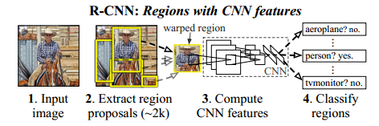

1. **input image->Extract region proposals:**通过selective search生成2k个ROI

2. **Extract region proposals->warped region:**进行warp图片,将图片归一化到统一大小,以便之后的svm可以是一个统一的尺寸

3. **Compute CNN features:**通过卷积得到图像特征,应该是5层卷积+2层全连接
4. **Classify regioins:**通过SVM进行分类


###### a. selective search

- CNN可以解决特征提取(extract features),从而后面接着全连接,softmax等,就可以解决分类的问题.这是我们已知.但是,CNN需要固定的尺寸的输入,同时他只能做到的是对一张图片进行多个分类,而不能出bounding box.因此,**对于bounding box的选择,首先需要采用selsctive search进行**

- Selective Serach 是一种基于图片信息给出可能潜在的搜索框的作用,具体方法的说明在picture中已有保存,主要的思想是基于颜色相似度,纹理相似度,尺寸相似度等等的方向进行小区域的融合,融合成大区域.一张图片中,可以大约出2000个搜索框,即2000个**ROI(Region Of Interest)**.这样,也即意味着通过图像输入(227\*227\*3),可以出大约2000\*4的搜索框参数.
- 不过,由于Selective Search的搜索框大小不同,因此下一步需要完成的便是将图像归一化到一个尺度,否则无法进行卷积操作(或者应该说卷积操作后无法与全连接进行配置)


###### b. 卷积

- selective search产生了各种各样的方框之后,将他们全部warp成统一尺寸,从而之后才可以送入SVM进行分类
- 由于采用了warp成了统一的尺寸,因此CNN部分可以使用同一套卷积进行处理,而不需要不同尺寸的卷积对应不同尺寸的操作


##### (2) Fast RCNN

> R-CNN有很多缺点
>
> 1. SPPnet解决了Warp的问题
> 2. 同时把卷积放在了最开始,不需要每一个ROI都过一次CNN最后比其他的东西

###### a. SPPnet

- 由于warp会导致图像丢失尺寸信息,因此导致识别不够准确,为了解决问题,采用了SPPnet

- SPPnet网络结构:

     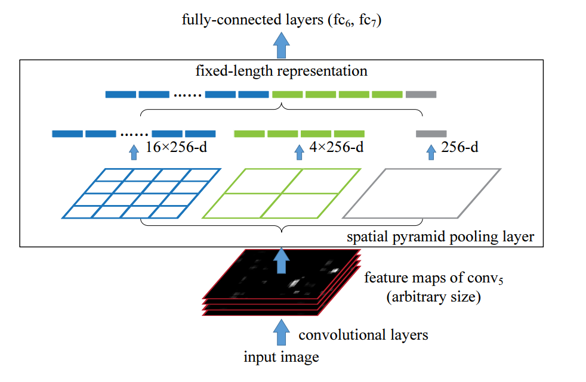

     1. 对任意输入图像,先经过卷积层,卷积层之后把图像修改到多少W\*H SPPnet不管(深度由卷积层定,论文中为256-d),但是对他们执行区域MaxPooling,即从蓝,绿,灰,分别提取出4\*4,2\*2,以及1的Maxpooling格子,这样子,就可以获得一个16+4+1,每个有256-d的深度的feature vector,这样子,就可以有固定尺寸的feature vector送入全连接了


###### b. Fast RCNN结构

> 受到SPPnet的影响,Fast RCNN进行了两个重要改进

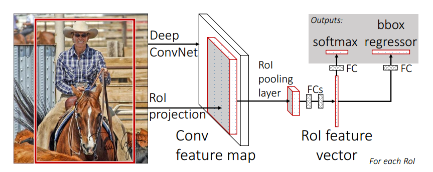

**FastRCNN结构**

1. **输入:**一张图片与Selective Search 产生的ROI区域
2. **Deep ConvNet:**输入图片后,首先通过几个conv和maxpooling处理整张图片,得到Conv feature map
3. **ROI pooling layer:**对每一个ROI,在Conv feature map上面找到对应的提取的特征区域,送入到ROI pooling layer中,ROI pooling layer将h\*w大小的window,分割成了H\* W个子区域,每个子区域采用Maxpooling得到固定的尺寸,在送入到FCs中,产生ROI feature vector
4. **两路输出:**ROI feature vector通过两个FC,一路送入softmax,一路送入bbx regressor,得到了目标参数


###### c. ROI Pooling Layer

论文原话:

> The RoI pooling layer uses max pooling to convert the features inside any valid region of interest into a small feature map with a fixed spatial extent of H × W (e.g., 7 × 7),

ROI pooling layer使用max pooling 把feature 于每一个有效(valid)的ROI 变成一个小的feature map,这个feature map有固定的大小(H\*W)


> RoI max pooling works by dividing the h × w RoI window into an H × W grid of sub-windows of approximate size h=H × w=W and then max-pooling the values in each sub-window into the corresponding output grid cell. 

ROI max pooling工作,通过分割大小为h\*w的ROI窗口到H\*W的子窗口,每个此窗口的size为h/H\*w/W的大小,之后使用max-pooling,得到了相1.1.1 R-CNN
R-CNN,region with CNN.主要基于selective search+CNN的模型进行前向传播.




##### (3) Faster RCNN

> Faster RCNN的RPN结构,第一次尝试地直接把region proposal的工作交给了卷积网络,而不采用selective search进行,从而不需要使用十分耗时的selective search(因为selective search需要用CPU进行解决,是一个迭代问题而非一个并行计算问题),之后detector采用的是Fast RCNN 的分类手段

**Faster RCNN网络结构:**


1. **卷积层出feature Map:**任意一张图片,先resize到M\*N的大小,之后过一个比较大的卷积层,得到FeatureMap
2. **RPN层:**FeatureMap输入之后(论文中深度为256-d),先过一个3\*3d 的256层卷积(可能目的是为了融合周边的feature),之后,对于每一个FeatureMap上面的点,进行1\*1的卷积,(**相当于对于featureMap上面每一个点的256-d的数进行全连接,全连接的输出为卷积层数**),分别是18层和36层.
     - 18=2\*9,9指的是每一个featureMap上面产生9中不同的尺寸,判断这9个尺寸的东西是formground还是background.
     - 36=4\*9.4是指每一个ROI的大小由4个参数决定(这里还有一点不明白的,他到底这个为什么需要4,4是任意的值还或者是特定的大小,如果是特定的大小,那么为什么需要4个参数而不是1个参数)
3. **fc+relu提取特征:**得到了proposal之后,结合上图像信息以及FeatureMap的信息,选取具体区域的特征,过全连接和relu,最终走两条路,Softmax得到目标的种类,bbox_pred得到目标的4个回归值(即重新修改回归的大小)


###### a. RPN

RPN很神奇...可惜我还是有一点不明白,为什么CNN还可以用于region proposal,而且即使可以,为什么可以直接regression出对应的修正值出来,这部分有时间还是要好好滴看


##### (4) MaskRCNN

> 最开始实现semantic segmentation的是FCN的网络结构,全部采用卷积结构,从而达到了end-to-end的网络输入输出效果.FasterRCNN的网络结构本身只是用于做region propoal和classification的,并没有涉及到语义分割部分.因此,MaskRCNN产生了,在RPN的搜索框之后,接了一个小型的FCN网络.从而是在bbx中进行segmentation的,这样子把图像识别的效果大大提升了

**MaskRCNN网络结构:**

**添加部分:**

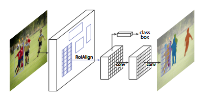

- 最左边,是基于之前的FasterRCNN的结构,出了搜索框以及对应的类别名称
- ROIAllgn:对于特定的类别,专门训练一种FCN,然后与搜索框内进行二值图的判断,最终得到目标轮廓


###### a. FCN


###### b. ROIAllgn

> MaskRCNN最好的好处就是基于FasterRCNN,从而其出轮廓的地方只需要作的是区分Mask或者非Mask,而不需要去做classification,这样子,可以有多少个种类训练多少个轮廓,从而达到非常好的效果


#### 2.1.2 YOLO系列

> YOLO系列是直接进行了目标的regression,即直接卷积出了所需要的尺寸,BoundingBox的尺寸等的参数,然后直接获取了所对应的目标参数
>
> 参考文章:https://blog.csdn.net/guleileo/article/details/80581858 (包含了V1和V2)

##### (1) Yolo V1

###### a. 网络结构

448x448x3的,过了一系列的网络卷积,最终获得了一个7x7x30的输出

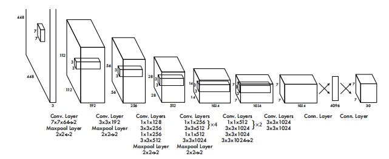


###### b.输入输出

​	YOLOV1对于每一张图片都resize到了448x448x3的尺寸,然后通过了一系列的卷积,池化,全连接的操作,最终回归到了7x7x30的尺寸.

​	这里的7x7是指把一张图分为了7x7的大小,30是目标物的尺寸,每个类别的分类数字

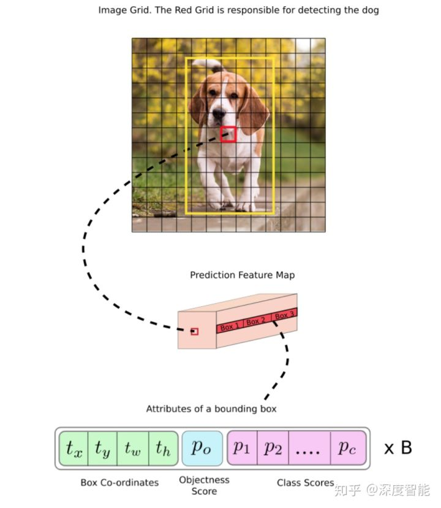

​	**这张图中可以看出,经过特征提取的部分,最终一张图片变成了一个预测Map.按照上面的理解,深度即为30,尺寸为7x7**


###### c. 详细解释:

1. 通过网络结构(某些卷积是需要进行Padding的操作的),可以把一张图片最终变为:
     $$
     S*S*(B*5+C)
     $$
     这里S即分割的大格子的数目

     B即每个大格子认为需要分成多少个BoundingBox.YOLOV1中设置为2

     5包含了图片位置信息xywh 以及一个维度认为这个大格子是否属于Object

     C是预测的总数,20个类即分为20个类

2. 按照理解,每个大格子(grid)中只能够预测一个种类的object,可以有两BBOX,但是其实最终是一个grid只进行一个object的识别与位置输出

3. 对于5,其中包含了图片的位置信息和正确率判断函数

     - **位置信息:**

     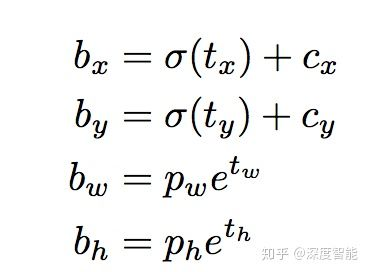

     - 这里的**xywh**是由右边的参数的出来的.其中tx ty tw th这四个参数是网络最终的输出,cx,cy是这个grid的左上角标,pw ph是这个grid的大小.

          

     - **类别置信度:**

          类别置信度中的confidence代表了预测的box中含有object的置信度和这个box预测的有多准这两重信息,计算方式为:
          $$
          P(C)=P(object)*IOU^{truth}_{pred}
          $$

          - P(ojbect):如果一个object在这个gridc中,那么取1,否则取0
          - 第二项IOU是计算预测的bbox和真实的groundtruth之间的IOU值

          


###### d. 训练

最终的损失函数的构建

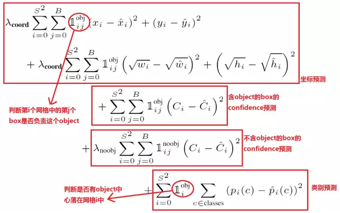

网络构建中,首先有coord和noobj,这两个参数分别为5和0.5,即这个grid中是否存在目标

- **坐标预测中**,对于w和h进行了根号操作,就是希望越小的wh,他们根号对他们的影响很大,但是越大的wh,他们根号之后其实损失值并没有直接的距离那么大.从而对小的wh的识别精准度进行了提升
- **类别指定度中**,对有无坐标都进行了计算,要求Ci往1或0进行变动
- **类别预测中**,也是分是否有目标,有目标的情况下进行预测


###### e. 网络缺陷

1. **小目标检测不好**

     因为直接将目标给了小格子进行计算,因此对于小目标检测的效果并不好,且如果两个物体都属于一个框的话,那么小目标就不能够完成检测了.这个是FasterRCNN的优势,因为他们出了Anchor进行目标的检测

     另外一种理解,由于原理上的限制,Yolo仅是针对于最后一层卷积输出进行检测计算,小物体像素少,经过层层卷积,这一层几乎不会剩下太多信息,导致难以识别


> YOLO V1的最大问题在于他对于小目标的检测效果并不好,且如果两个物体都属于一个框的话,那么很容易就不能够完成识别任务.同时,必须要求同一尺寸的输入,多尺寸的输入也是不允许的


##### (2) Yolo V2

> YoloV2是在V1的基础上进行了部分的升级改造,可以说基本上所有可能的效果都用上了进行大幅度的修改,从而让V2有了更好的效果
>
> YOLO9000好像就是进行了二级分类的操作,这一块好像很有意思,可以之后复现完成之后好好来看看这一块的东西

###### a. 网络模型与细节改变

- 网络模型

     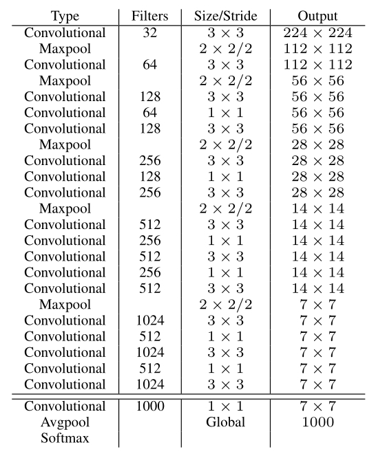

添加特性:

1. **模仿VGG**

     大量地使用了3x3卷积,pooling,并且卷积pool之后层数加倍

2. **采用AVGpool替代全连接**

     其中使用了1x1卷积以及AVGpool进行全连接的使用\

3. **batch normal提高稳定性**

     主要是为了缓解梯度消失的问题,有专门的论文可以进行了解


> 个人感觉V2的变化其实并不算很大,只是采用了非常多其他人的手段进行了V2的更新,从而让他的效果更好,但是具体更新了多少,其实也没有想象中那么的多罢了
>
> 当然了,能够把所有特性融合起来进行网络的加强,几乎把正确率提升了20%,这本身也是非常有意义的事情,有空可以精看V2的论文,看看如何进行网络升级的


##### (3) Yolo V3

> V3的速度就快了非常多了,模型复杂了,但是可以通过改变模型结构进行大小和精度的trade off
>
> 参考资料: https://www.jianshu.com/p/d13ae1055302
>
> 一个比较好的网络结构图:https://blog.csdn.net/leviopku/article/details/82660381

###### a. 网络结构

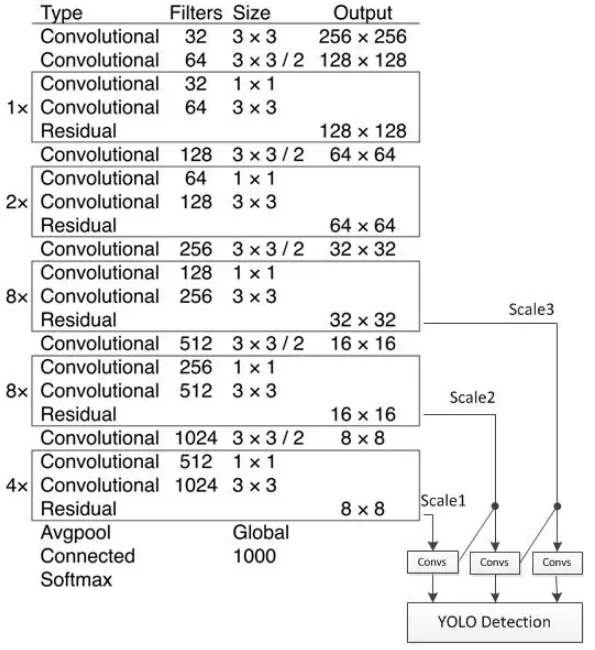

- 这个网络结构主要是Darknet-53,效果和ResNet152相近,但是速度快了非常多
     1. 采用256x256x3作为输入左侧1,2,8表示包含了多少个重复的残差组件(可以看到每个残差组件都是由2个卷积构成)


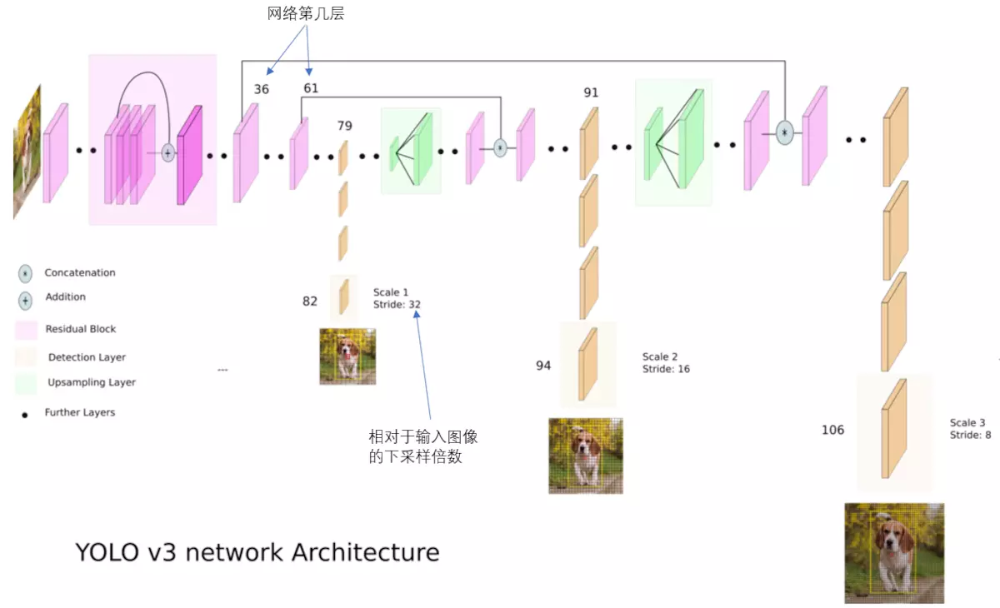

- **更详细的网络模型**

     在79层网络的时候,通过卷积得到层得到一种尺度的检测结果

     之后在79层的同时,采用了上采样卷积,然后与61层进行特征融合,得到了91层的网络,针对这个网络进行再次预测,这个有了中部感受野

     继续进行上采样,与36层进行进行融合,得到了最小感受野(即适合检测小目标)

     > 三张狗图可以看到所对应的感受野的大小(网页上面看得到),就可以很清楚地感受到感受野的变化程度

     

- **Anchor动态选择:**

     在V2版本中,Anchor的选择已经采用了k-means进行了聚类操作,进行了动态目标检测的选取,此处也是采用了先验框进行

     

###### a. 网络结构

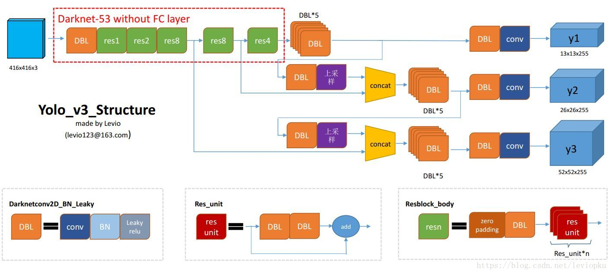


#### 2.1.3 CenterNet

> CenterNet的效果的确是不错的,目前至少来说识别是可以了,但是后面经常会跳,这个是需要进行解决的一个问题.可以进行最近邻地跳的改选,另外一个是

##### (1) CenterNet效果图

> CenterNet的作者直接给出了SSD位于CenterNet上面的准确度效果,且通过不同的BackBone,可以得到不同的准确度,传闻非常厉害

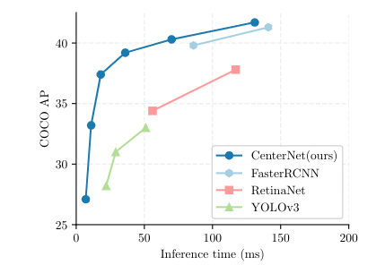

- 可以看到,CenterNet吊打YOLOV3,在推理时间为50ms的情况下,效果比YOLOV3的好太多了,同时准确度也完全不输FasterRCNN,因此不妨就是重新看看CenterNet


##### (2) 实现原理

> 实现原理感觉是直接用heat map的方式进行对应的得到的


#### 2.1.2 小目标检测

> 或许远距离的车会变成小目标,这个可以重新确定一下是否是小目标,如果此部分需要进行网络结构提升还需要重新想办法

- 小目标识别主要是在YOLO中的文章出现的,由于YOLO的网络结构原因,YOLO的小目标检测比基于Anchor方案的小目标检测差很多,因此YOLO V3针对于此还专门进行了网络结构的改进.
- 接下来如果网络里面有小目标需要进行识别,检测的,可以专门地针对于这方面的论文进行一些研究


#### 2.1.3 行人识别

> 行人识别的意义看看有没有对于漏识别非常重要的问题,一定要非常注意是否有漏识别,一旦漏识别,很有可能导致其他非常多的问题需要进行处理


### 2.2 目标跟踪

#### 2.2.1 移动目标预测

> 美团论文


#### 2.2.2 目标追踪

> 


## 3. 识别跟踪方向

> 前期计划就采用Detection+Tracking的方案进行任务的完成,泛化性的问题目前不是需要重点考虑的方案,可以先放下不继续过多的了解

### 3.1 Detection+Tracking综述

> 简单的历史综述:http://www.sohu.com/a/330699110_651893
>
> 目前比较厉害的比如CREST:crest convolutional residual learning for visual tracking
>
> 2018 目标跟踪论文:  https://blog.csdn.net/weixin_40645129/article/details/81173088
>
> 一篇比较好的综述:https://www.jianshu.com/p/7bcb18084966?tdsourcetag=s_pcqq_aiomsg

> 主要跟踪VOT竞赛: https://www.zhihu.com/search?type=content&q=VOT2019

- **跟踪比赛算法图:**

     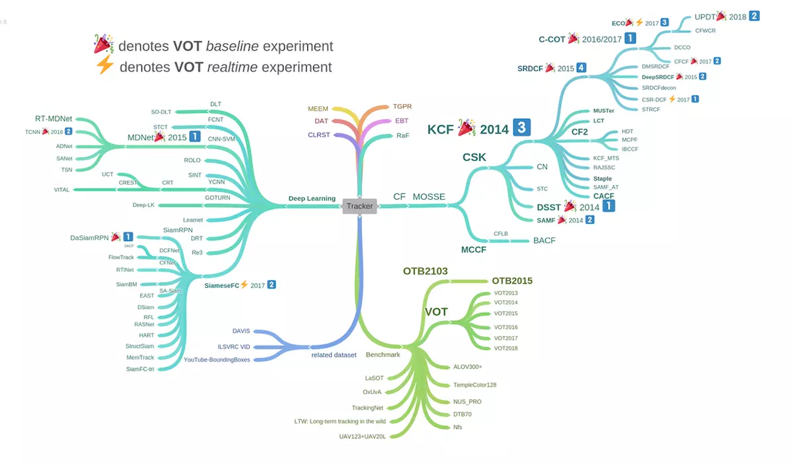


- 目前,主要的方案有基于相关滤波CF(Correlation Filter)和Siam-两个大的方向的目标追踪方案,在长时间追踪的方案中Siam的方案比CF的方案好很多,短距离的追踪方案中,CF的方案比Siam的方案好很多
- 网上很多代码,但是具体使用那个代码的确不能够排版,现在内心偏向于Siam的方案,但是感觉CF的方案也是非常不错的


### 3.2 Siam方案

> 主要的代码网址: https://github.com/STVIR/pysot (商汤开源,Sima的一系列代码都有了)
>
> ​						介绍网址:https://zhuanlan.zhihu.com/p/66295025
>
> SiamMask代码;https://github.com/foolwood/SiamMask

#### 3.2.1 Siam主流网络介绍

##### (1) SiameseFC网络

> 参考资料:https://zhuanlan.zhihu.com/p/35040994 (介绍Siamese词语的由来)
>
> https://blog.csdn.net/autocyz/article/details/53216786 (介绍SiameseFC网络)

- 最开始用于衡量签字的名称是否相同
- 有孪生网络和伪孪生网络,孪生网路用于处理两个网络比较相似的情况,伪孪生网络用于处理两个输入有一定区别的网络


###### a. 网络结构

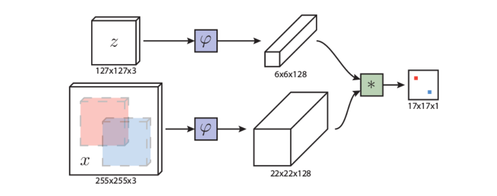

- Z为第一帧所对应的ROI,下面的225x225x3为目标搜索图

- 二者都通过一个相同的网络,之后分别生成对应大小的Tensor

     **小网络结构:**

     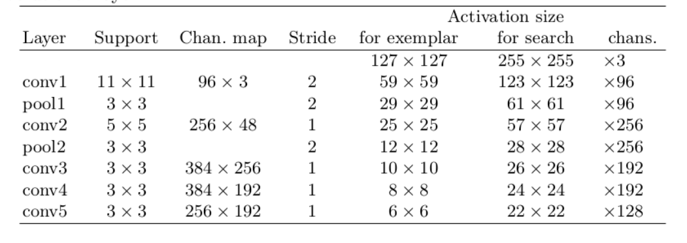

     这个网络有一些类似于AlexNet的网络,采用了所对应的操作,最终把chans匹配到了128维,最终扔进去卷积

- 上面的Tensor与下面的Tensor做**卷积**,最终输出所对应的值

     假设值相同,那么当两个信号相同的时候,即大的一样大,小的一样小,这样子的卷积结果是最大的,否则大的乘上小的,值会越小


**损失函数:**

归根到底是最小化损失函数进行目标获取

正负样本,直接基于第一个ROI及其附近的区域作为正样本,对这个范围意外的参数作为负样本进行追踪


此处采用的是logistic loss,其中的y为本身生成的正负样本,v为每一张小图通过神经网络所输出的值

此处可以进行值的更新,主要是针对于神经网络$$\varphi$$ 进行计算


###### b. Tracker实现

> 目前主要不是很清楚他是基于什么训练的,训练之后的数据又如何安放

- 似乎直接进行线性插值,即将卷积之后的17x17的score map扩大为272x272的尺寸,进而获得了所对应的Size


##### (2) SiamRPN++

> 参考资料:https://blog.csdn.net/WZZ18191171661/article/details/88579348 
>
> (包含了SiamRPN和DaSiamRPN)

###### a. SiamRPN

- 基于SiamFC,引入了FasterRCNN中的RPN模块,让tracker可以回归位置,形状等,从而可以省去多尺度测试


- SiamRPN网络结构


###### b. DaSiamRPN

> 基于SiamRPN,针对于训练数据集,丰富样本的个数和种类,利用更好的训练方式让tracker变得更加鲁棒
>
> 针对与long-term跟踪问题,提出了局部到全局的思路


###### c. SiamRPN++

> 以往希望加深网络,但是发现加深网络之后效果并不好,基于此,进行了一系列的改进,获取了更好的效果
>
> 参考资料:https://zhuanlan.zhihu.com/p/58154634 (作者写的知乎)

**创新点1:缓解平移不变性问题**


##### (3) SiamMask


#### 3.2.2 代码使用

> 先采用商汤的方案进行时间,毕竟是大公司维护的可能好一些,而且他们的目标也是提供一个更好的测试平台,SiamMask的方面就可以先放着不用太着急,如果商汤的代码写的太烂就去乖乖地看SiamMask的代码,先做起来


### 3.3 多目标跟踪

> 似乎Siam是能够进行单目标的跟踪,这一点并不是很确定,需要进行进一步的验证,
>
> 多目标跟踪的主流方向有SORT,好像帧率挺好,效果挺好,具体并不清楚了
>
> 参考资料:https://blog.csdn.net/NIeson2012/article/details/94471642


## 4. 未来扩展

### 4.1 随手记录

> 主要是进行随后记录,看看主要需要记录什么东西

- 多目标攻击的时候,可以进行一个提示,让大家回放
- 可以指挥员进行说明,然后大家集火攻击一台车子


## 5. 定位方案分析

> 小地图显示打算直接采用一个imshow,对于不同位置进行不同位置的imshow的操作完成对应的任务,输入对应的xyz,如果超出位置就不进行索引,没有超出位置就索引

### 5.1 定位方案

​	目前的一个比较大的问题是在于框的框选并不是想象中的那么好,一来数据集本身的确做的不算好,二来的确不能够要求精准性太高,这个毕竟不是Mask级别的,而是直接的BBOX的级别.这一块如果希望提升,可能需要重新做一下数据集,换一些跟踪方案看看效果了

​	目前希望出效果,那么打表的确是最有可能的,直接生成一张数据,然后根据不同的点去点,生成一个映射关系


### 5.2 单目方案

> 单目方案中还发现了一个mobileye的公司,这个纯粹用视觉进行测距的,感觉也是非常有意思,可以细细地了解一下

##### (1) PnP

PNP的使用效果很不好,因为框的效果差距太大,导致PnP经常会跳,同时一旦箱子运动到了侧面,那么效果直接爆炸

```
cameraMatrix = np.array(
[[649.0117,0.,317.6791],
[0.,651.8293,227.4236],
[0.,0.,1.]])
distCoeffs = np.array([[-0.0292,-0.1151,0.,0.,0.]])
object_points=np.array([[-200,-300,0],[200,-300,0],[-200,300,0],[200,300,0]],dtype=np.float64)


```


##### (2) 映射关系

- 使用公式:

     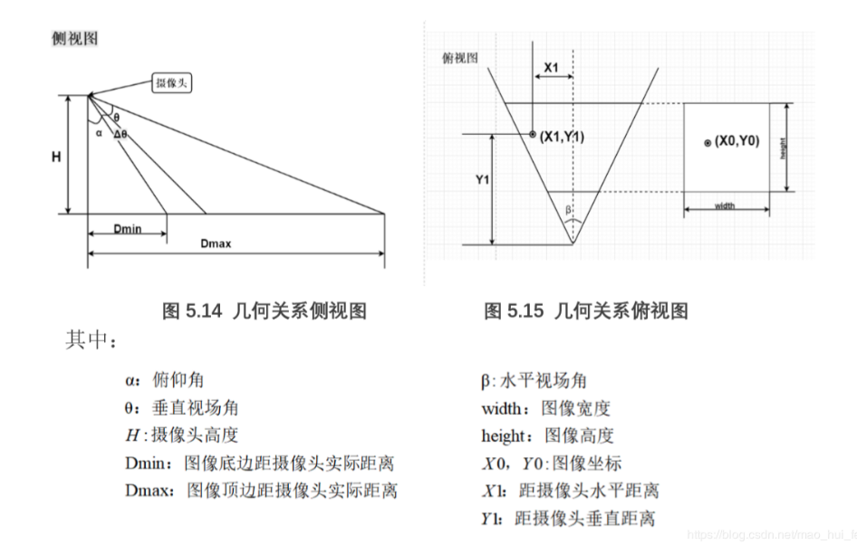

     

     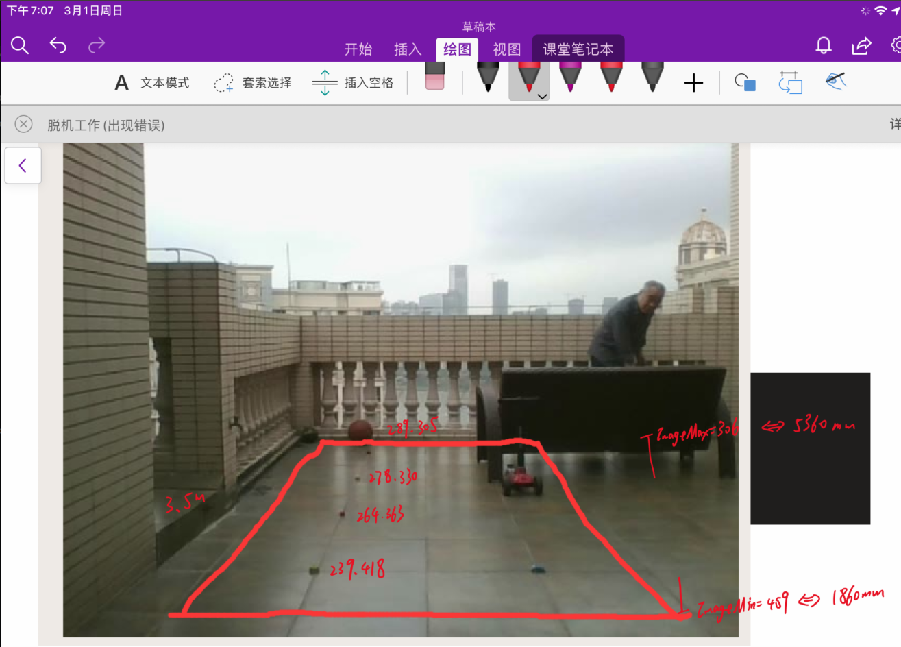

     ```python
     d0=(h-Image_Max)/height*xita
     Y=Y1=H*math.tan(alpha+xita-d0)
     X=(x-350)/500*(1+0.005*(Image_Min-h))*2000
     ```

     - dΘ:

          h为坐标点y方向值,Image_Max为最远处的像素点,height为图片中最远与最近的距离

     - Y:

          直接采用H\* tan(alpha+dΘ)

     - X:

          采用一个放大比例求解,0.005为每增加一个像素,X方向上距离扩大的比例


```python
#认为地图是线性的,看看效果
import sys
import cv2

from detectors.detector_factory import detector_factory
from opts import opts
import numpy as np
import math


def showResult():
    #设置主路径
    CENTERNET_PATH ="/home/elevenjiang/Documents/Project/RM/Code/CenterNet/CenterNet-master_suitcate/src/lib"
    sys.path.insert(0, CENTERNET_PATH)

    #导入训练参数
    MODEL_PATH ="/home/elevenjiang/Documents/Project/RM/Code/CenterNet/CenterNet-master_suitcate/exp/ctdet/coco_dla/model_last.pth"
    TASK = 'ctdet' # or 'multi_pose' for human pose estimation
    opt = opts().init('{} --load_model {}'.format(TASK, MODEL_PATH).split(' '))

    #初始化检测器
    detector = detector_factory[opt.task](opt)
    path="/home/elevenjiang/Documents/Project/RM/Code/MakeData/VideoPlace/first_move4.avi"
    cap=cv2.VideoCapture(path)

    H=95#摄像头高度为80mm
    Dmin=1860
    Dmax=5360
    Image_Max=306
    Image_Min=459
    alpha=math.atan(Dmin/H)
    print("alpha为:",alpha)
    xita=math.atan(Dmax/H)-alpha
    print("xita为:",xita)
    height=Image_Min-Image_Max


    while True:
        Map=np.zeros((560,300,3),dtype=np.uint8)

        flag,frame=cap.read()
        image=frame.copy()

        if flag:
            ret=detector.run(frame)['results']
            for result in ret[2]:
                x,y,w,h,score=result
                if result[4]>0.3:
                    # print(x,y,w,h)
                    cv2.rectangle(image,( int(x),int(y) ) ,(int(w),int(h) ),(0,0,255),1)
                    d0=(h-Image_Max)/height*xita
                    print("dxita=",d0)

                    Y1=H*math.tan(alpha+xita-d0)/10
                    print("当前所在的距离为:",Y1)
                    Y=550-Y1

                    X=(x-350)/500*(1+0.005*(Image_Min-h))*2000/10
                    print("当前X为值:",X)
                    cv2.putText(image,str(int(Y1))+","+str(int(X)),(int(x),int(y)),cv2.FONT_HERSHEY_SIMPLEX,1.5,(0,255,0),2)

                    print("绘制的中心是在:({},{})".format(str(int(Y)),str(int(X+150))))
                    cv2.circle(Map,(int(X+150),int(Y)),3,(0,0,255),22)

            cv2.imshow("image",image)
            cv2.namedWindow("Map",cv2.WINDOW_NORMAL)
            cv2.imshow("Map",Map)
            cv2.waitKey(1)
            print("*************************************")

        else:
            return 0


if __name__ == '__main__':
    showResult()

```


##### (3) 仿射变换


- 仿射变换可以看到是u,v变到x,y,透视变换是u,v变到x,y,z
- 仿射变换,其实实质上就是包含了一个图像的平移,缩放,旋转,翻转,错切(shear).由方程组知道,如果确定了3个点,就可以求出这个对应的方程组.某种意义上可以理解为,3个点确定了一个平面


- 透视变换,需要给定4个点才可以解这个矩阵.某种意义上可以理解为,4个点确定了一个三维空间

     最终发现:如果是同一条直线,效果很好,但是距离有限,其他地方的效果依然非常差.其实这个的实质感觉有一点像插值的方法(但是插值的方法现在还缺一个暴力映射的关系,这个关系还在找ing)


- 仿射变换代码

```python
import cv2
import numpy as np

image1=cv2.imread("1574.jpg")
image2=cv2.imread("1575.jpg")
Map=np.zeros((400,250),dtype=np.uint8)

cv2.imshow("image1",image1)
cv2.imshow("Map",Map)


pts1 = np.float32([[289,305],[279,329],[239,417],[448,415]])
pts2 = np.float32([[50,100],[50,200],[50,400],[150,400]])

M=cv2.getPerspectiveTransform(pts1,pts2)
print(M)


test_point=np.float32([265,363,1])
test_point_T=test_point.T
out=M@test_point_T
print("out",out)
Final=[out[0]/out[2],out[1]/out[2]]#这个的效果是对的
print(Final)

#但是最终的图片感觉怪怪的
dst=cv2.warpPerspective(image1,M,(560,300))
cv2.imshow("dst",dst)


cv2.waitKey(0)
```


##### (4) 插值打表

现在还在寻找ing,有二元到一元的映射,但是没有二元到二元的映射,这一还在寻找ing(其实二元到二元的就是类似于仿射变换)

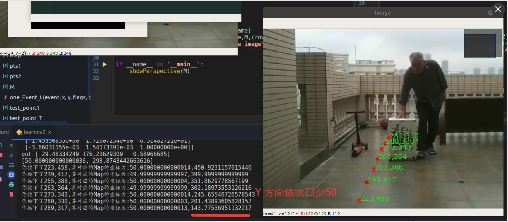


##### (5) ProjectPoint

> 可以考虑得到图像中的二维点,便于进行打表操作

###### a. 基本地图显示

```python
#进行3D点的绘制
import numpy as np
import cv2 as cv
import glob

def generate3DPoint(width,height):
    objp = np.zeros((width*height,3), np.float32)
    objp[:,:2] = np.mgrid[0:width,0:height].T.reshape(-1,2)#生成实际坐标点的XYZ
    objp[:,:2]=objp[:,:2]*10
    return objp


def drawPoints(image,image_points):
    for point in image_points:
        point_2=point.ravel()
        cv.circle(image,tuple(point_2),3,(0,0,255),2)
    return image


def draw3DImage(object_points):
    data=np.load("camera_intrinsic.npz")
    mtx=data['camera_matrix']
    dist=data['dist']

    criteria = (cv.TERM_CRITERIA_EPS + cv.TERM_CRITERIA_MAX_ITER, 30, 0.001)#进行迭代
    objp = np.zeros((4*5,3), np.float32)
    objp[:,:2] = np.mgrid[0:5,0:4].T.reshape(-1,2)#生成实际坐标点的XYZ
    objp[:,:2]=objp[:,:2]*2.5

    # cap=cv.VideoCapture(0)
    # while True:
    #     ret,frame=cap.read()
    #     if ret:
    #         cv.imshow("frame",frame)
    #         gray=cv.cvtColor(frame,cv.COLOR_BGR2GRAY)
    #         findchess_ret,corners=cv.findChessboardCorners(gray,(5,4))
    #         if findchess_ret:
    #             #得到标定板空间姿态
    #             pose_ret,rvec,tvec=cv.solvePnP(objp,corners,mtx,dist)
    #             image_points,jac=cv.projectPoints(object_points,rvec,tvec,mtx,dist)
    #             result=drawPoints(frame,image_points)
    #             cv.namedWindow('image',cv.WINDOW_NORMAL)
    #             cv.imshow("image",result)
    #         cv.waitKey(20)
    #     else:
    #         break


    frame=cv.imread("Board0.jpg")
    gray=cv.cvtColor(frame,cv.COLOR_BGR2GRAY)
    findchess_ret,corners=cv.findChessboardCorners(gray,(5,4))
    print(findchess_ret)
    if findchess_ret:
        #得到标定板空间姿态
        pose_ret,rvec,tvec=cv.solvePnP(objp,corners,mtx,dist)
        image_points,jac=cv.projectPoints(object_points,rvec,tvec,mtx,dist)
        result=drawPoints(frame,image_points)
        cv.namedWindow('image',cv.WINDOW_NORMAL)
        cv.imshow("image",result)
    cv.waitKey(0)


if __name__ == '__main__':
    draw3DImage(generate3DPoint(5,5))
```


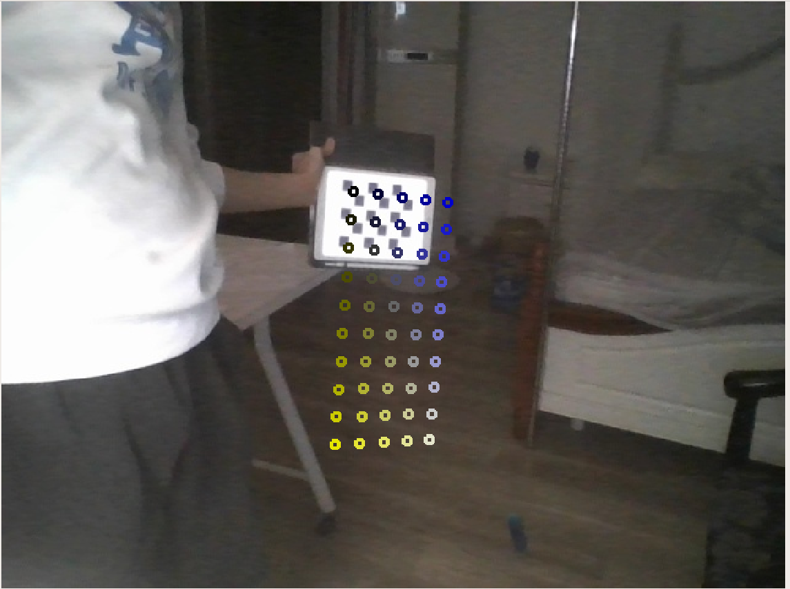


### 5.3 双目方案

> 我个人还是偏向于使用双目方案,但是这一块目前本身没有想着在家里做验证所以那时候就没有让项管把ZED寄回来.这一块目前只能提出理论模型

> 双目方案

##### (1) 模型建立

> 双目模型是最直观的一种方法,直接获得目标的XYZ,之后进行坐标系变换,得到了世界的XYZ,然后就可以画图了

- 到时候可能要上到三目甚至是四目,基于此所以想用双目的方案去做,然后多个距离融合判断最为可能的距离

- 


##### (2) 目标绘制


## 6. 二次识别

> 如果想识别细类,发现了一片treecnn的论文,就是进行一个二次识别的任务,即第一步识别大类,第二部识别小类

- 参考资料:https://blog.csdn.net/qq_24305433/article/details/79856672


# 二 实际工作

## 1. 项目方案

- 个人认为,这个任务可以变成针对于BoundingBox的识别任务,目标就是产生对应的BBX.

- 目前可以产生BBX的方案有三种

     1. 基于运动检测的目标识别
     2. 基于Detection的目标识别
     3. 基于目标追踪的目标识别

     这三种中,运动目标检测和Detection这两种方法均是生成BBX的,Tracking的方案是保持BBX的,因此Tracking的方案可以使用,但是Detection和运动目标检测只能二选其一


> 由于Detection的成熟模型比较多,因此前期打算采用Detection+Tracking的方案进行目标追踪,后期如果Detection的泛化能力不足,那么就考虑采用Moving的方案进行数据集的采集(甚至是制作),之后再完成Detection+Tracking


### 1.1 识别与跟踪

#### 1.1.1 SiamMask

> 找到了一个CVPR2019的论文,先采用他们的github项目进行任务的包装阅读,如果效果OK,那么可以考虑基于他们的任务进行新的修改


#### 1.1.2 pysot

> 进行pysot的初探,了解其内部的接口等的参数内容

##### (1) 文件结构

1. demo:

     其中放了视频和所对应生成的gif图像

2. experiments

     其中放了各种网络内部包含的yaml文件,应该是不同网络参数的配置问题

3. install.sh

     其中要求输入install.sh文件,同时输入其中要求的conda path和创建的环境名称

4. install.md

     进行了安装教程的讲解,其中推荐直接使用install.sh文件进行安排,当然也可以采用step by step的方案进行环境的配置

     此处配置主要基于pytorch 0.4,CUDA9,还有一堆可有可无的包

     pytorch1.的还有CUDA10还是支持的,因为可以直接跑起来,很香

5. model zoo 

     网络结构动物园(可以理解为里面有一堆的模型,让人们任意地进行选择)

     网络模型可以从百度网盘上面进行下载,百度网盘中不仅仅有.yaml文件,同时还有model.pth文件用于进行网络参数的调用

     所有的网络模型都可以download下来跑一跑看看效果

6. pysot

     pysot中似乎就是完成了这个文件夹中最重要的代码构建任务,其中包括了

7. Readme

     其中写的东西比较废物,感觉没有太大的作用,主要是没有像MaskRCNN一样的sample可以进行代码调用的,就比较烦

     - 在执行demo.py文件之前,需要export一下所对应的路径,让Python找到需求的路径才行

     - 之后需要安装所对应的文件目录,即安装requirements.txt中的python包内容

     - 直接进行目标调试

          ```shell
          python tools/demo.py     --config experiments/siamrpn_alex_dwxcorr/config.yaml     --snapshot experiments/siamrpn_alex_dwxcorr/model.pth 
          
          ```

          - 运行一次时间为0.01s

          - ```
               --video /home/elevenjiang/Documents/Project/RM/Code/Dataset/MoveRobotVideo/00009.avi
               
               ```

               

          还可以使用较深网络

          ```python
          python tools/demo.py     --config experiments/siamrpn_r50_l234_dwxcorr_lt/config.yaml     --snapshot experiments/siamrpn_r50_l234_dwxcorr_lt/model.pth --video /home/elevenjiang/Documents/Project/RM/Code/Dataset/MoveRobotVideo/00009.avi
          
          ```

          运行一次时间为0.07s

          - 同时,还可以选择是否加入视频,Readme中有加入视频的操作

     - 效果还是可以的,但是动态更新的问题不符合我们比赛所需要的应用场景,还是需要采用识别的方案进行一次重新更正,两者之间进行交叉验证完成任务

     ```python
     python tools/demo.py     --config experiments/siammask_r50_l3/config.yaml     --snapshot experiments/siammask_r50_l3/model.pth 
     ```

     - 针对于Mask的方案

8. testing_dataset

     内部似乎是放一些训练数据集的,但是具体是什么不清楚,似乎没有用过

9. toolkit

     其中应该是放了一些工具包,比如评估的代码,数据集代码,可视化代码,还有一个utils,其中代码实现有一部分似乎采用了C语言,具体的使用不清楚了

10. tools

      内部包含了一些展示功能代码,如demo.py,eval.py等的代码,如果需要执行,可以直接先进行这部分代码的测试

11. 内部还包括了一些迭代器等的任务,需要进行存储


##### (2) 文件详解

> 需要开始一点点地啃下来整一套代码,因此打算从demo.py开始

###### a. demo.py

1. 首先使用参数配置器,获取了模型的路径,视频文件

2. 定义了get_frames,作为一个迭代器,用于获取所对应的下一帧

3. 导入config文件参数(一些训练/展示配置信息),比如使用CUDA与否等

4. 进行识别模型创建

     - model=ModelBuilder(),ModelBuilder继承了nn.Module,包含了init和forward(就是一个网络),其中进行了一系列的参数初始化,比如设置backbone,ADJST,是否使用Mask等等操作

     - 基于选择的cfg中的model,送入tracker的类,生成所对应的,得到目标跟踪

          tracker=build_tracker(model)

5. 进行每帧识别

     - 第一帧先进行ROI选择

     - 第一帧之后进行图像输出,图像输出中包括有无Mask的方案

          outputs=tracker.track(frame)

          - outputs中包含了bbox和best_score两个值,进行所对应的参数输出

```python
from __future__ import absolute_import
from __future__ import division
from __future__ import print_function
from __future__ import unicode_literals

import os
import argparse

import cv2
import torch
import numpy as np
from glob import glob

from pysot.core.config import cfg
from pysot.models.model_builder import ModelBuilder
from pysot.tracker.tracker_builder import build_tracker

torch.set_num_threads(1)

parser = argparse.ArgumentParser(description='tracking demo')
parser.add_argument('--config', type=str, help='config file')
parser.add_argument('--snapshot', type=str, help='model name')
parser.add_argument('--video_name', default='', type=str,
                    help='videos or image files')
args = parser.parse_args()


def get_frames(video_name):
    if not video_name:#当输入的video_name为空时,打开摄像头
        cap = cv2.VideoCapture(0)
        # warmup
        for i in range(5):
            cap.read()#重复读取5帧图片
        while True:
            ret, frame = cap.read()
            if ret:
                yield frame#使其变为一个迭代器,返回frame的图像
            else:
                break
    elif video_name.endswith('avi') or video_name.endswith('mp4'):#只允许输入avi或者mp4文件
        cap = cv2.VideoCapture(args.video_name)
        while True:
            ret, frame = cap.read()
            if ret:
                yield frame
            else:
                break
    else:#如果是采用.jpg的命名,认为是图片,直接读取所有的所对应图片
        images = glob(os.path.join(video_name, '*.jp*'))
        images = sorted(images,
                        key=lambda x: int(x.split('/')[-1].split('.')[0]))
        for img in images:
            frame = cv2.imread(img)
            yield frame#不断读取下一张图片


def main():
    #1:导入模型参数
    # cfg类继承自yacs.config中的CfgNode,内部进行了一系列参数初始化,此处主要规定文件路径和CUDA参数
    cfg.merge_from_file(args.config)
    cfg.CUDA = torch.cuda.is_available()
    device = torch.device('cuda' if cfg.CUDA else 'cpu')

    #2:创建模型
    #model来自pysot/models中的model_builder,继承自nn.Module
    #模型中基于cfg进行了一系列模型的配置
    model = ModelBuilder()

    #3:导入模型
    model.load_state_dict(torch.load(args.snapshot,
        map_location=lambda storage, loc: storage.cpu()))#导入训练参数
    model.eval().to(device)#不启用BatchNormalization和Dropout,即验证模式


    #4:创建跟踪器
    #创建跟踪器(跟踪器主要使用了识别模型,但是还是需要其他的东西)
    tracker = build_tracker(model)#采用字典调用了所对应的模型

    #5:进行视频文件导入
    first_frame = True
    if args.video_name:#进行名称的配置
        video_name = args.video_name.split('/')[-1].split('.')[0]#为了获取窗口名称
    else:
        video_name = 'webcam'
    cv2.namedWindow(video_name, cv2.WND_PROP_FULLSCREEN)

    #6:获取帧
    #模型帧是采用模型帧率问题进行帧的获取
    for frame in get_frames(args.video_name):
        if first_frame:
            try:
                init_rect = cv2.selectROI(video_name, frame, False, False)#第一帧的时候进行ROI选择
            except:
                exit()
            tracker.init(frame, init_rect)#通过初始化,获取ROI区域的对应中心点等的参数
            first_frame = False
        else:
            outputs = tracker.track(frame)
            if 'polygon' in outputs:#应该是需要mask的时候
                polygon = np.array(outputs['polygon']).astype(np.int32)
                cv2.polylines(frame, [polygon.reshape((-1, 1, 2))],
                              True, (0, 255, 0), 3)
                mask = ((outputs['mask'] > cfg.TRACK.MASK_THERSHOLD) * 255)
                mask = mask.astype(np.uint8)
                mask = np.stack([mask, mask*255, mask]).transpose(1, 2, 0)
                frame = cv2.addWeighted(frame, 0.77, mask, 0.23, -1)#采用两张图交融的方案
            else:#当没有mask的时候,即只返回bbox和best_score
                bbox = list(map(int, outputs['bbox']))
                cv2.rectangle(frame, (bbox[0], bbox[1]),
                              (bbox[0]+bbox[2], bbox[1]+bbox[3]),
                              (0, 255, 0), 3)
            cv2.imshow(video_name, frame)
            cv2.waitKey(1)


if __name__ == '__main__':
    main()

```


- **demo问题:**

     经过demo的使用之后,发现有一个很大的问题,就是长时间追踪效果并不好,不过这也足够了,下一步就可以开始考虑固定帧率进行一次新的全场识别,从而进行目标的重新跟踪.全场识别如果采用Anchor方式,那么这几个ROI也可以作为信息的提供提供进去,是一个非常好的方案

     这种方案也为之后采用Detection+Tracking的方案进行更好的融合.

     因此接下来就是采用典型的Anchor识别+典型的追踪代码完成所对应的任务

- **demo总结:**

     这份代码中,主要的任务量是在于创建model和tracker这两个类,把这两个类的代码了解了,那么接下来的任务就轻松了


##### (3) model部分

> 因为demo中主要使用了demo和track两个进行任务的完成,因此接下来啃这两部分代码

定义代码使用:

model=ModelBuilder()

(是在pysot.models.model_builder的文件夹目录下)

###### a. ModelBuilder(nn.Module)


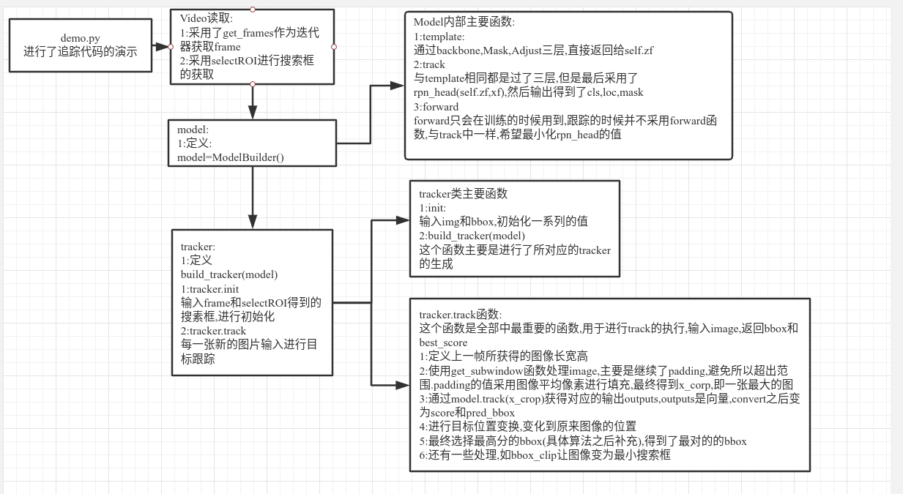


##### (4) tracker部分

> tracker应该是逻辑的实现代码

###### a. 基本类型创建

1. 基本类型创建:

     ```
     tracker = build_tracker(model)#采用字典调用了所对应的模型
     ```

     - build_tracker中进行了三种模型的选择:

          SiamRPNTracker

          SiamMaskTracker

          SiamRPNLTTracker


###### b. SiamRPNTracker类

**SiamRPNTracker:**

> 先这对一个跟踪的类进行识别任务完成

首先,他继承于SiameseTracker类


#### 1.1.3 Yolo V3

> 想要快速地验证一些成果,因此就直接使用YOLO V3进行一下验证,效果如何不是非常确定了,只是初步地拿出效果来,看看情况

- 使用代码 https://github.com/eriklindernoren/PyTorch-YOLOv3

##### (1) 文件结构

1. config

     config文件夹中包括了.data和.cfg文件

     - .cfg文件主要进行卷积层数,网络结构定义等问题的解决
     - .data文件中只是包含了train,valid的路径等的操作

2. data

     data文件夹中他的存储直接采用txt文件进行读写等的操作

3. output

     处理完后的图像输出效果

4. utils

     - augmentations

          按照给定维度进行图像旋转,获得所对应的图像变换

     - datasets:

          此文件夹定义了ImageFolder和ListDataset两个类,都是继承dataset的

##### (2) 文件详解


#### 1.1.4 CenterNet

> CenterNet的使用主要还是使了包调用对应的参数,整体也不算难,就是还是花了一些时间看了这个整体的工程结构
>
> 另外,一个比较大的问题是在于没有生成coco数据集的经验,因此这一部分也做了一些时间


##### (1) 配置问题

- 使用DVNv2

     安装的时候需要使用到DCNv2这个东西,好像是一种网络结果,使用了cuda编译之后速度可以提升,但是因为centernet本身提供的是pytorch0.4版本所对应的DCNv2,不能够使用,因此上github上面找到了1.0所支持的DCNv2,需要下载源码,同时把这个源码替换到工程代码本身的DCNV4的内容,才可以使用

     所对应的连接在:

     https://github.com/CharlesShang/DCNv2

- 会自动下载一个预训练的pth

     (其实所有的都会下载一个pth,dla的在pose_dla_dcn中,而resxx的在msra_resnet中)

     直接改变其中一个py文件中的预训练的False
     
     直接change pose_dla_dcn.py get_pose_net function下面的model中 "pretrained=False".


##### (2) 工程结构理解

> CenterNet的主体是使用了opts进行全局的任务操作的,也就是所有的网络结构等的信息,都是在opts的初始化参数系统中进行任务的完成的.训练,数据集,网络结构等,都是通过一个factory进行选择的

> 所有的实现代码都是在lib文件夹下的

###### a. opts.py

这个python文件是在lib的目录下,进行的是各种结构的初始化工作,比如数据集的准备,使用任务的准备等等


###### b. lib文件夹

> lib文件夹下包含了datasets detectors models等的包,神经网络的所有部分都在这一个文件夹中进行实现的

1. **datasets:**

     > 这一块包含了dataset与sample两个文件,然后包含了一个dataset_factory.py的文件.这个工厂文件就是用来进行调控这两个文件中的py代码的.两个文件夹中的代码分别是进行了各种数据集的dataset的包含,比如coco,kitti,同时还包含了另外的ctdet,ddd(这两块不是很清楚他们具体指代的是什么意思)

     - **coco.py**

          coco.py的dataset中,主要返回的是一个detections的dict,detections中包含了detection,detection中主要存放了一个bbox

          - image_id
          - category_id
          - bbox
          - score(好像没什么用)

     - **ctdet.py**

          这里面使用了gititem的工具,但是不是很懂这一块的具体任务.这一个还需要之后好好滴看代码

     - 


###### c. tools文件夹

> tools中最重要的是包含了kitti转coco的方法,需要自己构建coco结构的数据集,主要就是参考这个.py文件


###### d. src文件夹

> src文件夹下包含了demo.py,  test.py,  main.py三个文件夹,分别用于结果检验,代码测试,训练


###### e. train文件夹

> train中是进行训练任务的完成,主要的特色是直接使用了一个model,要求输入model和loss这两个东西,然后送入一个x,通过output=model(x) 得到输出,之后就可以得到其所对应的损失结果,然后进行梯度下降

```python
class ModelWithLoss(torch.nn.Module):
  def __init__(self, model, loss):
    super(ModelWithLoss, self).__init__()
    self.model = model
    self.loss = loss
  
  def forward(self, batch):
    outputs = self.model(batch['input'])
    loss, loss_stats = self.loss(outputs, batch)
    return outputs[-1], loss, loss_stats
```

- - 需要吸纳送入model和loss
     - outputs是通过model,由送入的batch中的['input']进行数据输出
     - 使用loss,得到outputs和loss中的差距(loss的定义还需要去看一下)
     - 最后返回了ouputs,loss,loss_stats

- 最终的训练在BaseTrainer这个类中实现,其实还是按照了loss.backward()的方式进行参数更新


###### f.随手记

> 这一块随便记录一些东西,之后一起进行整合

- 网络结构这一块有一个DCN的网络,这个网络也有很多东西
- 工程目录主要还是看src中的内容


- src中,包含了三个直接执行的demo,main,test的py文件(\_init\_paths.py文件是用于将lib文件添加到python的执行环境中)
- 然后是包含了lib和tools这两个文件夹,lib中主要的代码实现文件夹包括datasets,detectors,model,trains,utils这五个大的文件夹,同时还有一个opts.py进行全部参数的预定义


###### demo.py 

这一块是分开了视频和图像两种处理方法进行处理,主要是使用detector.run进行识别任务的


- os.path.isdir()用于判断一个对象是否是目录

- os.path.isfile()用于判断一个对象是否是文件

- sort与sorted:

     sort应用于list上,sorted应用于可迭代的对象上(这个sort在名称排序上也见过,需要去好好弄一下)

- demo中主要使用的是detect.run()的函数完成任务

- torch.cuda.synchronize:用于进行计时的操作


**BaseDetector.run()**

这个函数进行目标的识别操作

- 先进行了图像/图像路径/tensor的判断

- 进行图像预处理,得到images和meta两个东西

- 其中包含了几个主要函数:

     - pre_process()

          送入image,scale,传出meta.scale是opts中规定的识别尺寸

          使用了cv2.getAffineTransform进行尺寸变换

          仿射变换Affine

          PerspectiveTransform:投射变换

          这两块有时间需要去看

          最终image进行了仿射变换,变换到Tensor.而meta返回了一个dict,保存了c,s,out_height,out_width(应该是用于记录变换尺寸的?)

          

     - process()

          这里直接是进行了raise NotImplementedError的操作,就是为了让别人进行这个的继承

          这一块应该是用于让别人进行继承,如果继承了就没有问题,否则会报错,process的实际完成应该是具体的识别的py文件中进行识别的

          参考资料:https://www.php.cn/python-tutorials-393743.html

          这一块是类的使用中的问题

          - ctdet.py:

               这里进行实际的识别的内部内容的完成,如果需要自己的识别任务,就需要继承baseDetector,然后进行操作

               在debugger中,实现了对应的添加英文字母的操作

               画图中它使用了getTextSize进行矩形框的绘制

               颜色的赋值中,采用了tolist的操作,是将数组变成列表的操作

               绘制图案中,采用了add_coco_bbox的操作进行绘制,在rectangel中,是使用了getTextSize进行框的生成

     - post_process()
     
     - merge_outputs()


##### (3) 自己数据集使用

> 主要参考的文章:https://blog.csdn.net/weixin_41765699/article/details/100118353

###### a. voc->coco

> voc是一个文件一个xml的方式进行标注的,coco是一个json文件进行了所有图片的标注
>
> 标注主要就是给定bbox以及对应的id,image_id,其他的东西不太需要进行准备

- 首先是需要生成对应的coco数据集格式的json文件.

     这一块的数据生成感觉也算是随意.本质上json文件就是用于存放一堆xml的地方.xml的解析采用ET的方案还算是可以的,整体的代码不算复杂

- 注意在annotations中,image_id和id是不同的.id是每一个目标一个id

     ```python
import pickle
     import json
     import numpy as np
     import cv2
     import os
     import xml.etree.ElementTree as ET
     
     
     def convert2coco(xml_dir):
         """
         xml_dir:这个文件夹下包含了一系列的xml文件
         """
         cats=['car','redarmor','bluearmor','greyarmor','base','watcher','ignore']#一共希望分成的所属类别
         cat_info=[]
         for i,cat in enumerate(cats):
             cat_info.append({'name':cat,'id':i+1})
         print(cat_info)
     
         ret={'images':[],'annotations':[],"categories":cat_info}#需要生成的json文件格式
         """
         在images中的每一个image需要插入:
         filename:直接是对一个路径的.png文件
         id:图像的id
         (其他比如height和width可以不放在这里面)
     
         在annotations中的每一个annotation需要插入的参数:
         image_id:
         id:这两个干脆设置成一样的算了
         category_id:即对应的类别编号
         bbox:需要是一个xywh的结构,xy是左上角
         occluded:是否有遮挡
         (segmentation没有好像也可以)
         """
         
         #开始进行数据解析
         num=0
         image_id=0
         xml_files=os.listdir(xml_dir)#/home/elevenjiang/Documents/Project/RM/Code/Dataset/Tococo/image_annotation
         for line in xml_files:
     
             if num%50==0:
                 print("processing ",num,"; file ",line)
     
          
             #存入图片信息
             xml_f=os.path.join(xml_dir,line)#如果需要索引绝对路径的才进行这个操作
             filename=line[0:-4]#去除掉后面的.xml
             filename=filename+".jpg"
             image={'file_name':filename,'id':int(image_id)}
             ret['images'].append(image)
     
             #存入标注信息
             tree=ET.parse(xml_f)
     
             for obj in tree.findall('object'):
                 name=obj.find('name').text
                 
                 bndbox=obj.find('bndbox')
                 xmin=int(float(bndbox.find('xmin').text))
                 xmax=int(float(bndbox.find('xmax').text))
                 ymin=int(float(bndbox.find('ymin').text))
                 ymax=int(float(bndbox.find('ymax').text))
                 difficult=0
                 category_id=7
                 if obj.find('difficulty') is not None:
                     difficult=int(obj.find('difficulty').text)
     
                 #进行车子的分类
                 if name=="car":
                     category_id=1
                     difficult=difficult
     
                 
                 if name=='armor':
                     armor_color=obj.find('armor_color').text
                     if armor_color=='red':
                         category_id=2
                         
                     elif armor_color=='blue':
                         category_id=3
                         
                     elif armor_color=='grey':
                         category_id=4
     
                 if name=='base':
                     category_id=5
                     difficult=difficult
     
     
                 if name=='watcher':
                     category_id=6
                     difficult=difficult
                 
                 ann={'image_id':image_id,'id':int(len(ret['annotations'])+1),'category_id':category_id,'bbox':[xmin,ymin,abs(xmax-xmin),abs(ymax-ymin)],'occluded':difficult}
                 ret['annotations'].append(ann)
     
             #进行image_id数更新
             num=num+1
             image_id=image_id+1
             # if image_id>500:
             #     break
     
         out_path="./newtrain_5k.json"
         json.dump(ret,open(out_path,'w'))
     
     if __name__ == "__main__":
     	 xml_dir="/home/elevenjiang/Documents/Project/RM/Code/Dataset/CenterData/Train/image_annotation"
         convert2coco(xml_dir)
         
            
     ```
     
- 这里面的参数赋值其实是比较随意的,都可以进行赋值操作
  
     - 发现真正导致数据不收敛的是因为数据做错了


###### b. 创建对应文件

> 创建对应文件主要是dataset中新增一个rm.py的文件专门用于自己的数据(直接抄coco的改改名称就好),同时更改opts中的数据集,改成是自己的数据集就好了.具体内容解释不清楚可以查看那个CSDN博客

**前面需要在环境配置中,在src/lib/models/network的文件夹中添加DCNv2的文件夹,同时取消掉下载的操作,具体的查看配置问题进行解决**

1. **添加rm.py文件**

     直接在datasets/dataset的文件夹下添加一个rm.py文件,把coco.py的文件复制过来即可,然后其中需要更改的地方为:

     - 把coco的类变换为RM的类(同时后面的super也需要改名称)

     - num_classes=80改成自己希望的类别数

     - 对data_dir进行修改,data_dir是全局的路径,而img_dir是所有文件存储的位置

     - split=='val':

          这一块需要修改几个路径:

          (其实本质上都是采用os.path.join进行路径合并,因此需要就根据刚刚配置的路径放文件就好了)

          ```python
           if split == 'val':
                self.annot_path = os.path.join(
                    self.data_dir, 'annotations', 
                    'instances_val2017.json')#data_dir/annotations/image_info_test-dev2017.json
              else:
                if opt.task == 'exdet':
                  self.annot_path = os.path.join(
                    self.data_dir, 'annotations', 
                    'instances_train2017.json')#data_dir/annotations/instances_extreme_train2017.json
                else:
                  self.annot_path = os.path.join(
                    self.data_dir, 'annotations', 
                    'instances_train2017.json')#data_dir/annotations/instances__train2017.json
          ```

     - 修改其中的class_name和_valid_ids

          这一块其实更正的id是从1开始,而不是从0开始,但是感觉影响并不大

2. **修改dataset_factory**

     在dataset_factory中添加自己的类(在COCO的同级下添加,而不是在sample_factory中添加)

3. **修改opts.py**

     - ```python
          self.parser.add_argument('--dataset', default='rm',help='coco | kitti | coco_hp | pascal |rm)
          ```

          此处的ped改为rm即可

     - default_dataset_info中的num_classes变为对应的类(即ctdet中修改num_classes)

4. **修改debugger.py**

     在其中添加上自己的类别

     
     
     - 如果显示的结果的命名不对,是这里出现了的datset应该命名为coco


5. **准备数据集:**

     放置文件的格式为:(文件格式readme中的development.md也说了)

     ```
     data
     └── coco
         ├── annotations
         ├── train2017
         └── val2017
     ```

     - 在data目录下方式coco这个数据集,其中annotations中放置json文件(与dafault中的json文件名字相同)

          ```
          instances_train2017.json
          instances_val2017.json
          ```

     - train2017和val2017文件夹下面分别放置训练和验证的图片(图片可以多不可以少)
     
          如果有的数据不够,或者会进行图片报错,可以在datasets/sample/ctdet.py中_ gettitem _的函数读取图片中固定读一张图片:
     
          ```python
          img = cv2.imread(img_path)
          try:
              height, width = img.shape[0], img.shape[1]
              except:
                  img=cv2.imread("/home/elevenjiang/Documents/Project/RM/Code/CenterNet/CenterNet-master_suitcate/data/coco/train2017/1.jpg")
                  height, width = img.shape[0], img.shape[1]
                  print("缺少这张图片:",img_path)
          ```
     
          


###### c. 训练

> 有了生成的对应model,最后的生成问题就不大了.

训练代码:

```
python main.py ctdet --exp_id res18 --batch_size 16 --master_batch 15 --lr 1.25e-4 --load_model ../models/model_last.pth
```


```
python main.py ctdet --exp_id coco_dla --batch_size 8 --master_batch 15 --lr 1.25e-4 --load_model ../models/model_last.pth
```

```
python main.py ctdet --exp_id coco_dla --batch_size 8 --master_batch 15 --lr 1.25e-4 --load_model ../exp/ctdet/coco_dla/model_last.pth
```

python main.py ctdet --exp_id coco_dla --batch_size 8 --master_batch 15 --lr 1.25e-4 --load_model ../models/model_last.pth


- 训练中的不同的数据集:
     - instances_train20170224.json:这个是直接进行了xml的移植
     - fourclass_json5k.json:这个是自己写的4个类别的判断的效果


###### d. 结果验证

```
python demo.py ctdet --demo /home/elevenjiang/Desktop/output.mp4 --load_model ../models/model_best.pth
```

```
python demo.py ctdet --demo /home/elevenjiang/Desktop/output.mp4 --load_model ../exp/ctdet/coco_dla/model_last.pth
```

- 不同训练参数的:

     - model_last_originxml.pth:直接是进行了基本转换的效果

          其对应了src0224的文件夹,这个文件夹的代码是可以进行原来xml的正确解析的

     - (4) 不同数据集方案

python demo.py ctdet --demo /home/elevenjiang/Desktop/output.mp4 --load_model ../exp/ctdet/coco_dla/model_last.pth


python demo.py ctdet --demo ../images/20200418-14-50.avi --load_model ../exp/ctdet/coco_dla/model_last.pth


> 不打算识别装甲板,而是打算按照原来的想法,直接识别大小车(红蓝),感觉这样子的效果会更好.而且装甲板识别很容易出错,等之后成功识别了车子之后再进行装甲板的识别解决

**识别方案:**

1. 识别大小蓝,大小红,哨兵一共5个.


```
python demo.py ctdet --demo ../ck_people.avi --load_model /home/elevenjiang/Documents/Project/RM/Code/CenterNet/OneClass_0419/model_last.pth
```


##### (5) 快速使用方案

> 本身CenterNet也提供了一个给我们进行识别的操作

> 不过调用他的包的时候需要注意,其底层的.lib文件是需要进行更改的,否则也会有大问题

```python
import sys
CENTERNET_PATH = /path/to/CenterNet/src/lib/
sys.path.insert(0, CENTERNET_PATH)

from detectors.detector_factory import detector_factory
from opts import opts

MODEL_PATH = /path/to/model
TASK = 'ctdet' # or 'multi_pose' for human pose estimation
opt = opts().init('{} --load_model {}'.format(TASK, MODEL_PATH).split(' '))
detector = detector_factory[opt.task](opt)

img = image/or/path/to/your/image/
ret = detector.run(img)['results']
```

其中,ret的值为:(dict中也可以包括实际的数字)

```python
#如果不确定内部包含什么,可以直接print( ret.keys() ) 查看内部有什么
{category_id : [[x1, y1, x2, y2, score], ...], }

```


使用实际例子:

```python
import sys
import cv2
CENTERNET_PATH ="/home/elevenjiang/Documents/Project/RM/Code/CenterNet/CenterNet-master/src/lib"


sys.path.insert(0, CENTERNET_PATH)

from detectors.detector_factory import detector_factory
from opts import opts

MODEL_PATH ="/home/elevenjiang/Documents/Project/RM/Code/CenterNet/CenterNet-master/exp/ctdet/coco_dla/model_best.pth"

TASK = 'ctdet' # or 'multi_pose' for human pose estimation
opt = opts().init('{} --load_model {}'.format(TASK, MODEL_PATH).split(' '))
detector = detector_factory[opt.task](opt)

img = "/home/elevenjiang/Documents/Project/RM/Code/CenterNet/CenterNet-master/images/AllianceVsArtisans_BO2_2_32.jpg"
ret = detector.run(img)['results']
#识别

print(len(ret))

for key in ret.keys():
    print(key)


image=cv2.imread(img)
for i in range(len(ret)):
    for result in ret[i+1]:
        if result[4]>0.9:
            cv2.rectangle(image,( int(result[0]),int(result[1]) ) ,(int(result[2]),int(result[3]) ),(0,0,255),1 )

cv2.imshow("image",image)
cv2.waitKey(0)


```


##### (5) 随手记

> 因为在调整的时候遇到了很多很细但是很杂的问题,因此这一块都放到这里来


#### 1.1.5 足球场定位

> 发现足球也好,篮球也好,都是需要进行目标跟踪的,而且他们的那种机子位置肯定也是追随者目标运动的,因此这一块也是可以进行参考

- 大概看了一个,好像是使用而来meanshift的方案去做目标跟踪的


##### (1) 华中科大足球定位

> http://kns.cnki.net/KCMS/detail/detail.aspx?dbcode=CMFD&filename=2009037207.nh
>

- 足球检测与跟踪
- 主要是基于卡尔曼预测与模板匹配,这篇文章主要是基于维特比的方法做到 
- 有一些是直接采用卡尔曼滤波,预测可能的道路,然后看整个道路上的正确率是多少进行最优解的确定
- 区域增长法进行图像分割
- 边缘提取(Marr算子(LOG滤波器),Canny算子)
- 光流法的作用?
- 卡尔曼滤波进行候选框的缩小,从而更有可能地提高检测效果

- https://www.jianshu.com/p/7d15cbe53866

     这个采用了meanshift进行目标跟踪等的任务


### 1.2 DJI数据集解析

> DJI也给了所对应的数据集,包括车子bbox和装甲板信息,但是数据集似乎有一些错误,这个不知道应该怎么处理了,需要重新找一些解决办法

#### 1.2.1 DJI文件对应名称

- 文件一共分为Central,Fianl,North,South四个文件夹,其中South文件夹中只有image,没有annotation
     - South:
          - 只包含iamge,一共1160张图片
     - North:
          - image中有387张
          - annotation有:2474个
     - Fianl:
          - image有2685
          - annotation有2685
     - Central:
          - image有2655
          - annotation有2655
- 经过数据测试,发现所对应的标注文件的xml中的filename是错误的,应该是.xml和.jpg同名就是正确的数据集了,基于此,完成数据集的初步解析


#### 1.2.2 XML文件内容解析

> 完成了最基本的识别任务,接下来就是需要开始针对于数据集内容进行解析了

##### (1) 中部赛区

- 中部赛区的这个数据集都是几乎一个尺度不变的视野,也就是一个观众席位置的视频点
- xml中,重要的信息有:


##### (2) 总决赛

- 总决赛的视角在不停的变化,有远近的图,这个进行跟踪比较难


##### (3) 另外两个错误数据集

> 算了,还是不用他们了,专心于解析中部和总决赛信息就算了


#### 1.2.2 数据解析代码


### 1.3 Colab训练情况

1. 就让他整体训练100次,看看整体的效果,在第7-8轮的时候,整体已经卡到total_loss在3-4.5之间,而且mAP有高有低
     - 第6个epoch的mAP为0.464,而第7个epoch为0.416,还是有一定的差别的,因此之后的epoch的选择上面可能也需要下一定的功夫了


## 2. 数据集标注软件

> 打算采用目标跟踪进行目标的跟踪任务,从而可以替代手动进行数据的标注任务,这一块的完成会比较方便进行比赛场的数据采集任务
>
> 花了两天时间基本上目前是可以进行标注了,但是内部还是很多地方不完善,至少代码写的不美,之后还是需要进行改进

### 2.1 工程框架

**初版:**

​	初版直接采用了KCF进行等级,同时导出的是txt的文件,如果需要转成json的格式还需要一定的东西(不过有了XYZ就还算好弄)

​	目前存在的问题就是用起来并不是交互性很好,而且其实跟踪框也并不算特别好,当然了最快能解决的就是把代码重构一下,至少能说好看.这一些都需要一点点地进行解决.


#### 2.1.1 使用说明

- videoToPicture:

     送入视频路径,以及生成图片的对应路径,begin_number用于进行初始化的开始图片参数

- 使用autoLabel进行数据标注

- 由标注数据生成json训练文件


### 2.2 完成时记录

> 全部基于Python进行书写,u1s1,Python的开发真的是很快

- 保存方式:

     ```
     种类,x,y,w,h(x是左上角)
     ```

- 路径配置:

     需要在Code的文件夹下进行执行.路径的配置其实也没有太好地进行管理

- 发现视频文件可以一直读取,但是一直读下去并没有太多的图片可以读,所以需要判断一下ret是否还有图片

- 对于waitKey的输入:

     

     - 回车是13,数字0对应了ascii的0


txt写入:

- txt写入要求每一次的写入都需要加上一个\n进行分隔开


KCF跟踪

- 如果需要opencv-python-contirbute的包,可以直接进行安装

     ```
     pip install opencv-contirb-python
     ```

     - 这个选中了之后就可以使用跟踪了


### 2.3 提升部分

- 存在一堆Bug,记录下来待解决和解决的方案

     - 可以允许有查看模式和制作标签模式,不是所有的都只能进行制作标签

          解决方案:直接定义保存操作为s,回车键的更新随意

     - 可以允许进行旧数据标签的修改

          解决方案:这个通过添加一个索引id进行了解决

     - 当目标消失时候的解决方法

          解决方案:直接不进行目标的保存就行

     - 还需要一个展示的图片,否则跟踪器会直接跟踪到展示的图片上面

          解决方案:直接创建了一个origin_image,标注在image上面,跟踪origin_iamge

     - 还需要进行旧的图片的信息删除,否则会出BUG

          可以进行删除,但是删除的方法太过于麻烦了,这一块的if else写的不够多

     - 需要允许标注的时候没有选对搜索框,或者说是重新来过
     
     - 多个视频送入的时候,有可能需要不断地进行配置.这一块的代码也需要进行准别
     
     - 确保每一个Entry都是输入了一个参数


## 3. 小地图显示

> 小地图显示打算直接采用一个imshow,对于不同位置进行不同位置的imshow的操作完成对应的任务,输入对应的xyz,如果超出位置就不进行索引,没有超出位置就索引

### 3.1 单目ProjectPoint

> 发现了ProjectPoint中出现了Bug,因此就一点点地想办法找一下BUG
>
> 2020.3.12:
>
> ​	今天发现ProjectPoint的畸变映射存在一些问题,如果使用畸变,就会产生一些坏值,但是不使用畸变,距离远了之后会出现一定的距离偏差

#### 3.1.1 ProjectPoint源码

> 因为不知道怎么实现的,因此就去看了一下ProjectPoint的Cpp源码,跟我想的一样,显示进行了坐标系的变换(使用rvec和tvec),然后是乘上了内参矩阵

1. 先让实际点XYZ乘上先通过rvec和tvec生成的Affine3d矩阵,获得空间3D点(即生成的4x4位姿矩阵)
2. 接着进行坐标系归一化,即获得了x=X/Z和y=Y/Z
3. 计算r=根号(x^2^+y^2^)
4. 获取theta,theta=atan(r)
5. 获取theta2到theat9(其实就是theta的多少次方)
6. 计算thetad(这一块是用于消除畸变的)
7. 最后,直接用相机内参乘上x,y,1这个归一化坐标系,得到像素中的uv

发现,如果直接使用ProjectPoint的内容,那么由于畸变矩阵的考虑,很容易出现一些奇怪的值,为此,不使用畸变矩阵,即畸变矩阵变成了(0,0,0,0,0),从而不会出现偶然的问题


**效果显示:**

每个点之间可以进行距离可以进行自定义选取,从而提升精度


numpy代码验证:

```python
import numpy as np
#变换到相机坐标系
Transform=np.array(([[ 8.74925928e-01, -7.43494962e-02 ,-4.78515175e-01, -5.06961339e+00],
                    [ 6.32689573e-02,  9.97223915e-01, -3.92619618e-02 ,-1.22592217e+01],
                   [ 4.80105884e-01  ,4.07615219e-03,  8.77201075e-01 , 1.42617898e+02],
[ 0.00000000e+00 , 0.00000000e+00  ,0.00000000e+00 , 1.00000000e+00]]))
point_4D=np.array(([0,20,0,1]))
out=Transform@point_4D#乘上XYZ1得到相机相机坐标系位子
print(out)

#归一化坐标系平面
point_normalize=np.array([[out[0]/out[2],out[1]/out[2],1]])
point_normalize=point_normalize.T
print(point_normalize)
camera_matrix=np.array([[660.98976401  , 0.    ,     310.80145632],
                        [  0.      ,   663.58257972, 212.52214799],
                       [  0.       ,    0.    ,       1.        ]])
print(camera_matrix)

#乘上目标矩阵,得到uv
UV=camera_matrix@point_normalize
print(UV)


```


##### (1) 是否使用畸变区别


##### (2) 点映射

> 首先先需要确定点在哪个位置,由于都是不规则的矩形,因此需要用最小二乘法求出每条边的k,b,然后判断点在这条线的上方/下方(同时斜率的正负,上下也不同).从而最终确定点属于某一个位置的索引


#### 3.1.2 全地图生成

> 接下来就是需要生成一整张地图,用于进行效果展示,看看那能否进行一个XYZ索引操作

这里的对应位置索引,直接认为是线性的,从而计算出最终结果

- 由于搜索框较大,导致了测距不准确


同一水平位置,距离差了40cm


- 当当BBOX的点比较准确的时候,准确定可以在10cm以内


#### 3.1.3 存在问题

- 目前场地较小,之后需要放到更大的场地进行测试,同时采用像素更高的摄像设备,从而看远距离效果如何
- 搜索到的点依赖于BoundingBox的准确度,如果BBOX不准确,点的变动情况也会发生很大的变化


## 4. 数字标牌二次识别

> **第一版总目标:基于所有车子的图片,在车子的图片上面进行识别,找到装甲板. 装甲板一共分为10个类,即5台车,2边.**

> 2020.3.14:
>
> ​	为了进行更精细的识别,给自己一周的时间复现一个网络结构,然后用自己的数据集进行标签的识别,得到对应的目标.先不要想太复杂的,效率什么的都不需要考虑到最好,目前只需要进行一些简单的操作就行了
>
> 2020.3.15:
>
> ​	这一次完全自己做一个,基于所有车子的图片,**在车子图片上面进行装甲板的识别,然后进行10分类,**网络模型自己构建,数据集自己准备,完全地进行第一次的网络的构建


### 4.1 数据集准备

> 不管其他,首先还是需要进行数据集的提取和解析任务


#### 4.1.1 制作装甲板专门数据集

- **判断装甲板所属:**

     判断某块装甲板属于某个类,直接采用判断这个装甲板的bbox是否在在车子的bbox上面,如果在上面则认为是这个车子的armor

     

- **生成数据集:**

     每个车子都要进行单独的图片提取,然后是上面的装甲板位置也需要进行一下简单处理


#### 4.1.2 重新制作数据集

> 因为上一次的训练情况有一点的Bug,导致了很多误识别会识别成5,这个是存在问题的,因此打算重新进行训练,整体训练分成两个部分,第一个是完成不同赛区数据集的交叉验证,第二部分是进行颜色增强,测试基地装甲板的效果

##### (1) 采用总决赛数据预测分区赛数据

- 由于分区赛中不包含5号装甲板,因此只能够采用总决赛的数据进行中部分区赛的数据验证

- 总决赛生成了15503个车子的图片,把这些进行训练,训练直接执行train_myself.py的文件即可

     ```
     python3 train_myself.py
     ```

     

##### (2) nms横向类别

> 很多地方装甲板会重复识别,这个时候就需要采用横向nms进行处理了

##### (1) 横向NMS

由于一个装甲板可能会被识别成多个类别,因此这里采用了横向NMS,即基于所有最高的置信度进行目标的筛选工作,从而重复识别的问题得到了解决

NMS的学习代码

```python
def non_max_suppression(prediction, conf_thres=0.5, nms_thres=0.4):
    """
    Removes detections with lower object confidence score than 'conf_thres' and performs
    Non-Maximum Suppression to further filter detections.
    Returns detections with shape:
        (x1, y1, x2, y2, object_conf, class_score, class_pred)
    """
    # From (center x, center y, width, height) to (x1, y1, x2, y2)
    prediction[..., :4] = xywh2xyxy(prediction[..., :4])#先进行变换

    output = [None for _ in range(len(prediction))]#此处生成了len(prediction)个None的list,一个图片的Tensor对应一个prediction,因此一张图片就一个

    for image_i, image_pred in enumerate(prediction):
        # Filter out confidence scores below threshold
        #所有原始的image_pred为:[10647,17]
        image_pred = image_pred[image_pred[:, 4] >= conf_thres]#先进行了概率阈值的筛选,这里可以筛选到[N,17],N往往小于100

        # If none are remaining => process next image
        if not image_pred.size(0):#没有高于阈值的就不再进行处理
            continue

        # Object confidence times class confidence
        score = image_pred[:, 4] * image_pred[:, 5:].max(1)[0]#通过目标分数乘以种类分数,得到score,shape为N
        
        # Sort by it
        image_pred = image_pred[(-score).argsort()]#从小到大排序得到分数,采用负score,得到从大到小的结果,shape为[N,17]
        class_confs, class_preds = image_pred[:, 5:].max(1, keepdim=True)#class_confs和class_preds的尺寸都是[N,1],从第5个之后,就是所有类别的分数,在所有分数中选择最大的分数作为对应的类别,然后是获得这个类别对应的编号class_preds
        detections = torch.cat((image_pred[:, :5], class_confs.float(), class_preds.float()), 1)#最后拼接成一个7维的目标

        # Perform non-maximum suppression
        keep_boxes = []#用于保存的boxes
        while detections.size(0):#detections.size(0)是最后detections解析之后所剩的目标
            large_overlap = bbox_iou(detections[0, :4].unsqueeze(0), detections[:, :4]) > nms_thres#第0个和所有其他的进行比对,得到一个detections.size(0)的Tensor
            
            #把label注释掉了,因此全部的都进行融合
            label_match = detections[0, -1] == detections[:, -1]#用于比较每个目标的label是否相同,从而知道类别是否相同,同一个类别才进行NMS操作
            print("label_match",label_match)
            print("label_match",label_match.shape)

            # Indices of boxes with lower confidence scores, large IOUs and matching labels
            invalid = large_overlap & label_match  #两个目标重叠超出一定值,且相同label的,是无效的detections,这里也是detections.size(0)的值,指代了无效的bbox
            
            
            weights = detections[invalid, 4:5]#object_conf,即这个bbox的object_conf

            # Merge overlapping bboxes by order of confidence
            detections[0, :4] = (weights * detections[invalid, :4]).sum(0) / weights.sum()#把取消了的detections进行了融合操作,即取了一个平均,从而获得了这个类别的分数
            keep_boxes += [detections[0]]#最终保存的box

            detections = detections[~invalid]#对剩下的目标进行处理,所有有效的图片称为新的detections


        if keep_boxes:
            output[image_i] = torch.stack(keep_boxes)#把所有的目标进行拼接

    return output#可能会返回[]
```


NMS的更改代码(为了横向比较,去除了类别相同的处理)

```python
def non_max_suppression(prediction, conf_thres=0.5, nms_thres=0.4):
    """
    Removes detections with lower object confidence score than 'conf_thres' and performs
    Non-Maximum Suppression to further filter detections.
    Returns detections with shape:
        (x1, y1, x2, y2, object_conf, class_score, class_pred)
    """
    # From (center x, center y, width, height) to (x1, y1, x2, y2)
    prediction[..., :4] = xywh2xyxy(prediction[..., :4])#先进行变换

    output = [None for _ in range(len(prediction))]#此处生成了len(prediction)个None的list,一个图片的Tensor对应一个prediction,因此一张图片就一个

    for image_i, image_pred in enumerate(prediction):
        # Filter out confidence scores below threshold
        #所有原始的image_pred为:[10647,17]
        image_pred = image_pred[image_pred[:, 4] >= conf_thres]#先进行了概率阈值的筛选,这里可以筛选到[N,17],N往往小于100

        # If none are remaining => process next image
        if not image_pred.size(0):#没有高于阈值的就不再进行处理
            continue

        # Object confidence times class confidence
        score = image_pred[:, 4] * image_pred[:, 5:].max(1)[0]#通过目标分数乘以种类分数,得到score,shape为N

        # Sort by it
        image_pred = image_pred[(-score).argsort()]#从小到大排序得到分数,采用负score,得到从大到小的结果,shape为[N,17]
        class_confs, class_preds = image_pred[:, 5:].max(1, keepdim=True)#class_confs和class_preds的尺寸都是[N,1],从第5个之后,就是所有类别的分数,在所有分数中选择最大的分数作为对应的类别,然后是获得这个类别对应的编号class_preds
        detections = torch.cat((image_pred[:, :5], class_confs.float(), class_preds.float()), 1)#最后拼接成一个7维的目标

        # Perform non-maximum suppression
        keep_boxes = []#用于保存的boxes
        while detections.size(0):#detections.size(0)是最后detections解析之后所剩的目标
            large_overlap = bbox_iou(detections[0, :4].unsqueeze(0), detections[:, :4]) > nms_thres#第0个和所有其他的进行比对,得到一个detections.size(0)的Tensor

            #把label注释掉了,因此全部的都进行融合
            # label_match = detections[0, -1] == detections[:, -1]#用于比较每个目标的label是否相同,从而知道类别是否相同,同一个类别才进行NMS操作
            

            # Indices of boxes with lower confidence scores, large IOUs and matching labels
            invalid = large_overlap #去除类别相同的处理 & label_match  #两个目标重叠超出一定值,且相同label的,是无效的detections,这里也是detections.size(0)的值,指代了无效的bbox

            weights = detections[invalid, 4:5]#object_conf,即这个bbox的object_conf

            # Merge overlapping bboxes by order of confidence
            detections[0, :4] = (weights * detections[invalid, :4]).sum(0) / weights.sum()#把取消了的detections进行了融合操作,即取了一个平均,从而获得了这个类别的分数
            keep_boxes += [detections[0]]#最终保存的box

            detections = detections[~invalid]#对剩下的目标进行处理,所有有效的图片称为新的detections


        if keep_boxes:
            output[image_i] = torch.stack(keep_boxes)#把所有的目标进行拼接

    return output#可能会返回[]
```

主要就是注释掉了label_match的操作


### 4.2 YOLO验证

> 经过一晚上的训练,YOLO出来的效果还是不错的,但是这个需要的是在车子的图片上进行识别,如果是在大图片上面,这个效果就会变得很差,这一块的确是一个新的思路,我们可以进行一个二级识别网络的创建.有一点回归到特征表示的层面上了.
>
> 但是如果可以从这里面进行一些新东西的寻找,那也将会变得很有意思

- **识别效果**

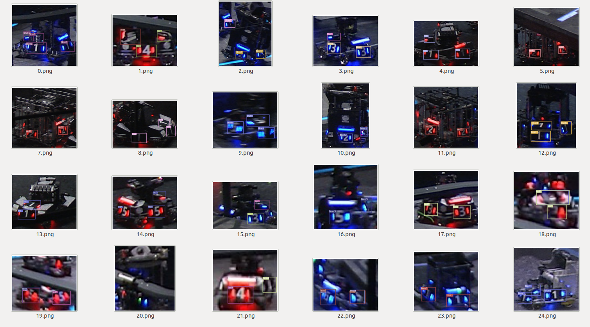


### 4.3 手动复现一个识别网络

> 因为YOLO的资料比较多,不妨就进行YOLO的代码复现,实现第一个自己的神经网络
>
> 主要的资料在Pytorch中进行


### 4.4 YOLO与CenterNet合并

> 目前已经知道了如何进行一个神经网络的构建,从网络的构建到数据集的准备到损失函数的确定以及评估等等.虽然仍然是没有自己敲出来代码,但是至少了是完成了这些任务,接下来就先针对性地进行运动目标检测,然后得出其中小方框中的内容进行识别

#### 4.4.1 包封装

- 因为很多神经网络的实现方法基本上相同,这就导致了很多包是相同的,因此这里需要进行一下神经网络的封装,另外就是要把识别的方法全部封装到一个类中,这样子调用起来就方便很多了,不需要一堆的初始化等的操作


#### 4.4.2 YOLOV3并行识别

- 发现由于每一次需要重复识别多张图片,导致装甲板识别的速度大大变慢,因此需要想办法进行多张照片的识别.同时,这多张照片并不能够保证是数量相同的,有可能一时间会很多张,另外的时候会很少张,这一块也需要进行一个平衡


##### (1) iter_able

pytorch的dataset包含了可以动态batchsize的操作,这一块可以去挖一下

- 不过发现可以直接cat一下,然后输出的东西是一个list,这样子就很舒服了,从而解决了并行的问题,目前至少的速度可以达到
- 最终决定,直接采用一个dict去保存,包括图片,图片左上点位置,以及他们输出的结果,然后进行综合,最终输出.另外,为了让整体的效果尽量好,也进行了再一次的提升


##### (2) 显存管理

> 发现其实可以进行显存管理,最简单的比如不进行数据跟踪.同时还可以计算总的显存大小,明确某一部分比较浪费显存

- https://blog.csdn.net/qq_28660035/article/details/80688427

- 如果不想要重复,可以直接

     ```python
     with torch.no_grad():
     	xxxx
     ```

     这样子显存可以小很多


###### (3) 时间计算

> 发现整体时间还是浪费在了YOLO的识别部分,这一块还是需要重新处理

```
CenterNet识别时间为:0.06416654586791992
Center处理时间为:0.00026226043701171875
Center处理总时间为:0.06442880630493164
YOLO识别时间为0.2918131351470947
YOLO处理时间为:0.0008158683776855469
YOLO处理总时间为:0.2926290035247803
进行到了第513帧
每一帧耗时为:0.3746635913848877s
***************************************************
CenterNet识别时间为:0.05684471130371094
Center处理时间为:0.0002675056457519531
Center处理总时间为:0.05711221694946289
YOLO识别时间为0.2914607524871826
YOLO处理时间为:0.0007719993591308594
YOLO处理总时间为:0.2922327518463135
进行到了第514帧
每一帧耗时为:0.36629533767700195s

```


接下来细分YOLO中导致时间较慢的原因


## 5. 神经网络泛化性问题

> 神经网络最担心的问题就是泛化性的问题,虽然比赛时候可以先对几辆车进行一个提前的识别,有5天的周期,但是和对手方的比赛实质上就是只有一场的,因此能否保证泛化是一个很大的topic

### 5.1 待验证

- 可以采用不同学校之间的,然后看看到实验室的识别,看看这两个之间能否有一个泛化
- 采用比赛视频中的某几个,然后和没有数据集的情况看,查看是否能够泛化
- **这一块的泛化都针对于车子这一个大类,只要能够处这个BBOX,细节的识别可以之后再说**


目前只制作一个类进行识别,就是车子的类,然后验证不同学校之间的泛化性如何

- 只选取总决赛的比赛中的几所,验证南部赛区的情况

     选取比赛场次:

     - 高巨毅恒VS狼牙


### 5.2 泛化失败

- 如果泛化失败,那么可能就需要考虑运动目标检测的方案进行识别,然后选择小的ROI进行装甲板的跟踪操作


## 6. 数据增强

> 数据增强,比如最基本的就是颜色方面的某个区域内的提升,从而提高颜色的容错性,另外,还可以进行其他的操作,比如AutoAugment的操作,学习一种自动增强的技术

### 6.1 数据增强方法

#### 6.1.1 AutoAugment

> 参考资料:https://blog.csdn.net/pwtd_huran/article/details/80868435
>
> 官方github:https://github.com/DeepVoltaire/AutoAugment

非常好用,直接生成多很多的数据集,然后就可以看到效果了,Nice啊非常,直接down下来那个github,然后就可以调用文件了

```python
from PIL import Image,ImageEnhance,ImageOps
from DataAugment.AutoAugment.autoaugment import ImageNetPolicy
import matplotlib.pyplot as plt
img=Image.open("../../temp_image/0.jpg")
img2=Image.open("../../temp_image/1.jpg")
policy=ImageNetPolicy()


imgs=[]
for _ in range(8):
    imgs.append(policy(img))


for _ in range(8):
    imgs.append(policy(img2))

def show_sixteen(images, titles=0):
    f, axarr = plt.subplots(4, 4, figsize=(15, 15), gridspec_kw={"wspace": 0, "hspace": 0})
    for idx, ax in enumerate(f.axes):
        ax.imshow(images[idx])
        ax.axis("off")
        if titles: ax.set_title(titles[idx])
    plt.show()


show_sixteen(imgs)
```


#### 6.1.2 PBA

> 参考资料:https://blog.csdn.net/qq_42793029/article/details/93975387?depth_1-utm_source=distribute.pc_relevant.none-task&utm_source=distribute.pc_relevant.none-task
>
> github:https://github.com/arcelien/pba


## 7. 训练数据

> 需要使用Tensorboard进行训练结果变化的查看,从而知道到底是增强了多少等的问题,需要大量的实验数据进行比对,同时还需要自己创建一个对比的情况,从而知道正确率等的问题


# 三 NIVDIA

> 发现这里面如果显存出现了问题,会导致其中其他也出现种种的问题,因此需要进行解决


# 四 tkinter

> 数据标注上面,还是需要进行GUI的使用,把这个工程给具体细化地进行完成,熟悉使用各种操作
>
> 这里面主要先进行tkinter和qt两个的使用说明,既然他们本质是画图,那么应该区别都不算特别大,可以进行使用

## 1. 环境安装

```
sudo apt-get install python-tk
```


## 2. 基本使用

> 官方手册:http://effbot.org/tkinterbook/

### 2.1 基本模块

一共有16个核心的窗口部件,进行GUI的绘制等的任务

**Button：**一个简单的按钮，用来执行一个命令或别的操作。

**Canvas：**组织图形。这个部件可以用来绘制图表和图，创建图形编辑器，实现定制窗口部件。

**Checkbutton：**代表一个变量，它有两个不同的值。点击这个按钮将会在这两个值间切换。

**Entry：**文本输入域。

**Frame：**一个容器窗口部件。帧可以有边框和背景，当创建一个应用程序或dialog(对话）版面时，帧被用来组织其它的窗口部件。

**Label：**显示一个文本或图象。

**Listbox：**显示供选方案的一个列表。listbox能够被配置来得到radiobutton或checklist的行为。

**Menu：**菜单条。用来实现下拉和弹出式菜单。

**Menubutton：**菜单按钮。用来实现下拉式菜单。

**Message：**显示一文本。类似label窗口部件，但是能够自动地调整文本到给定的宽度或比率。

**Radiobutton：**代表一个变量，它可以有多个值中的一个。点击它将为这个变量设置值，并且清除与这同一变量相关的其它radiobutton。

**Scale：**允许你通过滑块来设置一数字值。

**Scrollbar：**为配合使用canvas, entry, listbox, and text窗口部件的标准滚动条。

**Text：**格式化文本显示。允许你用不同的样式和属性来显示和编辑文本。同时支持内嵌图象和窗口。

**Toplevel：**一个容器窗口部件，作为一个单独的、最上面的窗口显示。

**messageBox**：消息框，用于显示你应用程序的消息框。(Python2中为tkMessagebox)


##### (1) 数据类型

> TK中提供了许多数据类型的选择,基于这些数据类型,可以很好地进行任务的使用

###### a. StringVar()

通常配合tk.StringVar()进行操作,从而可以进行string的变化

```python
tk_string=tk.StringVar()#定义一个String
tk_string.set("helloworld")#设置名称
data=tk_string.get()#进行
```


**使用实例:**

```python
#!/usr/bin/env python
# -*- coding: utf-8 -*-
# author:洪卫
 
import tkinter as tk  # 使用Tkinter前需要先导入
 
# 第1步，实例化object，建立窗口window
window = tk.Tk()
 
# 第2步，给窗口的可视化起名字
window.title('My Window')
 
# 第3步，设定窗口的大小(长 * 宽)
window.geometry('500x300')  # 这里的乘是小x
 
# 第4步，在图形界面上设定标签
var = tk.StringVar()    # 将label标签的内容设置为字符类型，用var来接收hit_me函数的传出内容用以显示在标签上
l = tk.Label(window, textvariable=var, bg='green', fg='white', font=('Arial', 12), width=30, height=2)
# 说明： bg为背景，fg为字体颜色，font为字体，width为长，height为高，这里的长和高是字符的长和高，比如height=2,就是标签有2个字符这么高
l.pack()
 
# 定义一个函数功能（内容自己自由编写），供点击Button按键时调用，调用命令参数command=函数名
on_hit = False
def hit_me():
    global on_hit
    if on_hit == False:
        on_hit = True
        var.set('you hit me')
    else:
        on_hit = False
        var.set('')
 
# 第5步，在窗口界面设置放置Button按键
b = tk.Button(window, text='hit me', font=('Arial', 12), width=10, height=1, command=hit_me)
b.pack()
 
# 第6步，主窗口循环显示
window.mainloop()
```


###### b. IntVar()

除了StringVar以外,还可以进行值的传递,即采用IntVar()进行操作


#### 2.1.1 常用模块

##### (1) TK

构建的全部的窗口是基于一个TK类,这个类上面可以进行许多操作

```python
window=tk.TK()#初始化这个类
wintow.title("My windows")#对Windows名称进行定义
window.geometry("500x300")#设置窗口大小,500x(字母x)300

#中间所有窗口的组件,如果是在window中的,需要进行显示

window.mainloop()#这是一个while循环,进行任务执行
```


- 实际举例

```python
import tkinter as tk  # 使用Tkinter前需要先导入
 
# 第1步，实例化object，建立窗口window
window = tk.Tk()
 
# 第2步，给窗口的可视化起名字
window.title('My Window')
 
# 第3步，设定窗口的大小(长 * 宽)
window.geometry('500x300')  # 这里的乘是小x
 
# 第4步，在图形界面上设定标签
l = tk.Label(window, text='你好！this is Tkinter', bg='green', font=('Arial', 12), width=30, height=2)
# 说明： bg为背景，font为字体，width为长，height为高，这里的长和高是字符的长和高，比如height=2,就是标签有2个字符这么高
 
# 第5步，放置标签
l.pack()    # Label内容content区域放置位置，自动调节尺寸
# 放置lable的方法有：1）l.pack(); 2)l.place();
 
# 第6步，主窗口循环显示
window.mainloop()
# 注意，loop因为是循环的意思，window.mainloop就会让window不断的刷新，如果没有mainloop,就是一个静态的window,传入进去的值就不会有循环，mainloop就相当于一个很大的while循环，有个while，每点击一次就会更新一次，所以我们必须要有循环

```


##### (2) label

> Label是一个标签,上面可以进行文字的书写

```python
l = tk.Label(master=window, text='你好！this is Tkinter', bg='green', font=('Arial', 12), width=30, height=2)
```

- master就是继承的窗口
- text是上面需要进行显示的
- bg是background
- font是文字格式
- width和height是这个label的大小


生成了l 的类以后,之后使用l.pack()或者l.place()进行具体位置的放置


##### (3) Button

> 用于实现各种按钮,按钮可以包含文本或者图片,同时使用一个关联的python函数进行这个方法的关联

```python
b=tk.Button(master=window,text="button",command=hit_me)
```

- master:主要的窗口

- text:button旁边的文字

- command:按下之后执行的函数

     执行的函数一般是if else的状态,分别记录按键被按下与否

     ```python
     number=1
     on_hit = False
     def hit_me():
         global on_hit
         global check
         if on_hit == False:
             on_hit = True#按下之后进行状态切换
             var.set('you hit me {}'.format(number))
             number=number+1
         else:
             on_hit = False
             var.set('')
     ```


###### a. command传递参数

如果需要执行函数,可以直接封装一个lamda函数进行参数的传递

```python
b = tk.Button(self.fatherWindow, text=text, width=width, command=lambda:self.beginMission(mission_name), font=self.font)
```

这里是想要执行beginMission的函数,通过一个lambda把mission_name封装起来,然后进行执行


##### (4) Entry

> 提供一个单行文本的输入域,用于进行文件的输入

```python
e1 = tk.Entry(window, show='*', font=('Arial', 14))   # 显示成密文形式
```

- master=window
- show: 对输入的内容进行处理,如果是*,则输入的全部都是 * 如果show=None,则显示的就是输出的内容
- font: 字体格式大小等


另外,对于输入的信息想要获取对应的string的,可以此采用:

```
string_toget=e1.get()#获取e1中的内容
```


**使用实例:**

```python
#!/usr/bin/env python
# -*- coding: utf-8 -*-
# author:洪卫

import tkinter as tk  # 使用Tkinter前需要先导入

# 第1步，实例化object，建立窗口window
window = tk.Tk()

# 第2步，给窗口的可视化起名字
window.title('My Window')

# 第3步，设定窗口的大小(长 * 宽)
window.geometry('500x300')  # 这里的乘是小x

# 第4步，在图形界面上设定输入框控件entry并放置控件
e1 = tk.Entry(window, show='*', font=('Arial', 14))   # 显示成密文形式
e2 = tk.Entry(window, show=None, font=('Arial', 14))  # 显示成明文形式
e1.pack()
e2.pack()

# 第5步，主窗口循环显示
window.mainloop()
```


##### (5) Text

> 提供一个多行文本区域,用于显示多行文本操作,可以用来收集用于输入的多行信息

```
t = tk.Text(window, height=3)#用于定义一个text的内容
t.insert(index="insert",chars=var)
```

采用t.insert在window中进行信息的插入,从而全部显示在Text中

index可以选择:

- "insert":在光标位置插入chars的内容
- "end":在末尾位置插入chars的内容


```python
#!/usr/bin/env python
# -*- coding: utf-8 -*-
# author:洪卫
 
import tkinter as tk  # 使用Tkinter前需要先导入
 
# 第1步，实例化object，建立窗口window
window = tk.Tk()
 
# 第2步，给窗口的可视化起名字
window.title('My Window')
 
# 第3步，设定窗口的大小(长 * 宽)
window.geometry('500x300')  # 这里的乘是小x
 
# 第4步，在图形界面上设定输入框控件entry框并放置
e = tk.Entry(window, show = None)#显示成明文形式
e.pack()
 
# 第5步，定义两个触发事件时的函数insert_point和insert_end（注意：因为Python的执行顺序是从上往下，所以函数一定要放在按钮的上面）
def insert_point(): # 在鼠标焦点处插入输入内容
    var = e.get()
    t.insert('insert', var)
def insert_end():   # 在文本框内容最后接着插入输入内容
    var = e.get()
    t.insert('end', var)
 
# 第6步，创建并放置两个按钮分别触发两种情况
b1 = tk.Button(window, text='insert point', width=10,
               height=2, command=insert_point)
b1.pack()
b2 = tk.Button(window, text='insert end', width=10,
               height=2, command=insert_end)
b2.pack()
 
# 第7步，创建并放置一个多行文本框text用以显示，指定height=3为文本框是三个字符高度
t = tk.Text(window, height=3)
t.pack()
 
# 第8步，主窗口循环显示
window.mainloop()
```


##### (6) Listbox

> 提供列表框的部件,显示可以选择方案的一个列表,从而可以用于配置得到radiobutton和checklist

```python
lb = tk.Listbox(window, listvariable=var2)
```

- master=window
- listvariable:进行显示的参数


###### a. 选项赋值

```python
#1:采用var2进行赋值
var2 = tk.StringVar()
var2.set((1,2,3,4)) 
lb = tk.Listbox(window, listvariable=var2)#赋值


#2:进行参数插入
list_items = [11,22,33,44]#创建一个列表
for item in list_items:
    lb.insert('end', item)  #在最后面进行新选项的插入
    
#2.1:具体位置插入
lb.insert(1, 'first')#在第一个位置加入'first'字符
lb.insert(2, 'second')#在第二个位置加入'second'字符
lb.delete(2)#删除第二个位置的字符
```


###### b. 选项输出

```python
value=lb.get(lb.curselection())
```

在lb中获取到lb当前的选项,也是一个string类型,如果没有进行选择,会出现报错,但是不会停止运行


##### (7) Radiobutton

> 这个是用于进行多个点的选择的操作

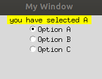


```python
r1 = tk.Radiobutton(window, text='Option A', variable=var, value='A', command=print_selection)
```

- text:信息的输出
- variable,value:指的是当我们选中了这个button,那么其variable(即var) 就会变为A


**实际使用**

```python
r1 = tk.Radiobutton(window, text='Option A', variable=var, value='A', command=print_selection)
r1.pack()
r2 = tk.Radiobutton(window, text='Option B', variable=var, value='B', command=print_selection)
r2.pack()
r3 = tk.Radiobutton(window, text='Option C', variable=var, value='C', command=print_selection)
r3.pack()
```


如果其中的variable都是指向tk.StringVar,那么两个点只能够选择一个点,如果分别指向不同的点,那么可以有多种选择


##### (8) Checkbutton

> 代表一个变量,有两个不同的值,点击这个按钮,这个变量的值会在这两个之间进行切换

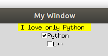


```python
c1 = tk.Checkbutton(window, text='Python',variable=var1, onvalue=1, offvalue=0, command=print_selection)    # 传值原理类似于radiobutton部件
```

- text:选项的备注
- variable:进行值的修改
- onvalue,offvalue:选中和没选中的情况
- command:选择了之后,进行的函数执行


**代码实例:**

```python
#!/usr/bin/env python
# -*- coding: utf-8 -*-
# author:洪卫

import tkinter as tk  # 使用Tkinter前需要先导入

# 第1步，实例化object，建立窗口window
window = tk.Tk()

# 第2步，给窗口的可视化起名字
window.title('My Window')

# 第3步，设定窗口的大小(长 * 宽)
window.geometry('500x300')  # 这里的乘是小x

# 第4步，在图形界面上创建一个标签label用以显示并放置
l = tk.Label(window, bg='yellow', width=20, text='empty')
l.pack()

# 第6步，定义触发函数功能
def print_selection():
    if (var1.get() == 1) & (var2.get() == 0):     # 如果选中第一个选项，未选中第二个选项
        l.config(text='I love only Python ')
    elif (var1.get() == 0) & (var2.get() == 1):   # 如果选中第二个选项，未选中第一个选项
        l.config(text='I love only C++')
    elif (var1.get() == 0) & (var2.get() == 0):   # 如果两个选项都未选中
        l.config(text='I do not love either')
    else:
        l.config(text='I love both')             # 如果两个选项都选中

# 第5步，定义两个Checkbutton选项并放置
var1 = tk.IntVar()  # 定义var1和var2整型变量用来存放选择行为返回值
var2 = tk.IntVar()
c1 = tk.Checkbutton(window, text='Python',variable=var1, onvalue=1, offvalue=0, command=print_selection)    # 传值原理类似于radiobutton部件
c1.pack()
c2 = tk.Checkbutton(window, text='C++',variable=var2, onvalue=1, offvalue=0, command=print_selection)
c2.pack()

# 第7步，主窗口循环显示
window.mainloop()
```


##### (9) Scale

> 允许通过滑块进行数字值的设置

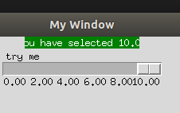


```python
s = tk.Scale(window, label='try me', from_=0, to=10, orient=tk.HORIZONTAL, length=200, showvalue=0,tickinterval=2, resolution=0.01, command=print_selection)
```

- label:进行输出的内容

- from_ to:开始和结束的尺度

- orient:横向或者纵向

- length:像素长度

- show_value:一开始展示的设置

- tickinternal:采样间距,滑动一次的变化情况

- resolution:保存到小数点后几位:

     resolution=0.1 采样到小数点后1位

     resolution=0.01: 采样到小数点后2位


##### (10) Canvas

> Canvas:画布,提供绘图功能,可以绘制直线,椭圆等等


**实际使用:**

```python
#!/usr/bin/env python
# -*- coding: utf-8 -*-
# author:洪卫

import tkinter as tk  # 使用Tkinter前需要先导入

# 第1步，实例化object，建立窗口window
window = tk.Tk()

# 第2步，给窗口的可视化起名字
window.title('My Window')

# 第3步，设定窗口的大小(长 * 宽)
window.geometry('500x300')  # 这里的乘是小x

# 第4步，在图形界面上创建 500 * 200 大小的画布并放置各种元素
canvas = tk.Canvas(window, bg='green', height=200, width=500)
# 说明图片位置，并导入图片到画布上
image_file = tk.PhotoImage(file='1.png')  # 图片位置（相对路径，与.py文件同一文件夹下，也可以用绝对路径，需要给定图片具体绝对路径）
image = canvas.create_image(250, 0, anchor='n',image=image_file)# 图片锚定点（n图片顶端的中间点位置）放在画布（250,0）坐标处
# 定义多边形参数，然后在画布上画出指定图形
x0, y0, x1, y1 = 100, 100, 150, 150
line = canvas.create_line(x0-50, y0-50, x1-50, y1-50)                   # 画直线
oval = canvas.create_oval(x0+120, y0+50, x1+120, y1+50, fill='yellow')  # 画圆 用黄色填充
arc = canvas.create_arc(x0, y0+50, x1, y1+50, start=0, extent=180)      # 画扇形 从0度打开收到180度结束
rect = canvas.create_rectangle(330, 30, 330+20, 30+20)                  # 画矩形正方形
canvas.pack()

# 第6步，触发函数，用来一定指定图形
def moveit():
    canvas.move(rect, 2, 2) # 移动正方形rect（也可以改成其他图形名字用以移动一起图形、元素），按每次（x=2, y=2）步长进行移动

# 第5步，定义一个按钮用来移动指定图形的在画布上的位置
b = tk.Button(window, text='move item',command=moveit).pack()

# 第7步，主窗口循环显示
window.mainloop()
```


画布上面可以绘制line,arc,rectangle等等的操作,之后用到了详细来看


##### (11) Menu

> 菜单条,用来实现下拉和弹出式菜单,点下菜单后可以进行选择任务操作


```python
menubar = tk.Menu(window)#创建一个容器,在窗口上方
filemenu = tk.Menu(menubar, tearoff=0)#生成第一个下拉选项

editmenu = tk.Menu(menubar, tearoff=0)#生成第二个下拉选项

#另外,还可以基于菜单生成次级菜单
submenu = tk.Menu(filemenu)#这个基于filemenu
```


**实际使用:**

```python
#!/usr/bin/env python
# -*- coding: utf-8 -*-
# author:洪卫

import tkinter as tk  # 使用Tkinter前需要先导入

# 第1步，实例化object，建立窗口window
window = tk.Tk()

# 第2步，给窗口的可视化起名字
window.title('My Window')

# 第3步，设定窗口的大小(长 * 宽)
window.geometry('500x300')  # 这里的乘是小x

# 第4步，在图形界面上创建一个标签用以显示内容并放置
l = tk.Label(window, text='      ', bg='green')
l.pack()

# 第10步，定义一个函数功能，用来代表菜单选项的功能，这里为了操作简单，定义的功能比较简单
counter = 0
def do_job():
    global counter
    l.config(text='do '+ str(counter))
    counter += 1

# 第5步，创建一个菜单栏，这里我们可以把他理解成一个容器，在窗口的上方
menubar = tk.Menu(window)

# 第6步，创建一个File菜单项（默认不下拉，下拉内容包括New，Open，Save，Exit功能项）
filemenu = tk.Menu(menubar, tearoff=0)
# 将上面定义的空菜单命名为File，放在菜单栏中，就是装入那个容器中
menubar.add_cascade(label='File', menu=filemenu)

# 在File中加入New、Open、Save等小菜单，即我们平时看到的下拉菜单，每一个小菜单对应命令操作。
filemenu.add_command(label='New', command=do_job)
filemenu.add_command(label='Open', command=do_job)
filemenu.add_command(label='Save', command=do_job)
filemenu.add_separator()    # 添加一条分隔线
filemenu.add_command(label='Exit', command=window.quit) # 用tkinter里面自带的quit()函数

# 第7步，创建一个Edit菜单项（默认不下拉，下拉内容包括Cut，Copy，Paste功能项）
editmenu = tk.Menu(menubar, tearoff=0)
# 将上面定义的空菜单命名为 Edit，放在菜单栏中，就是装入那个容器中
menubar.add_cascade(label='Edit', menu=editmenu)

# 同样的在 Edit 中加入Cut、Copy、Paste等小命令功能单元，如果点击这些单元, 就会触发do_job的功能
editmenu.add_command(label='Cut', command=do_job)
editmenu.add_command(label='Copy', command=do_job)
editmenu.add_command(label='Paste', command=do_job)

# 第8步，创建第二级菜单，即菜单项里面的菜单
submenu = tk.Menu(filemenu) # 和上面定义菜单一样，不过此处实在File上创建一个空的菜单
filemenu.add_cascade(label='Import', menu=submenu, underline=0) # 给放入的菜单submenu命名为Import

# 第9步，创建第三级菜单命令，即菜单项里面的菜单项里面的菜单命令（有点拗口，笑~~~）
submenu.add_command(label='Submenu_1', command=do_job)   # 这里和上面创建原理也一样，在Import菜单项中加入一个小菜单命令Submenu_1

# 第11步，创建菜单栏完成后，配置让菜单栏menubar显示出来
window.config(menu=menubar)

# 第12步，主窗口循环显示
window.mainloop()
```


##### (12) Frame

> 用来承载其他的GUI元素,相当于就是一个容器,其实就和tk.TK()的类形同,让其他组件的master可以选择frame,而不是仅仅的一个window

```python
frame_l = tk.Frame(frame)#生成左边帧
tk.Label(frame_l, text='on the frame_l1', bg='green').pack()
```


##### (13) messageBox

> 消息框,用于展示应用程序的信息等的操作,py2中为tkMesagebox

另外,这个东西可以弹窗,从而进行目标选择

```python
tkinter.messagebox.showinfo(title='Hi', message='你好！') #进行信息展示
print(tkinter.messagebox.askquestion(title='Hi', message='你好！'))  #提问
```


#### 2.1.2 组件放置

有pack,grid,place三种

##### (1) grid

grid是放方格,所以所有的内容会被放在规律的方格中

```python
tk.Label(window, text=1).grid(row=i, column=j, padx=10, pady=10, ipadx=10, ipady=10)
```

- row和column是放置的行列,padx,pady是把整张图分割的间隔.ipadx和ipady是单元格内部元素与单元格的上下间隔


- grid的放置有一些类似于表格,如果不进行指定的话,那么grid的每个格子的大小是由那一行最宽的那个决定的.因此,为了排版方便,可以自己认为2个格子为一个grid,然后基于这个采用columnspawn的操作,让他们全局进行拼接


##### (2) Pack

pack中的side包含了四中情况:

```python
tk.Label(window, text='P', fg='red').pack(side='top')    # 上
tk.Label(window, text='P', fg='red').pack(side='bottom') # 下
tk.Label(window, text='P', fg='red').pack(side='left')   # 左
tk.Label(window, text='P', fg='red').pack(side='right')  # 右
```


##### (3) Place

精确到像素点的位置,进行某个像素点坐标的放置

```python
place(x=50, y=100, anchor='nw')
```

anchor不知道是什么来的,直接给像素就可以进行展示了


# 五 坐标系变换

发现反解摄像头位置仍然出现了问题,为了确保这个环节的可控,因此还是好好地看看这一个部分的东西

https://blog.csdn.net/try_again_later/article/details/89088159

solvePnP出来的内容为:

计算出来的是相机坐标系下的目标的位置.即tvec是相机坐标系下的目标点的位置
$$
R=Rodrigues(rvec)\\
P_{camera}=RotateP_{world}+tvec
$$
Pworld意味着物体在世界坐标系下的位置

想要求出摄像头的位置,则可以是Pcamera=0,即意味着相机坐标系在


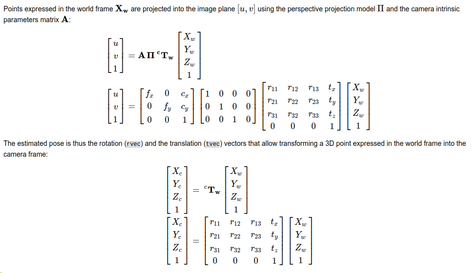


T从world->camera,即$T^C_W$就是camera坐标系下的 world坐标系的位姿


