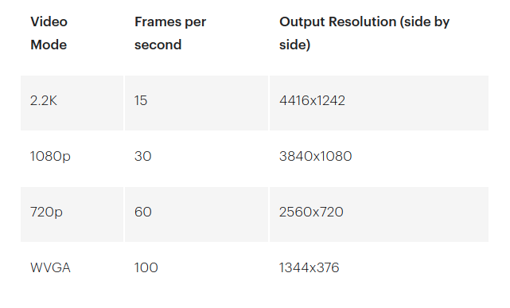
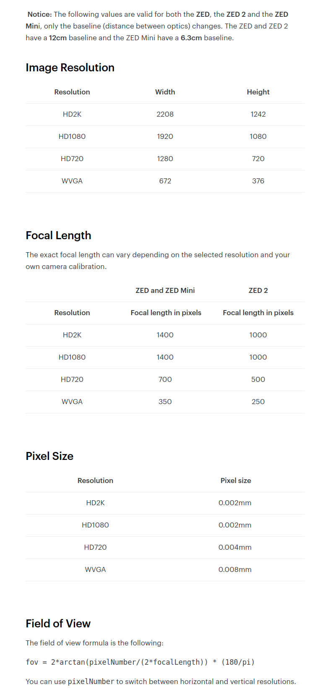
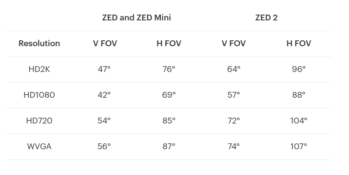

# ZED

> 2020.4.20:
>
> ​	这里记录ZED的使用方法,ZED虽然测距精度不行,但是在双目中肯定也是需要时常用到的,之后如果他的测距精度在10cm以内,那么定位的问题就能够解决了


## 1. 环境配置

**SDK下载:**

整体的都是需要SDK下载的,不过Python可以直接pip install 


> ZED的跟着官网教程走就行,注意需要翻墙下载所对应的驱动
>
> 配置教程:https://www.stereolabs.com/docs/getting-started/installation/

1. 下载.runfile,之后使能.run文件,最后进行.run文件的执行
2. 配置CUDA10
3. 到/usr/local/zed/tools/ZED Explorer目录下,执行./'ZED Depth Viewer'


### 1.1 Cpp环境配置

> 主要是跟着ZED的教程进行,这一块主要是跟着教程来的,ZED中有ROS等的东西,还是很不错的
>
> 同时这里面的CUDA的东西也需要看一下,这一块应该也是需要的


##### (1) ZED与OpenCV

> 必然首先是采用ZED调用OpenCV库,进行图层的读取
>
> 参考代码:github上面有了对应的开源:https://github.com/stereolabs/zed-opencv/tree/master/cpp

1. **CMakeLists:**

     CMakeLists主要是进行findpackage,ZED存储在了/usr/local/zed/tools的目录下,其中包括了一个.camek文件进行CMake的配置,其中的ZED包含路径为zed/include,ZED的动态链接库为usr/local/zed/lib

     ```cmake
     SET(execName ZED_with_OpenCV)
     CMAKE_MINIMUM_REQUIRED(VERSION 2.4)
     PROJECT(${execName})
     
     if(COMMAND cmake_policy)
     	cmake_policy(SET CMP0003 OLD)
     	cmake_policy(SET CMP0015 OLD)
     endif(COMMAND cmake_policy)
     
     SET(EXECUTABLE_OUTPUT_PATH ".")
     
     find_package(ZED 2 REQUIRED)
     find_package(OpenCV REQUIRED)
     find_package(CUDA ${ZED_CUDA_VERSION} EXACT REQUIRED)
     
     IF(NOT WIN32)
         add_definitions(-Wno-format-extra-args)
         SET(SPECIAL_OS_LIBS "pthread" "X11")
     ENDIF()
     
     include_directories(${CUDA_INCLUDE_DIRS})
     include_directories(${ZED_INCLUDE_DIRS})
     include_directories(${OPENCV_INCLUDE_DIRS})
     include_directories(${CMAKE_CURRENT_SOURCE_DIR}/include)
     
     link_directories(${ZED_LIBRARY_DIR})
     link_directories(${OpenCV_LIBRARY_DIRS})
     link_directories(${CUDA_LIBRARY_DIRS})
     
     FILE(GLOB_RECURSE SRC_FILES src/*.cpp)
     FILE(GLOB_RECURSE HDR_FILES include/*.hpp)
     
     ADD_EXECUTABLE(${execName} ${HDR_FILES} ${SRC_FILES})
     add_definitions(-std=c++11 -g -O3)
     
     TARGET_LINK_LIBRARIES(${execName}
                             ${ZED_LIBRARIES}
                             ${SPECIAL_OS_LIBS}
                             ${OpenCV_LIBRARIES}
                             ${CUDA_CUDA_LIBRARY} ${CUDA_CUDART_LIBRARY} ${CUDA_NPP_LIBRARIES_ZED} )
     
     ```

     

2. **main函数书写:**

     ```cpp
     //sl_zed的位置是在/usr/local/zed目录下
     #include<sl_zed/Camera.hpp>
     #include <opencv2/opencv.hpp>
     #include <SaveDepth.hpp>//进行图片保存
     
     
     using namespace sl;//使用sl命名空间,用于ZED的使用
     
     cv::Mat slMat2cvMat(Mat& input);//声明一个函数,用于从slMat到cvMat进行变换
     void printHelp();//声明一个函数,用于输出帮助
     
     int main(int argc, char **argv) {
     
         //Create a ZED camera object
         //1:进行ZED类的初始化操作
         //1.1:定义Camera类,用于zed
         Camera zed;//使用camera类进行ZED摄像头的声明
     
         //1.2:定义初始化参数(大量地使用了枚举)
         InitParameters init_params;//设置初始参数
         init_params.camera_resolution = RESOLUTION_HD1080;//像素
         init_params.depth_mode = DEPTH_MODE_QUALITY;//深度
         init_params.coordinate_units = UNIT_METER;
         if (argc > 1) init_params.svo_input_filename.set(argv[1]);//如果有svo参数会进行配置
             
         //1.3:打开摄像头
         ERROR_CODE err = zed.open(init_params);//ERROR_CODE定义为枚举类型,open使用了init_params进行初始化操作
         if (err != SUCCESS) {
             printf("%s\n", toString(err).c_str());
             zed.close();
             return 1; // Quit if an error occurred
         }
     
     
         //1.4:设置运行参数(在开启摄像头之后记性配置)
         RuntimeParameters runtime_parameters;
         runtime_parameters.sensing_mode = SENSING_MODE_STANDARD;
     
         // Prepare new image size to retrieve half-resolution images
         //准备新图片尺寸,为了补回恢复的像素图片(并不知道是用来做什么的)
         Resolution image_size = zed.getResolution();
         int new_width = image_size.width / 2;
         int new_height = image_size.height / 2;
     
         
         //为了在sl::mat和cv::mat中进行数据共享,使用slMat2cvMat函数
         //只有头指针of sl::mat被复制了,而不是数据它本身
         Mat image_zed(new_width, new_height, MAT_TYPE_8U_C4);//设置channel为4
         cv::Mat image_ocv = slMat2cvMat(image_zed);//使用函数进行转换,为了之后进行图像保存
         Mat depth_image_zed(new_width, new_height, MAT_TYPE_8U_C4);
         cv::Mat depth_image_ocv = slMat2cvMat(depth_image_zed);//为了之后进行图像保存
         Mat point_cloud;
     
         // Loop until 'q' is pressed
         char key = ' ';
         while (key != 'q') {
     
             if (zed.grab(runtime_parameters) == SUCCESS) {
     
                 //重置左边图像,深度是一半的像素
                 zed.retrieveImage(image_zed, VIEW_LEFT, MEM_CPU, new_width, new_height);//获取的图像为image_zed类型的
                 zed.retrieveImage(depth_image_zed, VIEW_DEPTH, MEM_CPU, new_width, new_height);//获取的深度为zed类型的
     
     
                 zed.retrieveMeasure(point_cloud, MEASURE_XYZRGBA, MEM_CPU, new_width, new_height);
     
                 //进行图像展示,直接在while循环中之前就可以读到
                 cv::imshow("Image", image_ocv);//共享了地址之后,可以进行图像显示
                 cv::imshow("Depth", depth_image_ocv);
     
                 // Handle key event
                 key = cv::waitKey(10);
                 processKeyEvent(zed, key);
             }
         }
         zed.close();
         return 0;
     }
     
     /**
     * Conversion function between sl::Mat and cv::Mat
     **/
     //采用了这个进行数据转换
     cv::Mat slMat2cvMat(Mat& input) {
         // Mapping between MAT_TYPE and CV_TYPE
         int cv_type = -1;
         switch (input.getDataType()) {
             case MAT_TYPE_32F_C1: cv_type = CV_32FC1; break;
             case MAT_TYPE_32F_C2: cv_type = CV_32FC2; break;
             case MAT_TYPE_32F_C3: cv_type = CV_32FC3; break;
             case MAT_TYPE_32F_C4: cv_type = CV_32FC4; break;
             case MAT_TYPE_8U_C1: cv_type = CV_8UC1; break;
             case MAT_TYPE_8U_C2: cv_type = CV_8UC2; break;
             case MAT_TYPE_8U_C3: cv_type = CV_8UC3; break;
             case MAT_TYPE_8U_C4: cv_type = CV_8UC4; break;
             default: break;
         }
     
         // Since cv::Mat data requires a uchar* pointer, we get the uchar1 pointer from sl::Mat (getPtr<T>())
         // cv::Mat and sl::Mat will share a single memory structure
         return cv::Mat(input.getHeight(), input.getWidth(), cv_type, input.getPtr<sl::uchar1>(MEM_CPU));
     }
     
     /**
     * This function displays help in console
     **/
     void printHelp() {
         std::cout << " Press 's' to save Side by side images" << std::endl;
         std::cout << " Press 'p' to save Point Cloud" << std::endl;
         std::cout << " Press 'd' to save Depth image" << std::endl;
         std::cout << " Press 'm' to switch Point Cloud format" << std::endl;
         std::cout << " Press 'n' to switch Depth format" << std::endl;
     }
     
     ```

     


### 1.2 Python环境配置

> python的环境可以直接pip install pyzed就行了,比较简单

- 直接pip install pyzed 就可以完成任务

测试代码:

```python
import cv2 as cv
import pyzed.sl as sl

if __name__ == '__main__':
    init=sl.InitParameters()
    cam=sl.Camera()

    if not cam.is_opened():
        print("摄像头开启失败")

    status=cam.open(init)

    runtime=sl.RuntimeParameters()#
    sl_left_mat=sl.Mat()
    sl_right_mat=sl.Mat()

    while True:
        err=cam.grab(runtime)
        if err==sl.ERROR_CODE.SUCCESS:
            cam.retrieve_image(sl_left_mat,sl.VIEW.LEFT)
            cam.retrieve_image(sl_right_mat,sl.VIEW.RIGHT)
            cv_left=sl_left_mat.get_data()#将sl的mat转成cv的mat(即np.uint8)
            cv_right=sl_right_mat.get_data()
            cv.imshow("left_view",cv_left)
            cv.imshow("right_view",cv_right)
            cv.waitKey(1)

        else:
            break
```

- 另外,这里面就算是不启动深度计算,那么ZED也是需要消耗显存的

     默认是开启深度,这时候GPU的使用率为


### 1.3 无SDK模式

> ZED也可以不使用SDK进行使用,就相当于是一个普通的摄像头,然后从中读取参数

- **参考github:**

     git@github.com:stereolabs/zed-opencv-native.git

     这里面就可以直接使用ZED的参数,他的Readme写的非常好,序列号直接可以打开/usr/local/zed/tools中的Viewer进行查看 我的ZED:24086

     这里面是需要一个serial number进行使用的


#### 1.3.1 代码理解

- 使用cv.VideoCapture()进行图片获取

- 设置了像素大小

- 获得了/usr/local/zed/settings/目录下的标定文件

     这个就是一个标定文件的名称

- 从标定文件中获取到内参矩阵

- 使用cv2.remap的操作,对图片进行修复,然后展示了更改后的图片效果

     这里面进行了像素的插值,重映射等的操作


通过这一套的操作,就可以获取经过校正的图片的情况了.主要是获得了映射的参数,然后cv2.remap一下就可以获得图片了


但是测试了之后,发现速度非常慢,720HD的0.03s每一帧,相比于用SDK的720HD为0.004s每一帧.因此宁愿消耗一些CUDA,从而提升速度,这个的CUDA消耗量还行


#### 1.3.2 像素更改

不同像素表



```python
image_size = Resolution()
image_size.width = 1920
image_size.height = 1080

# Set the video resolution to HD720
cap.set(cv2.CAP_PROP_FRAME_WIDTH, image_size.width*2)
cap.set(cv2.CAP_PROP_FRAME_HEIGHT, image_size.height)
```

- 修改里面的width和height就行


### 1.4 ZED常用参数

- 焦距参数信息等

     这里面的参数都是准确的,对于每一个相机都相同

     https://support.stereolabs.com/hc/en-us/articles/360007395634-What-is-the-camera-focal-length-and-field-of-view-


#### 1.4.1 焦距图像大小




#### 1.4.2 帧率测试


#### 1.4.3 FOV



- 果然,焦距越短,视野越大,视野大小和图像大小没关系,主要是和焦距有关系


## 2. 基本使用

> 沉下心来乖乖地看ZED教程学习,主要就是ZED的documentation,后面的API reference也是基于Documentation进行书写的
>
> 同时,还有一个github的代码:https://github.com/stereolabs/zed-examples   这个代码用于进行配置

- ZED Documentation主要结构

     ZED中主要是进行了视频流(Video),深度获取(Depth Sensing),基于深度进行摄像头6DOF的获取(Positional Tracking),三维场景重建(Spatial Mapping)这几个大方向的SDK接口

- ZED接口中主要进行了ROS,ROS2,OpenCV,MatLab,Tensorflow的几个软件的相互交互


### 2.1 Cpp接口

> Cpp主要需要一堆的链接等等的操作,还有CUDA的CMake编写,整体比较麻烦,但是也不是不能用,这里暂时不进行整理


- **整体跟随Tutorial进行使用**

#### 2.1.1 Camera

##### (1) Getting Start

内部主要包含了所对应的相机介绍,ZED安装教程等操作

###### a. 基本工程文件配置

1. **json文件配置:**

     json文件的配置中需要进行zed文件,cuda文件的包含:

     ```json
     "includePath": [
         "${workspaceFolder}/**",
         "/usr/local/zed/include/",
         "/usr/local/zed/include/sl/",
         "/usr/local/cuda/include"
     ],
     ```

     - zed/include下包含了sl sl_core sl_zed三个文件夹

2. **CMakeLists.txt:**

     1. **CMake的新用法:**

          1. set(execName ZED_Camera)

               之后,在以后的add_executable中,可以直接

               ADD_EXECUTABLE(${execName} ${SRC_FILES})

               进行可执行文件的设置

          2. **option:**

               option可以进行选项的配置,具体参考文件为:https://www.jianshu.com/p/a7ca57abced1

               以后有空可以好好学习一下CMake的语法,这个未来肯定很有用的

          3. **set(EXECUTABLE_OUTPUT_PATH ".")**

               设置输出可执行文件的路径

          4. **FILE(GLOB_RECURSE SRC_FILES src/*.cpp):**

               把src文件夹下所有.cpp文件设置为了SRC_FILES文件

          5. **cmake_policy(SET CMP0003 OLD):**

               ```
               cmake_policy(SET CMP<NNNN> NEW)
               cmake_policy(SET CMP<NNNN> OLD)
               ```

               告诉CMake去使用old或者new行为for一个给定的规则,CMP中是规则配置

               CMP中的规则都是比较旧的规则,而不是新的规则

     2. **CMake编写:**

          ```cmake
          SET(execName ZED_Camera_Control)
          CMAKE_MINIMUM_REQUIRED(VERSION 2.4)
          PROJECT(${execName})
          
          #采用动静态库进行编译
          option(LINK_SHARED_ZED "Link with the ZED SDK shared executable" ON)
          
          #如果没有静态连接库,则进行输出无windows
          if (NOT LINK_SHARED_ZED AND MSVC)
              message(FATAL_ERROR "LINK_SHARED_ZED OFF : ZED SDK static libraries not available on Windows")
          endif()
          
          #进行目标规则的选择,没有好像也是对的
          # if(COMMAND cmake_policy)
          # 	cmake_policy(SET CMP0003 OLD)
          # 	cmake_policy(SET CMP0015 OLD)
          # endif(COMMAND cmake_policy)
          
          #设置输出
          SET(EXECUTABLE_OUTPUT_PATH ".")
          
          #添加一系列头文件和链接库
          find_package(ZED 2 REQUIRED)
          find_package(OpenCV REQUIRED)
          find_package(CUDA ${ZED_CUDA_VERSION} EXACT REQUIRED)
          
          include_directories(${CUDA_INCLUDE_DIRS})
          include_directories(${ZED_INCLUDE_DIRS})
          include_directories(${OPENCV_INCLUDE_DIRS})
          include_directories(${CMAKE_CURRENT_SOURCE_DIR}/include)
          
          link_directories(${ZED_LIBRARY_DIR})
          link_directories(${OpenCV_LIBRARY_DIRS})
          link_directories(${CUDA_LIBRARY_DIRS})
          
          #生成自己所编写的代码
          FILE(GLOB_RECURSE SRC_FILES src/*.cpp)
          
          ADD_EXECUTABLE(${execName} ${SRC_FILES})
          add_definitions(-std=c++11 -g -O3)
          
          
          #根据动静态库进行选择
          if (LINK_SHARED_ZED)
              SET(ZED_LIBS ${ZED_LIBRARIES} ${CUDA_CUDA_LIBRARY} ${CUDA_CUDART_LIBRARY} ${CUDA_NPP_LIBRARIES_ZED})
          else()
              SET(ZED_LIBS ${ZED_STATIC_LIBRARIES} ${CUDA_CUDA_LIBRARY} ${CUDA_LIBRARY})
          endif()
          
          #链接上目标路径
          TARGET_LINK_LIBRARIES(${execName} ${ZED_LIBS} ${OpenCV_LIBRARIES})
          
          ```

          

##### (2) Video

> ZED中只能获得图像,而不能够进行图像的显示,如果需要图像的显示,还是需要采用OpenCV的操作进行图像的显示

###### a. sl::Mat->cv::Mat

> 如果需要摄像头进行图像可视化,需要把sl::Mat转换为cv::Mat
>
> sl::Mat变为cv::Mat类型主要通过进行指针的定义,可以在while循环中来一张图片进行一次更新,也可以直接在while函数外面进行参数定义

- **while函数外面进行配置:**

     sl::Mat image_zed需要进行初始化,否则image_ocv不知道需要配置成什么参数

     注意需要了解构造函数的概念,进行构造函数的配置

     ```cpp
     //前期定义
     Resolution image_size = zed.getResolution();
         int new_width = image_size.width / 2;
         int new_height = image_size.height / 2;
     
         //为了在sl::mat和cv::mat中进行数据共享,使用slMat2cvMat函数
         //只有头指针of sl::mat被复制了,而不是数据它本身
         Mat image_zed(new_width, new_height, MAT_TYPE_8U_C4);//设置channel为4
         cv::Mat image_ocv = slMat2cvMat(image_zed);//使用函数进行转换,为了之后进行图像保存
     
     
     //函数定义
     cv::Mat slMat2cvMat(Mat& input) {
         // Mapping between MAT_TYPE and CV_TYPE
         int cv_type = -1;
         switch (input.getDataType()) {
             case MAT_TYPE_32F_C1: cv_type = CV_32FC1; break;
             case MAT_TYPE_32F_C2: cv_type = CV_32FC2; break;
             case MAT_TYPE_32F_C3: cv_type = CV_32FC3; break;
             case MAT_TYPE_32F_C4: cv_type = CV_32FC4; break;
             case MAT_TYPE_8U_C1: cv_type = CV_8UC1; break;
             case MAT_TYPE_8U_C2: cv_type = CV_8UC2; break;
             case MAT_TYPE_8U_C3: cv_type = CV_8UC3; break;
             case MAT_TYPE_8U_C4: cv_type = CV_8UC4; break;
             default: break;
         }
     
         // Since cv::Mat data requires a uchar* pointer, we get the uchar1 pointer from sl::Mat (getPtr<T>())
         // cv::Mat and sl::Mat will share a single memory structure
         return cv::Mat(input.getHeight(), input.getWidth(), cv_type, input.getPtr<sl::uchar1>(MEM_CPU));
     }
     
     
     //while中使用
     zed.retrieveImage(zed_image, VIEW_LEFT,MEM_CPU,new_width,new_height);
     cv::imshow("OpenCV_Image",image_opencv);
     ```

     - 完整代码

          ```cpp
          #include <stdio.h>
          #include <string.h>
          #include <sl/Camera.hpp>//包含zed摄像头
          #include <opencv2/opencv.hpp>//必须包含OpenCV,进行图像的显示操作
          
          //使用sl和std命名空间,此处不适用cv命名空间,否则cv类很容易进行冲突
          using namespace std;
          using namespace sl;
          
          //声明sl::Mat变为cv::Mat类型
          cv::Mat slMat2cvMat(Mat& input);
          
          int main(int argc, char **argv) {
              //1:ZED摄像头初始化
          
              //1.1:创建一个zed类
              Camera zed;
          
              //1.2:进行摄像头参数初始化,param中也已经有了对应的初始化参数
              sl::InitParameters param;
              param.camera_resolution= sl::RESOLUTION_HD720;
          
              //1.3:进行摄像头的开启
              ERROR_CODE err = zed.open(param);
              if (err != SUCCESS) {
                  cout << toString(err) << endl;
                  zed.close();
                  return 1; // Quit if an error occurred
              }
          
              //1.4:定义sl:Mat,用于之后接收图片
              //1.4.1:获取图片大小
              Resolution image_size=zed.getResolution();
              int new_width=image_size.width/2;
              int new_height=image_size.height/2;
              cout<<"newheight"<<new_height<<",new width"<<new_width<<endl;
              
              //1.4.2:定义sl::Mat
              Mat zed_image(new_width,new_height,MAT_TYPE_8U_C4,MEM_CPU);
          
              //1.4.3:获取所对应的cv图像
              cv::Mat image_opencv=slMat2cvMat(zed_image);
              
              //2:进行ZED图像显示
              char key = ' ';
              while (key != 'q') {
                  //2.1:采用zed.grab()进行图像获取
                  if (zed.grab() == SUCCESS) {
                      //2.2:取到sl::Mat的数据
                      zed.retrieveImage(zed_image, VIEW_LEFT,MEM_CPU,new_width,new_height);
          
                      //2.3:展示图像
                      cv::imshow("OpenCV_Image",image_opencv);
                      
                  } 
                  
                  key = cv::waitKey(10);
              }
          
              //3:关闭ZED,完成图像任务
              zed.close();
              return EXIT_SUCCESS;
          }
          
          cv::Mat slMat2cvMat(Mat& input) {
              // Mapping between MAT_TYPE and CV_TYPE
              int cv_type = -1;
              switch (input.getDataType()) {
                  case MAT_TYPE_32F_C1: cv_type = CV_32FC1; break;
                  case MAT_TYPE_32F_C2: cv_type = CV_32FC2; break;
                  case MAT_TYPE_32F_C3: cv_type = CV_32FC3; break;
                  case MAT_TYPE_32F_C4: cv_type = CV_32FC4; break;
                  case MAT_TYPE_8U_C1: cv_type = CV_8UC1; break;
                  case MAT_TYPE_8U_C2: cv_type = CV_8UC2; break;
                  case MAT_TYPE_8U_C3: cv_type = CV_8UC3; break;
                  case MAT_TYPE_8U_C4: cv_type = CV_8UC4; break;
                  default: break;
              }
          
              // Since cv::Mat data requires a uchar* pointer, we get the uchar1 pointer from sl::Mat (getPtr<T>())
              // cv::Mat and sl::Mat will share a single memory structure
              return cv::Mat(input.getHeight(), input.getWidth(), cv_type, input.getPtr<sl::uchar1>(MEM_CPU));
          }
          ```

          

- **while函数内进行参数变换:**

     ```cpp
     zed.retrieveImage(zed_image, VIEW_LEFT);//获取到sl::Mat zed_image
     cv::Mat cv_image;//定义cv::Mat
     cv_image=cv::Mat((int)zed_image.getHeight(),(int)zed_image.getWidth(),CV_8UC4,zed_image.getPtr<unsigned char>(sl::MEM_CPU));//进行图像变换
     cv::imshow("Image",cv_image);//最后进行imshow
     ```

     - 完整代码

          ```cpp
          #include <stdio.h>
          #include <string.h>
          #include <sl/Camera.hpp>//包含zed摄像头
          #include <opencv2/opencv.hpp>//必须包含OpenCV,进行图像的显示操作
          
          //使用sl和std命名空间,此处不适用cv命名空间,否则cv类很容易进行冲突
          using namespace std;
          using namespace sl;
          
          
          int main(int argc, char **argv) {
              //1:ZED摄像头初始化
          
              //1.1:创建一个zed类
              Camera zed;
          
              //1.2:进行摄像头参数初始化,param中也已经有了对应的初始化参数
              sl::InitParameters param;
              // param.camera_resolution= sl::RESOLUTION_HD720;
          
              //1.3:进行摄像头的开启
              ERROR_CODE err = zed.open(param);
              if (err != SUCCESS) {
                  cout << toString(err) << endl;
                  zed.close();
                  return 1; // Quit if an error occurred
              }
          
              //1.4:定义sl:Mat,用于之后接收图片
              Mat zed_image;
              
              //2:进行ZED图像显示
              char key = ' ';
              while (key != 'q') {
                  //2.1:采用zed.grab()进行图像获取
                  if (zed.grab() == SUCCESS) {
                      //2.2:取到sl::Mat的数据
                      zed.retrieveImage(zed_image, VIEW_LEFT);
          
                      //2.3:通过指针的变化获得cv::Mat的图像
                      cv::Mat cv_image;
                      cv_image=cv::Mat((int)zed_image.getHeight(),(int)zed_image.getWidth(),CV_8UC4,zed_image.getPtr<unsigned char>(sl::MEM_CPU));
                      cv::imshow("Image",cv_image);
                      // cv::imshow("VIEW", cv::Mat((int) zed_image.getHeight(), (int) zed_image.getWidth(), CV_8UC4, zed_image.getPtr<sl::uchar1>(sl::MEM_CPU)));//直接使用zed_image的头指针即可变为图像Mat类型
                  } 
                  
                  key = cv::waitKey(10);
              }
          
              //3:关闭ZED,完成图像任务
              zed.close();
              return EXIT_SUCCESS;
          }
          
          
          ```

          


###### b. 进行图像操作

> 获取左右摄像头图片与全部摄像头图片

```cpp
#include <stdio.h>
#include <string.h>
#include <sl/Camera.hpp>//包含zed摄像头
#include <opencv2/opencv.hpp>//必须包含OpenCV,进行图像的显示操作

//使用sl和std命名空间,此处不适用cv命名空间,否则cv类很容易进行冲突
using namespace std;
using namespace sl;

//声明sl::Mat变为cv::Mat类型
cv::Mat slMat2cvMat(Mat& input);

int main(int argc, char **argv) {
    //1:ZED摄像头初始化

    //1.1:创建一个zed类
    Camera zed;

    //1.2:进行摄像头参数初始化,param中也已经有了对应的初始化参数
    sl::InitParameters param;
    param.camera_resolution= sl::RESOLUTION_HD720;

    //1.3:进行摄像头的开启
    ERROR_CODE err = zed.open(param);
    if (err != SUCCESS) {
        cout << toString(err) << endl;
        zed.close();
        return 1; // Quit if an error occurred
    }

    //1.4:定义sl:Mat,用于之后接收图片
    //1.4.1:获取图片大小
    Resolution image_size=zed.getResolution();
    int new_width=image_size.width/2;
    int new_height=image_size.height/2;
    
    //1.4.2:定义sl::Mat
    Mat zed_image_left(new_width,new_height,MAT_TYPE_8U_C4,MEM_CPU);
    Mat zed_image_right(new_width,new_height,MAT_TYPE_8U_C4,MEM_CPU);
    Mat zed_image_all(new_width,new_height,MAT_TYPE_8U_C4,MEM_CPU);

    //1.4.3:获取所对应的cv图像
    cv::Mat image_opencv_left=slMat2cvMat(zed_image_left);
    cv::Mat image_opencv_right=slMat2cvMat(zed_image_right);
    cv::Mat image_opencv_all=slMat2cvMat(zed_image_all);
    
    //2:进行ZED图像显示
    char key = ' ';
    while (key != 'q') {
        //2.1:采用zed.grab()进行图像获取
        if (zed.grab() == SUCCESS) {
            //2.2:取到sl::Mat的数据
            zed.retrieveImage(zed_image_left, VIEW_LEFT,MEM_CPU,new_width,new_height);
            zed.retrieveImage(zed_image_right, VIEW_RIGHT,MEM_CPU,new_width,new_height);
            zed.retrieveImage(zed_image_all, VIEW_SIDE_BY_SIDE,MEM_CPU,new_width,new_height);

            //2.3:展示图像
            cv::imshow("OpenCV_Image_left",image_opencv_left);
            cv::imshow("OpenCV_Image_right",image_opencv_right);
            cv::imshow("OpenCV_Image_all",image_opencv_all);
            
        } 
        
        key = cv::waitKey(10);
    }

    //3:关闭ZED,完成图像任务
    zed.close();
    return EXIT_SUCCESS;
}

cv::Mat slMat2cvMat(Mat& input) {
    // Mapping between MAT_TYPE and CV_TYPE
    int cv_type = -1;
    switch (input.getDataType()) {
        case MAT_TYPE_32F_C1: cv_type = CV_32FC1; break;
        case MAT_TYPE_32F_C2: cv_type = CV_32FC2; break;
        case MAT_TYPE_32F_C3: cv_type = CV_32FC3; break;
        case MAT_TYPE_32F_C4: cv_type = CV_32FC4; break;
        case MAT_TYPE_8U_C1: cv_type = CV_8UC1; break;
        case MAT_TYPE_8U_C2: cv_type = CV_8UC2; break;
        case MAT_TYPE_8U_C3: cv_type = CV_8UC3; break;
        case MAT_TYPE_8U_C4: cv_type = CV_8UC4; break;
        default: break;
    }

    // Since cv::Mat data requires a uchar* pointer, we get the uchar1 pointer from sl::Mat (getPtr<T>())
    // cv::Mat and sl::Mat will share a single memory structure
    return cv::Mat(input.getHeight(), input.getWidth(), cv_type, input.getPtr<sl::uchar1>(MEM_CPU));
}
```


### 2.2 Python接口

> Python大法,天下无敌!
>
> 这里面get_data之后,都是h,w,4通道的数据,可能是为了rgbd的数据从而好用,但是,如果是rgb,直接索引前三个通道就好,对于深度值,直接索引第一个通道的数据就好了

**快速使用代码**

```pythoin
import cv2 as cv
import pyzed.sl as sl
import numpy as np

if __name__ == '__main__':
    init=sl.InitParameters()
    init.depth_mode=sl.DEPTH_MODE.QUALITY
    cam=sl.Camera()

    if cam.is_opened():
        print("摄像头开启失败")

    status=cam.open(init)

    runtime=sl.RuntimeParameters()


    sl_left_mat=sl.Mat()
    sl_right_mat=sl.Mat()
    sl_depth_mat=sl.Mat()

    while True:
        err=cam.grab(runtime)
        if err==sl.ERROR_CODE.SUCCESS:
            cam.retrieve_image(sl_left_mat,sl.VIEW.LEFT)
            cam.retrieve_image(sl_right_mat,sl.VIEW.RIGHT)
            cam.retrieve_image(sl_depth_mat,sl.VIEW.DEPTH)

            cv_left=sl_left_mat.get_data()
            cv_right=sl_right_mat.get_data()
            cv_depth=sl_depth_mat.get_data()
            cv.imshow("depth",cv_depth)


            # #进行深度图的归一化
            cv_depth=cv_depth[:,:,0]#cv_depth是一个4通道的数,但是
            show_image_map=cv_depth.copy()
            cv.normalize(show_image_map,show_image_map,255,0,cv.NORM_MINMAX)
            show_image_map=show_image_map.astype(np.uint8)
            color_map=cv.applyColorMap(show_image_map,cv.COLORMAP_JET)


            cv.imshow("left_view",cv_left)
            cv.imshow("right_view",cv_right)
            cv.imshow("color_map",color_map)


            cv.waitKey(1)


```


#### 2.1.1 Camera

##### (1) 基本使用

主要是需要初始化开启参数,各种参数都是在初始化的参数中进行设置的

相机初始化方式

首先需要进行初始化,然后是定义一个相机,然后相机打开,最后是取图片

````python
if __name__ == '__main__':
    camera=sl.Camera()#定义一个相机类
    init_para=sl.InitParameters()#定有初始化参数列
    camera.open(init_para)#进行相机的打开
    while True:
        camera.grab()#获取图片
        image=sl.Mat()#分配sl.Mat的内存
        camera.retrieve_image(image)#不输入参数默认为左边视角
        cv.imshow("image",image.get_data())#通过get_data变成cv的类
        cv.waitKey(1)
````

- 在camera.open和camera.grab()中其实都是会返回参数的,如果是成功,则返回的是

     ```
     sl.ERROR_CODE.SUCCESS
     ```

     ```
     image = sl.Mat()
     if zed.grab() == SUCCESS:
       zed.retrieve_image(image, sl.VIEW.LEFT) 
     ```

     


###### A.init参数

> 很多参数都可以由init参数

###### a. 切换像素大小

```python
self.init=sl.InitParameters()

################更改像素:###############
self.init.camera_resolution=sl.RESOLUTION.HD720

#sl.RESOLUTION中的选择有:
"""
    HD1080 
    HD2K 
    HD720 
    LAST 
    VGA 
"""
```


###### b. 更改帧率

```python

#################更改帧率:################
self.init.camera_fps=30
#直接进行参数赋值即可
#帧率如果使用VGA,只是进行单纯度采图,那么帧率可以达到600帧(不过如果是需要存图的话就另说了)
```

- 存图:

     .jpg比.png快


##### (2) 获取内参

> 内参是fx,fy,但是fx,fy和焦距是不同的,fx,fy指代了多少像素对应了多少的距离信息

发现Depth_Mode中有NONE的操作,应该使用了这个就不需要进行深度的计算了

还可以获取摄像头的内参,从而计算他的XYZ的值

```python
calibration_params = zed.get_camera_information().calibration_parameters
# Focal length of the left eye in pixels
focal_left_x = calibration_params.left_cam.fx
# First radial distortion coefficient
k1 = calibration_params.left_cam.disto[0]
# Translation between left and right eye on z-axis
tz = calibration_params.T.z
# Horizontal field of view of the left eye in degrees
h_fov = calibration_params.left_cam.h_fov
```


- 基本使用

```python
import cv2 as cv
import pyzed.sl as sl

if __name__ == '__main__':
    init=sl.InitParameters()
    cam=sl.Camera()

    if not cam.is_opened():
        print("摄像头开启失败")

    status=cam.open(init)
    data=cam.get_camera_information().calibration_parameters
    print(data)#所有的参数
    print(data.left_cam)#左边摄像头
    print(data.left_cam.fx)#左边摄像头的fx
```


###### b. 双目测距实现


##### (3) Camera Calibration

> 这一部分是相机校正的部分

可以通过这个获得fx,fy,,畸变参数,等等

```
calibration_params=camera.get_camera_information().calibration_parameters
    
fx=calibration_params.left_cam.fx
fy=calibration_params.left_cam.fy
k=calibration_params.left_cam.disto
cx=calibration_params.left_cam.cx
cy=calibration_params.left_cam.cy
t=calibration_params.T

print(fx)
print(fy)
print(k)
print(cx)
print(cy)

#输出:
674.9759521484375
674.9759521484375
[0. 0. 0. 0. 0.]
619.2113037109375
341.45263671875
[120.0019989   0.          0.       ]
```

这里就进行了所有参数的标定,另外,还可以有他们的变换矩阵


###### a. 内参记录

```
HD720:
674.8720703125
674.8720703125
[0. 0. 0. 0. 0.]
619.210693359375
341.4534912109375
[120.0019989   0.          0.       ]


2K
1369.5692138671875
1369.5692138671875
[0. 0. 0. 0. 0.]
1069.94677734375
588.8057250976562
[120.0019989   0.          0.       ]


HD1080:
1382.631591796875
1382.631591796875
[0. 0. 0. 0. 0.]
929.1151733398438
509.3764343261719
[120.0019989   0.          0.       ]
```

- 我也自己尝试地表定过,畸变的参数的确很小,但是fx,fy等的其实还是非常的不准确的,因此就不换他的参数了


##### (4) 底层参数

**进行相机的曝光,白平衡等的调整**

Camera settings such as exposure, white balance and more can be manually set at runtime using `setCameraSettings()`. To change camera resolution and frame rate, use `InitParameters`.

曝光,白平衡等使用setCameraSettings(),设置像素使用InitParameters

```python
camera.set_camera_settings(sl.VIDEO_SETTINGS.EXPOSURE, 50)

#整体都在sl.VIDEO_SETTINGS中进行参数选取
AEC_AGC = None 
BRIGHTNESS = None 
CONTRAST = None 
EXPOSURE = None 
GAIN = None 
HUE = None 
LAST = None 
LED_STATUS = None
SATURATION = None 
SHARPNESS = None 
WHITEBALANCE_AUTO = None 
WHITEBALANCE_TEMPERATURE = None 
```

设置参数的时候需要在camera.open之后进行设置,在之前设置没有用

```python
if __name__ == '__main__':
    camera=sl.Camera()#定义一个相机类
    init_para=sl.InitParameters()#定有初始化参数列
    camera.open(init_para)#进行相机的打开
    camera.set_camera_settings(sl.VIDEO_SETTINGS.LED_STATUS,0)
    while True:
        camera.grab()#获取图片
        image=sl.Mat()#分配sl.Mat的内存
        camera.retrieve_image(image)#不输入参数默认为左边视角
        cv.imshow("image",image.get_data())#通过get_data变成cv的类
        cv.waitKey(1)

```


#### 2.1.3 Depth

> Depth中采用了32bits进行编码,
>
> 但是其实双目的深度模式我们都基本上用不到,这一块我们并不需要,因此用起来没有什么意义


##### (1) FILL和STANDARD

> 提供了STANDARD和FILL两种模式,标准模式是默认的,跑的快过FILL,但是他会存在更多的洞.

在STANDARD中,如果一个点没有深度,可以查看他没有深度的原因,共有NAN,-INFINITY,INFINITY三种模式,分别指代了被遮挡,太近,太远三种情况,可以通过isValidMeasure()进行一个点的测距

FILL MODE中,提供了满的深度图的Z值

设置方法是:

```python
runtime_parameters =sl.RuntimeParameters()
runtime_parameters.sensing_mode = sl.SENSING_MODE.FILL
```


##### (2) DepthModes

在DepthModes中,有几种可以进行选择,分别为:

```
ULTRA, QUALITY, MEDIUM, PERFORMANCE
```

- The Ultra mode offers the highest depth range and better preserves Z-accuracy along the sensing range.它默认可以选择最远40m的效果
- The Quality and Medium modes offer a compromise between quality and speed.
- The Performance mode disables some filtering operations and operates at a lower resolution to improve performance and frame rate.

- 另外,还有None的选项,就是不开启深度摄像头,这种还是会占用显存,另外GPU的利用率也会提升

**基本深度展示**

```PYTHON
"""
采用深度为None的操作,发现仍然需要占用显存
"""

import cv2 as cv
import pyzed.sl as sl

if __name__ == '__main__':
    init=sl.InitParameters()
    init.depth_mode=sl.DEPTH_MODE.NONE
    cam=sl.Camera()

    if not cam.is_opened():
        print("摄像头开启失败")

    status=cam.open(init)

    runtime=sl.RuntimeParameters()
    
    sl_left_mat=sl.Mat()
    sl_right_mat=sl.Mat()

    while True:
        err=cam.grab(runtime)
        if err==sl.ERROR_CODE.SUCCESS:
            cam.retrieve_image(sl_left_mat,sl.VIEW.LEFT)
            cam.retrieve_image(sl_right_mat,sl.VIEW.RIGHT)
            cv_left=sl_left_mat.get_data()#将sl的mat转成cv的mat(即np.uint8)
            cv_right=sl_right_mat.get_data()
            cv.imshow("left_view",cv_left)
            cv.imshow("right_view",cv_right)
            cv.waitKey(1)

        else:
            break
```


###### a. 不同状态切换

```python
init_parameters = sl.InitParameters()
init_parameters.depth_mode = sl.DEPTH_MODE.ULTRA
```


###### b. 最小范围

对于非常地的最小范围会增加内存,同时会减少FPS,提升这个值从而提升效果,

对于希望长距离的操作,推荐depth_minimun_distance的距离是1m以上的

```python
InitParameters init_parameters;
init_parameters.coordinate_units = UNIT::METERS;
init_parameters.depth_minimum_distance = 0.15 ; // Set the minimum depth perception distance to 15cm
```

这里设置最低的范围是0.15cm,即设定距离范围

测距精度的误差,是与Z成平方关系的,1%在近距离和9%在远距离


###### c. 最大范围

> 最大范围可以允许ZED进行更远距离的测试,最大可以40m,最好设置大一点,否则ZED20m以后的物体就不进行识别了

```python
init_parameters.depth_maximum_distance = 40000#40000mm的长度
```


##### (3) 获取深度

> 通过深度图像获取深度值

- 需要先在深度的时候进行深度初始化

```python
init_params = sl.InitParameters()
init_params.depth_mode = sl.DEPTH_MODE.ULTRA 
init_params.coordinate_units = sl.UNIT.MILLIMETE
```


- 之后获取深度值

```python
image = sl.Mat()
depth_map = sl.Mat()#定于深度值类
runtime_parameters = sl.RuntimeParameters()
if zed.grab(runtime_parameters) ==  SUCCESS :
  zed.retrieve_image(image, sl.VIEW.LEFT)#获取图片
  zed.retrieve_measure(depth_map, sl.MEASURE.DEPTH) #获取深度值图
    
    
depth_value=depth_map.get_value(x,y)
```


##### (4) 归一化深度图

> 深度图get_data之后会得到一个w,h,4通道的数据,直接索引第一个通道就好了,即[ :  ,  :  , 0]就可以得到对应数据

```python
import cv2 as cv
import pyzed.sl as sl
import numpy as np

if __name__ == '__main__':
    init=sl.InitParameters()
    init.depth_mode=sl.DEPTH_MODE.QUALITY
    cam=sl.Camera()

    if cam.is_opened():
        print("摄像头开启失败")

    status=cam.open(init)

    runtime=sl.RuntimeParameters()


    sl_left_mat=sl.Mat()
    sl_right_mat=sl.Mat()
    sl_depth_mat=sl.Mat()

    while True:
        err=cam.grab(runtime)
        if err==sl.ERROR_CODE.SUCCESS:
            cam.retrieve_image(sl_left_mat,sl.VIEW.LEFT)
            cam.retrieve_image(sl_right_mat,sl.VIEW.RIGHT)
            cam.retrieve_image(sl_depth_mat,sl.VIEW.DEPTH)

            cv_left=sl_left_mat.get_data()
            cv_right=sl_right_mat.get_data()
            cv_depth=sl_depth_mat.get_data()
            cv.imshow("depth",cv_depth)


            # #进行深度图的归一化
            cv_depth=cv_depth[:,:,0]#cv_depth是一个4通道的数,但是
            show_image_map=cv_depth.copy()
            color_map[np.isinf(color_map)]=0


            cv.normalize(show_image_map,show_image_map,255,0,cv.NORM_MINMAX)
            show_image_map=show_image_map.astype(np.uint8)
            color_map=cv.applyColorMap(show_image_map,cv.COLORMAP_JET)


            cv.imshow("left_view",cv_left)
            cv.imshow("right_view",cv_right)
            cv.imshow("color_map",color_map)


            cv.waitKey(1)


```


归一化里面需要注意,内部包含了inf的参数,这些需要进行归一化

```
color_map[np.isinf(color_map)]=0
```

另外,直接读取的image也需要进行类型转换,否则也会出问题

```
camera.retrieve_image(sl_image)
image=sl_image.get_data()[:,:,:3]
image=image.astype(np.uint8)
```


#### 2.1.4 拍摄视频

> ZED可以拍摄svo类型的视频,这个可以直接保存深度图在其中,是最好的效果,但是playback的时候,也是需要占用显存的

```python
    def capture_svo(self,filename="temp.svo",show_depth_map=False):
        """
        这个用于获取zed专门的svo数据,如果单独使用,是需要初始化相机的
        #初始化相机操作
        # camera=sl.Camera()
        # init=sl.InitParameters()
        # init.camera_resolution=resolution
        # status=camera.open(init)
        #
        # if status!=sl.ERROR_CODE.SUCCESS:
        #     print("无法打开摄像头")
        #     return


        使用方法:
        if __name__ == '__main__':
            zed=ZED(depth_mode=True)
            zed.capture_svo()
        """
        #1:默认保存成filename的文件中
        save_video_path=filename

        #2:初始化录制操作
        record_param=sl.RecordingParameters(save_video_path,sl.SVO_COMPRESSION_MODE.H264)
        err=self.camera.enable_recording(record_param)

        if err!=sl.ERROR_CODE.SUCCESS:
            print("拍摄出错,不进行拍摄")
            return

        runtime=sl.RuntimeParameters()
        break_info=False
        image=sl.Mat()
        sl_depth_image=sl.Mat()
        while True:
            if self.camera.grab(runtime)==sl.ERROR_CODE.SUCCESS:
                #获取图片
                self.camera.retrieve_image(image)
                cv.namedWindow("capture_image",cv.WINDOW_NORMAL)
                cv.imshow("capture_image",image.get_data()[:,:,:3])
                self.camera.retrieve_measure(sl_depth_image)
                if show_depth_map:
                    color_map=sl_depth_image.get_data().copy()#这里的depth_image只有单通道

                    #对深度图中inf和nan都设置为0,再生成color_map

                    color_map[np.isnan(color_map)]=0
                    color_map[np.isinf(color_map)]=0
                    cv.normalize(color_map,color_map,255,0,cv.NORM_MINMAX)
                    color_map=color_map.astype(np.uint8)
                    show_map=cv.applyColorMap(color_map,cv.COLORMAP_JET)
                    cv.imshow("color_map",show_map)


                info_input=cv.waitKey(1)
                if info_input==ord('q'):
                    break_info=True

            if break_info:
                break

    @staticmethod
    def playback_svo(filename="temp.svo"):
        """
        :param filename:导入的文件名称

        使用方法:
        if __name__ == '__main__':
            zed=ZED(depth_mode=True)
            zed.playback_svo()
        """
        show_video_path=filename

        print("Reading SVO file: {0}".format(show_video_path))
        assert os.path.exists(show_video_path),"不存在对应路径"

        input_type = sl.InputType()
        input_type.set_from_svo_file(show_video_path)
        init = sl.InitParameters(input_t=input_type, svo_real_time_mode=False)
        cam = sl.Camera()
        status = cam.open(init)
        if status != sl.ERROR_CODE.SUCCESS:
            print(repr(status))
            exit()

        runtime = sl.RuntimeParameters()
        image = sl.Mat()
        sl_depth_image=sl.Mat()

        while True:
            err=cam.grab(runtime)
            if err==sl.ERROR_CODE.SUCCESS:
                cam.retrieve_image(image)
                cv.imshow("image",image.get_data())

                cam.retrieve_measure(sl_depth_image,sl.MEASURE.DEPTH)
                color_map=sl_depth_image.get_data()

                color_map[np.isinf(color_map)]=0

                cv.normalize(color_map,color_map,255,0,cv.NORM_MINMAX)
                color_map=color_map.astype(np.uint8)
                color_map=cv.applyColorMap(color_map,cv.COLORMAP_JET)

                cv.imshow("depth",color_map)
                info_input=cv.waitKey(1)
                if info_input==ord('q'):
                    break
            else:
                break
```


## 3. 双目测距

> 这里主要是不借用ZED的测距,而采用我们的测距进行任务的完成
>
> 主要是给定了左右两个点,进行位置的计算.
>
> 但是还是推荐使用双目测距,否则太不准了

其实本身是要求识别的点在同一水平线上的,但是的确这里做不到这种效果

参考资料:https://blog.csdn.net/electech6/article/details/78526800


直接测距的方法进行获取

直接认为x决定了深度,而y只用一个y进行获取
$$
Z=\dfrac{Baseline*focal\_length}{X\_left-X\_right}\\
where:\\
Baseline:基线宽度\\
focal\_length:焦距(基本参数中可以查到)\\
X\_left,X\_right:左右的X点
$$


在ZED中的测距算法:

```python
#focal_length=1400#大于HD720
focal_length=700#HD720
baseline=120.0019989
#如果当y差距超过一定范围的时候不进行测距
if abs(left_point[1]-right_point[1])>30:
    return 0
else:
    Dis=left_point[0]-right_point[0]
    Z=baseline*focal_length/Dis
    print("当前深度为:",Z)
    return Z
```

就是要求他的远距离的测距精度尽量的小,这样子就算是完成了任务

另外,目标检测的准确性也直接影响了识别的精度,因此这里面也需要进行解决,这个只能够等回去再测了,这里测没有人手,解决不了


