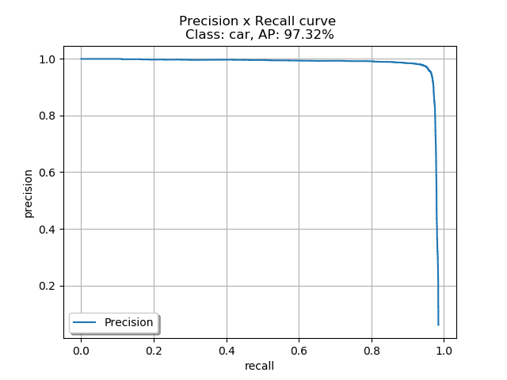
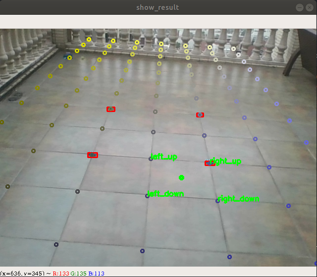
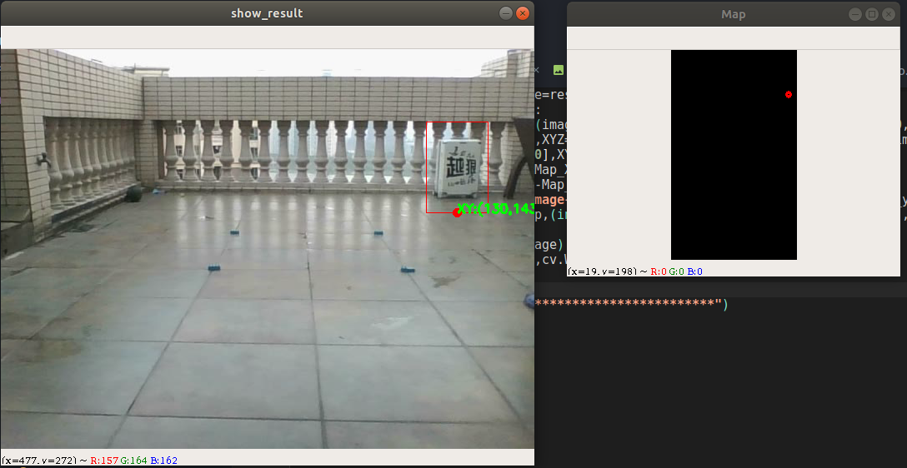
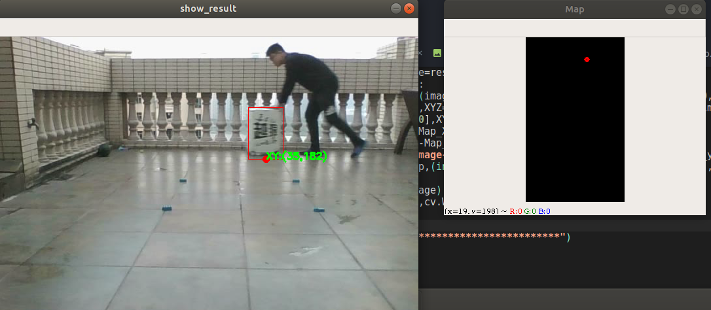

# 小地图技术整理

> 这个文档专门用于对小地图的技术进行整理,不进行具体的代码保存,只是作为效果展示的地方

*****

> **Log:**
>
> 2019.12.4:
>
> ​	今天开始正式进行RM小地图的任务制作,这个也将会是Robomaster几年最重要的一个任务,因此乖乖地一点点记录,把这个任务做好来
>
> 2019.12.10:
>
> ​	老师过来了进行了一下思路的整理,其实这个方案还是有的,接下来就是不断地进行弹道测试,查看弹道测试的效果,知道最终的优良性方案.
>
> ​	论文查询是有必要的,除此之外,还需要进行其他问题的解决,基于那么多的方案进行最终目标的确定.论文检索的时候需要有目标地检索,马上就会遇到问题了,遇到了问题之后就进行快速检索,解决问题
>
> 2019.12.20:
>
> ​	前段时间把YOLOV3的东西跑通了,接下来,就是开始进行优化,工具掌握的差不多了,就是优化的问题了,首先还是先好好地看看神经网络的识别效果,看看所对应的情况,再进行其他任务的解析
>
> 2020.2.2:
>
> ​	今天重新开始看小地图的任务.小地图应该是你今年最重要的任务,虽然目前按照道理来说应该已经开始干活了好几天了,但是其实还是很没有进入状态.弹道和工程对位其实最多在分区赛的时候就能够解决,接下来的更多任务肯定是子啊小地图上面花功夫.
>
> ​	测试了一下CenterNet的效果,感觉CenterNet的效果还算是可以的,但是没有上车去试,所以这个暂时不知道,接下来就是准备数据集,进行车上测试,看看效果了.如果CenterNet效果OK,那么就可以那这个作为底层BackBone了
>
> 2020.2.24:
>
> ​	其实感觉很多时候代码冗余,很多旧的代码不舍得删,导致了很多地方都不记得什么是自己写的了.这一块需要不断地coding从而提升代码的改进能力.这一块也算是一个工作,这半个月的时间需要进行改进的一部分
>
> 2020.3.3:
>
> ​	这几天发现ZED也有目标跟踪的操作,但是他的目标跟踪是针对人体检测+跟踪是在ZED2上面跑的.虽然这两个都不符合,但是我觉得其中的内容还是很大一部分符合了的,至少也知道了有人在做这一块的东西,跟足球运动员的跟踪是一个意思
>
> 2020.3.21:
>
> ​	周三的时候开了一个雷达站的识别分享会,发现数据难以保证泛化性,这一点是接下来需要重点研究的问题,如果可以完成泛化的话那就还好,否则就需要采用运动目标检测的方案进行一下验证,从而选择一个比较好的方案.另外,在装甲板时候的地方,需要把速度提升上去,尽可能地保证速度够快,否则识别的效果会不好.这一个也是需要考虑的.
>
> 2020.3.22:
>
> ​	进行了识别的优化,目前基本上可以做到5FPS,之后换上2080Super,同时显存变大以及一些优化,这个速度应该可以再快一些,至少可以达到10FPS.同时YOLOV3我觉得没有必要,可以直接采用YOLO-tiny的操作就好了.接下来整合一下这些信息,然后开始验证神经网络的泛化性问题,如果能报进行泛化性的保证,那么识别的任务基本上就算是完成了
>
> 2020.4.8:
>
> ​	今天需要进行神经网络泛化性的验证,只有目标检测满足了网络的泛化性,小地图的方案才能算是真正的有一个雏形
>
> 2020.4.17:
>
> ​	进行神经网络泛化性任务的解决,验证泛化性是可行的操作.完成了数据集的分类,以及mAP的计算,之后就是网络的泛化性,以及网络之间的对比了(网络之间的对比主要是在数据增强上面进行网络的比较)
>
> 2020.4.19:
>
> ​	验证了一下泛化性的情况,不同学校之间的泛化性是可以的,正确率OK,因此仍然是按照神经网络的识别思路进行任务的实现.之后的神经网络主要需要做的就是不断地优化制作数据集等的问题,确保制作数据集能够足够快,这样子到了比赛场地就可以直接使用了.(相当于整体的整体就是制作一个数据集的制作软件,然后进行各种参数的数据转化,从而最终完成任务)
>
> 2020.4.22:
>
> ​	GPU并行计算的也进行了尝试,即使是使用了DataLoader的方法,他的速度也加不上去,两张图片都是0.04s,然后再加上后面的车子的识别,这一块的整体时间掉到10帧/s我觉得并不奇怪.但是肯多地方可以进行加速,比如双目测距不用车子之间的匹配算,而直接使用ZED测距,比如装甲板的识别直接上yolo-tiny而使用yolo.这些只需要验证效果就可以加速.至少在yolo-tiny上面,可以提速很多,多张图片跑满GPU应该是不成问题的.双路 2080super走起!这些东西现在都有了代码,只需要找一个时间进行这一块的方案总结,就可以完成所有的这些任务了.
>
> 2020.4.27:
>
> ​	到了仓库进行识别泛化性的验证,发现泛化性的效果非常好,因此神经网络的方案是确定了,接下来就是把整一套工程进行重构,最终完成任务
>
> 2020.4.28:
>
> ​    接下来,就需要整理所有的代码,对各个环境进行整理,让全部的内容变得容易,确保比赛的时候可以使用.
>
> ​	从数据生成,训练,训练准确性,处理等等的问题,都需要一个一个地解决
>
> 2020.5.14:
>
> ​	接下来,需要去解决准确度,装甲板识别的问题,基于这两个才能把雷达站的主要任务进行解决.现在的只能说是把基本的问题进行了解决,但是其中还包含了许许多多的大问题需要去一一解决,一个是装甲板识别问题,这个问题做成分类问题还不好弄,最好还是弄成识别问题,然后去做分类.另外一个是识别准确度的问题,我希望能通过OCR识别对这个问题进行解决,虽然不知道效果如何,
>
> 2020.5.23:
>
> ​	今天发现2k的拍摄和720HD的拍摄还是区别很大的,而且到时候网络的训练,可能也是需要采用这种2k的结构进行训练,从而尽量保证识别的准确性.这里面可能又要下一点功夫了.不过如果2k的视频可以看得到东西,那么应该还是很不错的
>
> 2020.5.25:
>
> ​	目前基本上也实现了序列跟踪,虽然也存在了一些问题,但是大的功能模块已经实现了,接下来就是大量的工作进行完善了.另外,采用了前景检测的方法,也大大提升了识别的效果,让整体的置信度高了很多,把置信度放宽了很多,之后就是继续做数据集了
>
> 2020.5.26:
>
> ​	这个周末出小地图的第一版操作,显不处理id的问题,把车子的位置进行绘制,然后完成第一个版本的任务,至少有东西,可以放宽心来.因此目前需要重新解决大量的代码问题,从而最终完成任务.
>
> 2020.6.1:
>
> ​	目前开始进行神经网络的新一轮更新,这里面涉及的优化点有:
>
> 1. 小目标识别.可以先看那个知乎去解决
> 2. 数据集增强问题
> 3. 一个框框两个目标问题
> 4. 训练增强的问题	

******


# 一 识别

> 识别主要是获取到摄像头中每个车子的bbox,然后基于车子的bbox上面,再进行一次装甲板的识别,进行目标的分类.

## 1. 车子识别

### 1.1 神经网络

> 发现yolov3的识别一旦产生遮挡,效果就会变得比较差,因此转向了CenterNet

#### 1.1.1 网络结构

##### (1) YOLOV3

> yolov3的主要优势就是快,而且对于比较大的目标,yolov3的识别效果肯定也是不错的,因此目前是采用yolov3做在车上的装甲板识别

- 采用了所有的nms(纵向nms),避免一个区域里面有多个识别的情况

- 这一块还需要进行一个yolo-tiny识别装甲板的测试结果,看看tiny的效果如何,这算是一个工作


##### (2) CenterNet

> CenterNet作为检测的主要网络,直接对车子进行识别,避免了多个车子在一个bbox中的遮挡问题

- CenterNet的网络还没有榨干,之后可以上更大的网络进行使用
- 对于远处的目标,可以不用resize到512x512,而是采用原始的尺寸进行,或者可以再进行一下截取,从而多个区域进行识别,这里面在下一波网络效果提升部分可以去细看


#### 1.1.2 二阶识别

> 发现二阶识别中也存在一个问题,就是速度太慢,运行内存没有跑满导致整体的速度太慢了,这个也需要去解决

##### (1) 车牌识别

> 车牌识别的网络需要去确定,不一定是使用yolov3,可以使用yolo tiny,看看效果,这一块都需要代码去进行验证


#### 1.1.3 识别帧率

归根到底就是想办法把GPU跑满,跑满了就可以大力出奇迹了,到时候上了双卡GPU,应该效果就可以好很多,之后再进行测试看结果吧


### 1.2 识别效果验证

> 这一块需要一套代码进行完成

#### 1.2.1 识别泛化性

> 其实泛化性和识别的效果可以放在一起进行讨论,泛化性也是识别中的一项指标,而是且最重要的一项指标

这里面需要进行数据集的解析,从中进行数据集的分拆,然后需要使员工Tensorboard进行训练的结果的记录,从而all in all地验证泛化性问题


#### 1.2.2 识别准确率

> 这里面可以加上谷歌的数据增强的方法,然后再去验证识别的准确率

##### (1) 数据增强


##### (2) DJI数据集分析

> 2020.4.18:
>
> ​	发现数据集仍是坏的,因此还是使用之前的旧数据集进行分析

###### a. 文件概览

能用的文件夹包括Central和Final两个文件夹

- Fianl:
     - image有2685
     - annotation有2685
- Central:
     - image有2655
     - annotation有2655


**Center文件夹**

这里面的图片不包含VM_CH3,直接是学校名称,然后后缀

```
高校1Vs高校2_BOn_xxx_xxx.jpg
```

比赛结果:

```
('WMJ', '狼牙')
('速加网笃行', 'HLL')
('交龙', 'CUBOT')
('Alliance', 'Artisans')
('电创', 'RPS')
('火线', 'Born of Fire')
('领志科技Ares', '雷霆')
```


**Final文件夹**

Final的图片中包含了VW_CH3的开头,然后是两个学校的比较,中间的学校有一个Vs,前后分别是高校1和高校2,然后最后采用一个_进行最后BOn的后缀说明

```
VW_CH3高校1Vs高效2_BOx_xxx.jpg
```

提取方法:

首先去掉VW_CH3,然后找到Vs的位置,然后找到_的位置,然后得到前面和后面的参数

比赛结果:

```
('TOE', 'Super Power')
('ENTERPRIZE', 'Taurus')
('高巨毅恒', '狼牙')
('IRobot', 'Evolution')
('风暴', '华南虎')
('TDT', 'HERO')
('中维动力', 'Alliance')
('RoboGrinder', '交龙')
('RoboVigor', 'RPS')
('火线', 'Horizon')
```


###### b. **两个文件夹分析:**

其中发现,重复出现的有火线,交龙,狼牙,Alliance,RPS.

```
('WMJ', '狼牙')
('高巨毅恒', '狼牙')
('交龙', 'CUBOT')
('RoboGrinder', '交龙')
('Alliance', 'Artisans')
('中维动力', 'Alliance')
('电创', 'RPS')
('RoboVigor', 'RPS')
('火线', 'Born of Fire')
('火线', 'Horizon')
```

单独两场都没有的:

```
('速加网笃行', 'HLL')
('领志科技Ares', '雷霆')
('TOE', 'Super Power')
('ENTERPRIZE', 'Taurus')
('IRobot', 'Evolution')
('风暴', '华南虎')
('TDT', 'HERO')
```


**重新分配训练和测试集**

```
训练:
('WMJ', '狼牙')
('高巨毅恒', '狼牙')
('交龙', 'CUBOT')
('RoboGrinder', '交龙')
('Alliance', 'Artisans')
('中维动力', 'Alliance')
('电创', 'RPS')
('RoboVigor', 'RPS')
('火线', 'Born of Fire')
('火线', 'Horizon')
('速加网笃行', 'HLL')
('领志科技Ares', '雷霆')
('TOE', 'Super Power')

测试:
('ENTERPRIZE', 'Taurus')
('IRobot', 'Evolution')
('风暴', '华南虎')
('TDT', 'HERO')
```

基于这些数据集,重新生成文件夹进行处理

```
train_list=[('RoboGrinder', '交龙'), ('RoboVigor', 'RPS'),  ('TOE', 'Super Power'), ('中维动力', 'Alliance'), ('火线', 'Horizon'),('高巨毅恒', '狼牙'),('Alliance', 'Artisans'), ('WMJ', '狼牙'), ('交龙', 'CUBOT'), ('火线', 'Born of Fire'), ('电创', 'RPS'), ('速加网笃行', 'HLL'), ('领志科技Ares', '雷霆')]
test_list=[('ENTERPRIZE', 'Taurus'), ('TDT', 'HERO'),('风暴', '华南虎'),('IRobot', 'Evolution')]
```

保存成两个list,之后所有的数据集都按照这样子来了

发现文件中包含了非常多的空格,需要对空格进行处理,这个就直接每一个名称中加入一个'',这样子就保证了这是一长串的东西


**最终分为了train和test的数据集,进行任务的解析**


###### d. 生成网络训练的数据进行训练

> 这一次进行网络训练的整理,把数据集的生成,制作等等的接口给整理清楚,然后就可以不断地比较网络效果了

基于train的数据集,生成CenterNet要求的文件,从而今晚开始训练,只是针对于一类进行训练


### 1.3 结果记录

#### 1.3.1 2020.4

##### (1) 20200419

一个通宵训练了48轮,从coco的预训练数据集上面开始跑的,3k张左右训练集,400张左右的验证,983张的测试集,识别的效果是在测试集上面跑的.



正确率高的吓人,比较不敢相信

单类的识别的效果


##### (2) 20200427

> 在仓库重新跑了一下识别,基于DJI的数据集,也是能够正常识别到目标的车子的,因此神经网络的效果就确定了,肯定是采用神经网络的方案进行识别的了

###### a. 早上

识别调用包的问题,需要去把sys的东西给详细地理解一下,然后就算是完成任务了

发现直接基于DJI的数据集,在仓库跑的效果也还行,能够完成识别(中午时间拍摄的视频)

这样子神经网络的方案是确定了的,肯定就是采用神经网络了,之后的识别等的问题,只需要保证做数据的足够快等的问题就行了


###### b. 下午

下午的光照条件变了,这个时候的识别效果就差了很多,这里是需要进行解决的,但是这个的解决办法感觉就是做数据集,其他的方法并没有什么很好的办法

另外,发现可能是近距离识别效果不好,在5-10m的识别效果还是可以的,之后就是进行这个问题的解决了(除了做数据也并不知道有什么其他的好办法)


### 1.4 后续优化

> 目前需要先出结果,因此神经网络部分先不进行提升了,先手去做后续优化的问题,提升后续优化的解决方案

##### (1) 好的资料

###### a. 视频识别

> 视频识别主要是把背景信息和帧间信息进行融合,从而提升识别的结果

- **这一篇文章里面给了蛮多的相关论文**

https://blog.csdn.net/linolzhang/article/details/74999644?utm_medium=distribute.pc_relevant.none-task-blog-BlogCommendFromMachineLearnPai2-1.nonecase&depth_1-utm_source=distribute.pc_relevant.none-task-blog-BlogCommendFromMachineLearnPai2-1.nonecase

里面的提升漏检和误检的办法还是值得参考,用了我们的方法进行了提升


- **这里面就是一个简单的方法**

https://blog.csdn.net/yychentracy/article/details/88805967


##### (2) 实际处理

###### a. 第一版

> 采用与第一帧没有物体的进行相减,从而得到那个位置有目标的可能性,进而直接把置信度的进行增加
>
> 误检图的生成用最开始的背景和新的背景做差生成.这个可以大幅度地提升小地图的识别结果,效果非常的好
>
> 漏检图采用光流跟踪的方法,避免id之间的漏掉的情况,从而尽可能地保证不产生误识别的情况.但是光流跟踪里面,一定是需要帧率足够高,否则跟踪的效果就会差很多,这个没有主机是没有办法解决的
>

整体逻辑:

首先获取前景,然后得到背景的做差,这个与识别的结果进行互补升级操作

之后,基于新的光流预测点和识别结果,上下两帧之间进行object的匹配任务,得到最终确认的点,detect失败的点也可以进行显示,跟踪成功的点继续进行操作


##### (3) 光流跟踪

采用光流进行跟踪,这里面不打算采用xyz的距离的情况进行分类了,而是打算直接采用光流跟踪,这个帧率只要上的来,那么就问题不大了.

https://blog.csdn.net/xiao_lxl/article/details/95330541

这个博客的实现方法:

​	先用Harris提取特征点,然后进行特征点的跟踪,对点进行动态追踪,效果还行,但是这里面就是一些点的跟踪,可以把这些点改成xyz,但是都是一些单独的点,虽然可以对他们进行高斯分布的使用,但是觉得也不是特别好的解决方法

​	光流跟踪要求帧率一定要高,帧率低了就不行,zed的帧率里面不采用实时模式,而是一帧一帧地采,基于这个进行光流跟踪看看效果,如果可以的话,就尽量提升帧率(充钱)


##### (4) 背景相减

> 添加一个场景中一开始不会有车子的约束,从而允许一开始的置信度进行降低,最终提升车子的识别效果

###### a. 前景检测

> 前景检测的方法直接转灰度图然后相减,减出来得到东西就可以当成是前景了,不过这里面存在了一些小问题需要去解决的

1. 摄像头可能会轻微移动,虽然移动的不大,但是这样子会导致出现非常大的偏差,这里面可能需要采用前后景的操作去解决这个问题


## 2. 数据集标注软件

> 目前最好的还是直接采用神经网络进行标注,里面加入了一些数据增强的操作,提升识别的效果,另外花加入了装甲板识别的操作,提升识别的情况
>
> 另外,加入了GUI界面,从而使得整个工程的效果提升了


### 2.1 基本介绍

**初版:**

​	初版直接采用了KCF进行等级,同时导出的是txt的文件,如果需要转成json的格式还需要一定的东西(不过有了XY就还算好弄,之后可以进行函数包的封装工作)

​	目前存在的问题就是用起来并不是交互性很好,而且其实跟踪框也并不算特别好,当然了最快能解决的就是把代码重构一下,至少能说好看.这一些都需要一点点地进行解决.


**第二版:**

第二版采用了GUI界面,加入了许许多多的人性化的操作,视频采样也进行了提升,从而避免了目标太过于雷同,还有数据增强的方法,从而让识别效果又进行了一次的提升.

**整体结构**

1. GUI界面

     GUI界面用于调度全局的函数执行,这里面全部不采用继承,而是直接在初始化中定义使用功能的类,然后需要执行什么任务,直接开一个多线程进行执行即可

     多个函数之间的参数传递,全部采用了

2. BBox生成

     BBox生成中包含了BBox生成和识别两个类,BBox生成类调用了识别类中的bbox的生成操作

3. 数据增强

     数据增强中主要是使用了albumentation包进行数据增强

4. 文件处理

     文件处理中主要是负责检查数据制作的是否有误,另外就是生成各种类型的文件格式

5. 工具类:

     主要就是一些展示,画图等的工作


#### 2.1.1 使用说明

- 全部的任务采用了多线程进行执行,从而避免了一个出错就要重新开始
- 数据集的格式进行了统一,数据增强等的功能都进行了扩展
- 生成了一个专门的类用于调用所有的标注信息


#### 2.1.2 数据增强

数据增强的方法有很多,谷歌的自动数据增强也是不断地训练从而知道什么的效果比较好,但是他们的主要是针对数据分类进行,而且也没有什么太大的花样.之后可以再去看一个小目标检测增强的内容,看看他们的效果

目前打算采用的方法:

1. 颜色变换

     ```python
     A.RGBShift(r_shift_limit=10,g_shift_limit=20,b_shift_limit=20,p=1)#进行颜色变换
     ```

     

2. 尺度变换

     ```python
     A.RandomScale(scale_limit=0.6,p=1)
     ```

     

3. 随机产生车子的bbox进行遮挡

     这个按照潘铭杰的要求进行了多次的升级,目前的升级基本上不会造成目标的太大的遮挡,而且效果还是可以的

     

4. 运动模糊

     ```python
     A.MotionBlur(blur_limit=25,p=1)
     ```

数据增强的命名直接移动到了一个aug的文件夹中,先把原始图片移动过去,然后后面跟着一系列的数据增强的文件


### 2.2 提升部分

**这里面记录标注软件里面的种种问题,然后进行解决**

- 最好要可以生成CenterNet立刻用的,进行数据增强的操作,然后看到更多的东西
- 多个CenterNet网络进行识别
- 加上一个路径操作,一点直接可以展示到工作的路径(可以直接修改工作路径再修改回去)
- 使用一个ini文件进行参数操作
- a的操作仍然出错
- 查看的时候选择标注数据/增强数据
- 数据增强中遮挡不要太严重,尽量少一点遮挡
- 文件进行整合,一个数据集中也包括他对应的CenterNet?(或者说是他的模型?)
- 哪一天有空了或者什么都不想做了,可以把这里面的所有命名都进行一下修正
- 允许自动调整置信度阈值,从而进行显示
- DJI 数据集的导入问题需要确定一下,否则容易出问题


考虑把BBoxGenerater和Detector合并到一起去,只需要基于图片出一个识别结果

跳转等的专门写一个函数

其实相当于是一个大函数,进行多个小函数的分割,从而知道对应的内部操作,可以创建一个baseDetector,然后基于BaseDetector,生成一个Detector,在Detector继承BaseDetector


#### 2.2.1 完成修改

1. CenterNet至少会识别出一个目标,低于阈值也会

2. 增加了aug文件夹,原文件会保存在dataset文件夹中,数据增强会保存在aug文件夹中

3. 数据增强中增加了PMJ的数据增强要求.另外还添加了基于数据集导入数据的方式,以及数据清洗的内容

4. 增加了装机版标注的文件,只保存车的图片和装甲板的图片,不在大图中进行保存.

     之后如果想要去做大图的数据,再去想办法弄吧,现在先保存yolo能用的方案,新方案等这个做好了再说,先手确保能上场,再说精度提升的问题
     
5. 添加了导入数据的功能,可以把多个数据集进行融合操作

6. 允许导入svo文件,从avi文件中类似地导入

7. 允许识别的时候更改前后景,从而提升识别置信度

8. 加入多目标跟踪模块,多目标统一采用KCF的方法,可以多目标跟踪也可以单目标跟踪,都是一个方法,直接selectROIs就可以进行选择


#### 2.2.2 随手记录


# 二 定位

> 定位分为单目定位和双目定位,目前倾向于使用双目定位进行判断

## 1. 单目定位

> 单目定位在近距离效果不错，但是近距离的确很麻烦，非常的麻烦,做起来就是憨憨.不过通过单目,基本上算是了解了pnp,接下来的相机定位是需要靠pnp进行解决的


### 1.1 单目ProjectPoint

> 发现了ProjectPoint中出现了Bug,因此就一点点地想办法找一下BUG
>
> 2020.3.12:
>
> ​	今天发现ProjectPoint的畸变映射存在一些问题,如果使用畸变,就会产生一些坏值,但是不使用畸变,距离远了之后会出现一定的距离偏差

#### 1.1.1 ProjectPoint源码

> 因为不知道怎么实现的,因此就去看了一下ProjectPoint的Cpp源码,跟我想的一样,显示进行了坐标系的变换(使用rvec和tvec),然后是乘上了内参矩阵

1. 先让实际点XYZ乘上先通过rvec和tvec生成的Affine3d矩阵,获得空间3D点(即生成的4x4位姿矩阵)
2. 接着进行坐标系归一化,即获得了x=X/Z和y=Y/Z
3. 计算r=根号(x^2^+y^2^)
4. 获取theta,theta=atan(r)
5. 获取theta2到theat9(其实就是theta的多少次方)
6. 计算thetad(这一块是用于消除畸变的)
7. 最后,直接用相机内参乘上x,y,1这个归一化坐标系,得到像素中的uv

发现,如果直接使用ProjectPoint的内容,那么由于畸变矩阵的考虑,很容易出现一些奇怪的值,为此,不使用畸变矩阵,即畸变矩阵变成了(0,0,0,0,0),从而不会出现偶然的问题


**效果显示:**

每个点之间可以进行距离可以进行自定义选取,从而提升精度


numpy代码验证:

```python
import numpy as np
#变换到相机坐标系
Transform=np.array(([[ 8.74925928e-01, -7.43494962e-02 ,-4.78515175e-01, -5.06961339e+00],
                    [ 6.32689573e-02,  9.97223915e-01, -3.92619618e-02 ,-1.22592217e+01],
                   [ 4.80105884e-01  ,4.07615219e-03,  8.77201075e-01 , 1.42617898e+02],
[ 0.00000000e+00 , 0.00000000e+00  ,0.00000000e+00 , 1.00000000e+00]]))
point_4D=np.array(([0,20,0,1]))
out=Transform@point_4D#乘上XYZ1得到相机相机坐标系位子
print(out)

#归一化坐标系平面
point_normalize=np.array([[out[0]/out[2],out[1]/out[2],1]])
point_normalize=point_normalize.T
print(point_normalize)
camera_matrix=np.array([[660.98976401  , 0.    ,     310.80145632],
                        [  0.      ,   663.58257972, 212.52214799],
                       [  0.       ,    0.    ,       1.        ]])
print(camera_matrix)

#乘上目标矩阵,得到uv
UV=camera_matrix@point_normalize
print(UV)


```


##### (1) 是否使用畸变区别


##### (2) 点映射

> 首先先需要确定点在哪个位置,由于都是不规则的矩形,因此需要用最小二乘法求出每条边的k,b,然后判断点在这条线的上方/下方(同时斜率的正负,上下也不同).从而最终确定点属于某一个位置的索引




#### 1.1.2 全地图生成

> 接下来就是需要生成一整张地图,用于进行效果展示,看看那能否进行一个XYZ索引操作

这里的对应位置索引,直接认为是线性的,从而计算出最终结果

- 由于搜索框较大,导致了测距不准确



同一水平位置,距离差了40cm




- 当当BBOX的点比较准确的时候,准确定可以在10cm以内


#### 1.1.3 存在问题

- 目前场地较小,之后需要放到更大的场地进行测试,同时采用像素更高的摄像设备,从而看远距离效果如何
- 搜索到的点依赖于BoundingBox的准确度,如果BBOX不准确,点的变动情况也会发生很大的变化


### 1.2 几何约束

> 本质上都是3维空间的内容,因此可以由成像中心,像平面(xyz),二者建立一个直线,然后映射到平面上,角点即为所求,但是我感觉这里面主要的复杂在于像平面的xyz点不好弄出来,如果能够把像平面的点弄出来还是有可能能够解决的


## 2. 双目定位

> 双目定位还是打算使用ZED自身的深度进行测距,我们自己写的深度测距跳动的非常厉害,匹配也很容易出问题(不过现在识别精度提升了,可以再去尝试一下,毕竟这样子比较的可控)
>
> 另外,这个ZED经过了长期的使用,仍然没有坏,因此还是打算继续使用ZED进行测距,之后坏了真的怪不了谁
>
> 当目标变远了之后,由于目标点的跳动,这个的测距精度更是存在着很大的问题


### 2.1 具体方案

#### 2.1.1 双目距离

> 可以直接使用双目本身的距离进行测距,这个近距离很准,但是一旦到了远距离效果就会下降的很厉害.不过他的下降的厉害却可以保证跳动的不厉害,这个还是比较好的结果.之后还想要提升,可以对双目识别的效果再一次进行提升,从而提升测距效果


#### 2.1.2 自己双目

> 自己的双目跳动的很厉害,主要是因为两个摄像头的位置不同,从而中心框不同,导致了精度的不同,这个远距离的效果会弄得很差,算是一个数据融合问题,但是需要融合的东西太多了,太麻烦了,因此不太打算去做.先把近处的做稳做扎实再说


### 2.2 测距精度

测距情况:

10m内的测距精度大概在20cm左右

但是10m以外的测距精度就存在很大的问题了,10m以外的测距精度就很差了


下一步非常大的问题就是会产生误识别等的问题,这里面的问题一定要去解决,潜在的问题很大,识别效果问题


# 三 全局整合

## 1. 数据集制作

- 目前采用了AutoLabel2进行数据集的绘制,内部包含了GUI的界面,数据集制作等等的东西,下一次制作标签之前把整体的数据再一次进行一下清洗就好了


## 2. 神经网络识别

- 目前扩展到视频识别的方法,用了前景从而大幅度地提升了置信度的操作,同时采用了光流跟踪,从而可以跟踪一个序列了,虽然序列里面会出现断帧的情况,但是整体还算是ok的了
- CenterNet的东西可以之后再去提升,让ZED一个采用720HD的测近处,另外一个ZED采用2k测远处,从而解决远处识别的问题


## 3. 定位

- 定位现在还是采用ZED的测距进行测距,其他测距的效果还算是能够满足要求的,先保证20m的范围内能够满足要求

- 开局直接采用四个光点进行定位,如果精度不够再想办法解决,精度足够就不解决这个问题了

     发现四个光点的效果很差,现在先手怀疑是距离太远了导致识别精度太差的,当然也有可能是因为其他的,这个需要之后再进行测试才能有结果


# 三 欠缺内容

> 接下来,就需要细节地完成其中的所有点滴内容

##### (2) 训练(分割数据集,训练结果记录等)

- 标注时,可以按照一定的比例分割数据集等
- 在训练的过程中,需要不断记录网络的识别效果,从而选择一个比较好的参数
- 如果可能,需要生成一个全新的适用于训练的代码(即更改几个关键的地方)

- 后期如果想要升级,不同网络的测试可以直接测试他们的代码,然后直接trian一晚上查看效果


##### (3) 结果验证,调用执行等

- 装甲板的识别中,也需要对比不同网络的结果

     yolo-tiny还是mobilenet-ssd的效果好,这个是需要接下来进行测试的


##### (4) 双目识别

- 需要主机,在主机的情况下验证识别实时率,进而看实时率的情况调整一些识别逻辑

- 测距中,为了看清楚,大概率需要构建多级别的焦距双目相机(3-4组) 从而保证远处也能够成功识别


##### (5) 小地图显示

- 如果有跳动的很厉害的情况,需要进行修正,这个的问题需要去解决,但是如果解决未知


# 四 自建网络

> 肯定最好的是把网络信息融入其中,主要就是把语义信息融入整体,这个方向对于神经网络的可解释性等等的都非常有意思,因此先看看图神经网络的东西,主要是Reasoning-CNN,看看这里面是否有比较不错的信息

综述性文章: https://blog.csdn.net/ygfrancois/article/details/90605661


