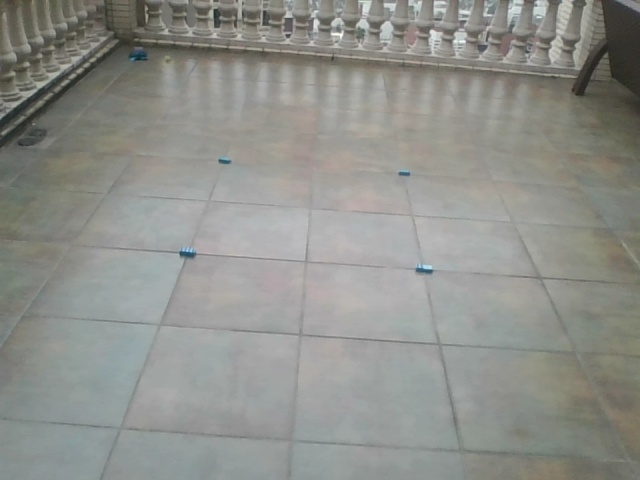
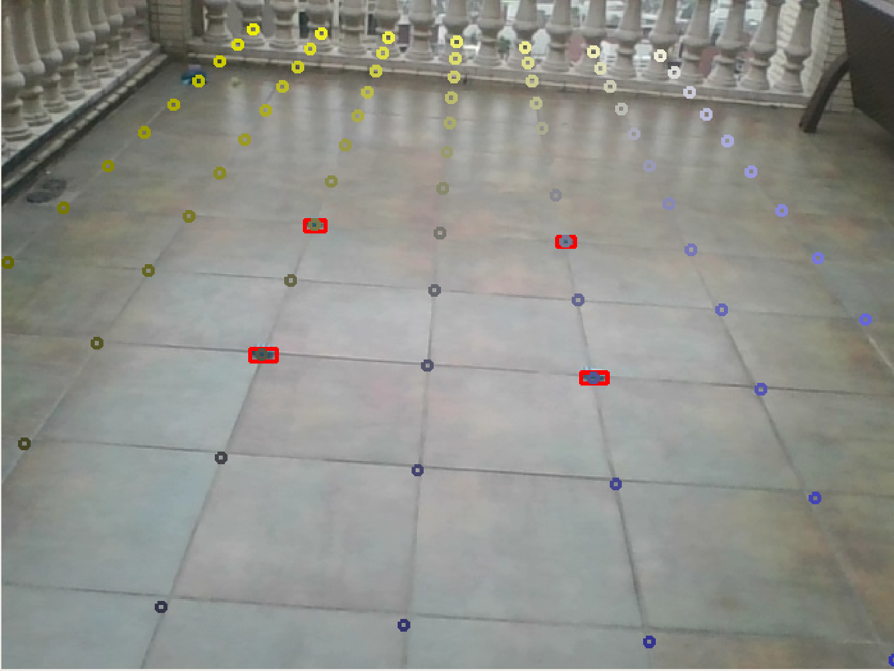
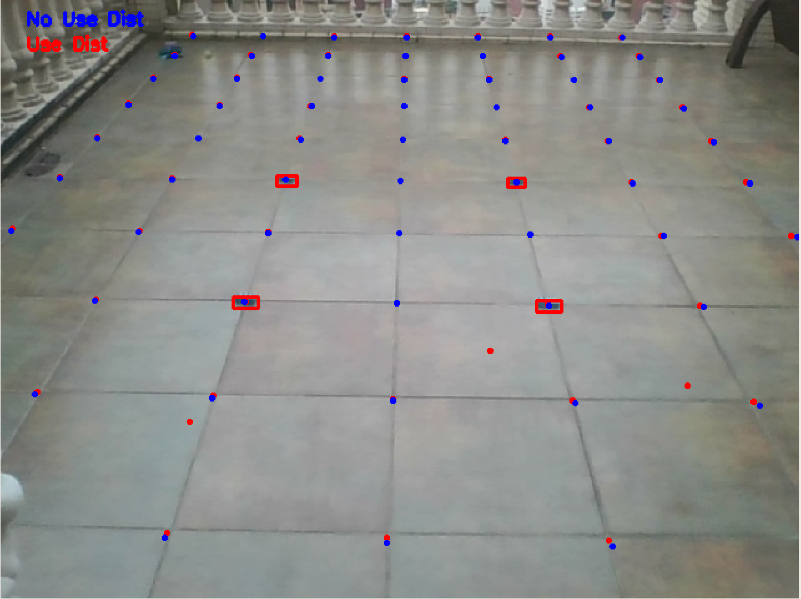
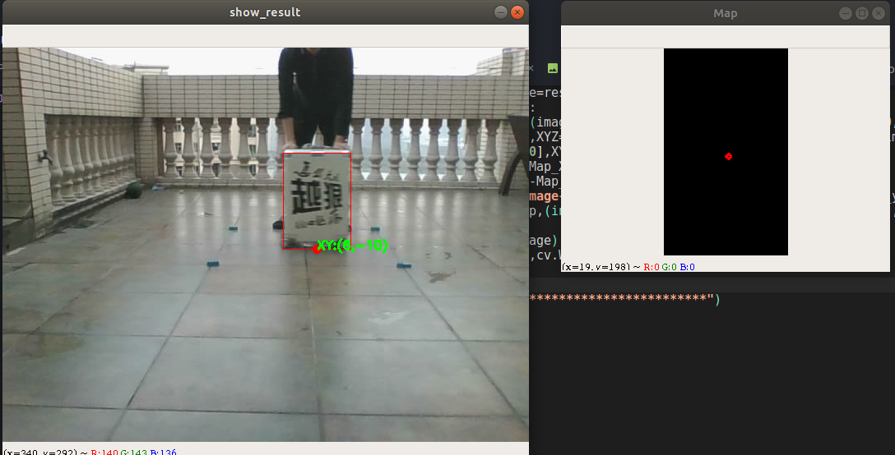
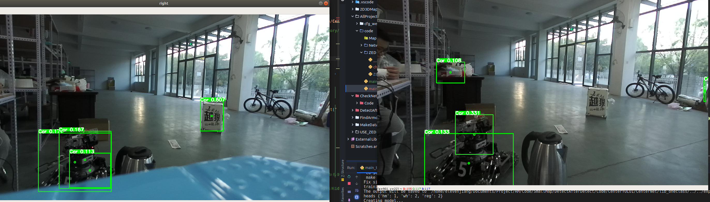

# 小地图方案整理

> 这个文档专门用于对小地图的技术进行整理,不进行具体的代码保存,只是作为效果展示的地方

*****

> **Log:**
>
> 2019.12.4:
>
> ​	今天开始正式进行RM小地图的任务制作,这个也将会是Robomaster几年最重要的一个任务,因此乖乖地一点点记录,把这个任务做好来
>
> 2019.12.10:
>
> ​	老师过来了进行了一下思路的整理,其实这个方案还是有的,接下来就是不断地进行弹道测试,查看弹道测试的效果,知道最终的优良性方案.
>
> ​	论文查询是有必要的,除此之外,还需要进行其他问题的解决,基于那么多的方案进行最终目标的确定.论文检索的时候需要有目标地检索,马上就会遇到问题了,遇到了问题之后就进行快速检索,解决问题
>
> 2019.12.20:
>
> ​	前段时间把YOLOV3的东西跑通了,接下来,就是开始进行优化,工具掌握的差不多了,就是优化的问题了,首先还是先好好地看看神经网络的识别效果,看看所对应的情况,再进行其他任务的解析
>
> 2020.2.2:
>
> ​	今天重新开始看小地图的任务.小地图应该是你今年最重要的任务,虽然目前按照道理来说应该已经开始干活了好几天了,但是其实还是很没有进入状态.弹道和工程对位其实最多在分区赛的时候就能够解决,接下来的更多任务肯定是子啊小地图上面花功夫.
>
> ​	测试了一下CenterNet的效果,感觉CenterNet的效果还算是可以的,但是没有上车去试,所以这个暂时不知道,接下来就是准备数据集,进行车上测试,看看效果了.如果CenterNet效果OK,那么就可以那这个作为底层BackBone了
>
> 2020.2.24:
>
> ​	其实感觉很多时候代码冗余,很多旧的代码不舍得删,导致了很多地方都不记得什么是自己写的了.这一块需要不断地coding从而提升代码的改进能力.这一块也算是一个工作,这半个月的时间需要进行改进的一部分
>
> 2020.3.3:
>
> ​	这几天发现ZED也有目标跟踪的操作,但是他的目标跟踪是针对人体检测+跟踪是在ZED2上面跑的.虽然这两个都不符合,但是我觉得其中的内容还是很大一部分符合了的,至少也知道了有人在做这一块的东西,跟足球运动员的跟踪是一个意思
>
> 2020.3.21:
>
> ​	周三的时候开了一个雷达站的识别分享会,发现数据难以保证泛化性,这一点是接下来需要重点研究的问题,如果可以完成泛化的话那就还好,否则就需要采用运动目标检测的方案进行一下验证,从而选择一个比较好的方案.另外,在装甲板时候的地方,需要把速度提升上去,尽可能地保证速度够快,否则识别的效果会不好.这一个也是需要考虑的.
>
> 2020.3.22:
>
> ​	进行了识别的优化,目前基本上可以做到5FPS,之后换上2080Super,同时显存变大以及一些优化,这个速度应该可以再快一些,至少可以达到10FPS.同时YOLOV3我觉得没有必要,可以直接采用YOLO-tiny的操作就好了.接下来整合一下这些信息,然后开始验证神经网络的泛化性问题,如果能报进行泛化性的保证,那么识别的任务基本上就算是完成了
>
> 2020.4.8:
>
> ​	今天需要进行神经网络泛化性的验证,只有目标检测满足了网络的泛化性,小地图的方案才能算是真正的有一个雏形
>
> 2020.4.17:
>
> ​	进行神经网络泛化性任务的解决,验证泛化性是可行的操作.完成了数据集的分类,以及mAP的计算,之后就是网络的泛化性,以及网络之间的对比了(网络之间的对比主要是在数据增强上面进行网络的比较)
>
> 2020.4.19:
>
> ​	验证了一下泛化性的情况,不同学校之间的泛化性是可以的,正确率OK,因此仍然是按照神经网络的识别思路进行任务的实现.之后的神经网络主要需要做的就是不断地优化制作数据集等的问题,确保制作数据集能够足够快,这样子到了比赛场地就可以直接使用了.(相当于整体的整体就是制作一个数据集的制作软件,然后进行各种参数的数据转化,从而最终完成任务)
>
> 2020.4.22:
>
> ​	GPU并行计算的也进行了尝试,即使是使用了DataLoader的方法,他的速度也加不上去,两张图片都是0.04s,然后再加上后面的车子的识别,这一块的整体时间掉到10帧/s我觉得并不奇怪.但是肯多地方可以进行加速,比如双目测距不用车子之间的匹配算,而直接使用ZED测距,比如装甲板的识别直接上yolo-tiny而使用yolo.这些只需要验证效果就可以加速.至少在yolo-tiny上面,可以提速很多,多张图片跑满GPU应该是不成问题的.双路 2080super走起!这些东西现在都有了代码,只需要找一个时间进行这一块的方案总结,就可以完成所有的这些任务了.
>
> 2020.4.27:
>
> ​	到了仓库进行识别泛化性的验证,发现泛化性的效果非常好,因此神经网络的方案是确定了,接下来就是把整一套工程进行重构,最终完成任务
>
> 2020.4.28:
>
> ​    接下来,就需要整理所有的代码,对各个环境进行整理,让全部的内容变得容易,确保比赛的时候可以使用.
>
> ​	从数据生成,训练,训练准确性,处理等等的问题,都需要一个一个地解决
>
> 2020.5.14:
>
> ​	接下来,需要去解决准确度,装甲板识别的问题,基于这两个才能把雷达站的主要任务进行解决.现在的只能说是把基本的问题进行了解决,但是其中还包含了许许多多的大问题需要去一一解决,一个是装甲板识别问题,这个问题做成分类问题还不好弄,最好还是弄成识别问题,然后去做分类.另外一个是识别准确度的问题,我希望能通过OCR识别对这个问题进行解决,虽然不知道效果如何,
>
> 2020.5.23:
>
> ​	今天发现2k的拍摄和720HD的拍摄还是区别很大的,而且到时候网络的训练,可能也是需要采用这种2k的结构进行训练,从而尽量保证识别的准确性.这里面可能又要下一点功夫了.不过如果2k的视频可以看得到东西,那么应该还是很不错的
>
> 2020.5.25:
>
> ​	目前基本上也实现了序列跟踪,虽然也存在了一些问题,但是大的功能模块已经实现了,接下来就是大量的工作进行完善了.另外,采用了前景检测的方法,也大大提升了识别的效果,让整体的置信度高了很多,把置信度放宽了很多,之后就是继续做数据集了
>
> 2020.5.26:
>
> ​	这个周末出小地图的第一版操作,显不处理id的问题,把车子的位置进行绘制,然后完成第一个版本的任务,至少有东西,可以放宽心来.因此目前需要重新解决大量的代码问题,从而最终完成任务.
>
> 2020.6.1:
>
> ​	目前开始进行神经网络的新一轮更新,这里面涉及的优化点有:
>
> 1. 小目标识别.可以先看那个知乎去解决
> 2. 数据集增强问题
> 3. 一个框框两个目标问题
> 4. 训练增强的问题	

******

# 一 方案制定

> 最开始的方案设计,对所有知识进行了解,从而最终决定最终的方案
>
> 这一块也类似于一个综述的工作,对所有可能用到的计数进行调研,从而最终决定使用哪一跳技术路线

## 1. 传统方向

> 传统方向目标了解的是帧差法,背景差分,光流法三大方向
>
> 参考资料:https://zhuanlan.zhihu.com/p/42938173 (知乎一个专栏系列)

### 1.1 帧差法

> 计算非常快,鲁棒性很强,但是由于此种检测方法非常容易导致物体内部出现空洞现象,因此只是适用于简单的运动目标检测

- 由于运动的物体较慢,因此导致了会出现空洞的情况,可以考虑采用多帧插法的方案进行
- 但是帧差法整体的效果我个人觉得并不是非常的理想,原因就是在于这个是我们手动进行不同的特征设计的,因此会导致泛化性不好,因此帧差法的方案还是暂时放下先不管.


### 1.2 背景差分法

> 先通过统计学建立一个背景模型,再利用背景差分法对运动目标与背景像素点进行分类

#### 1.2.1 基于统计学理论的运动目标检测

1. 混合高斯背景建模方法
2. Vibe(背景提取法)
3. PBAS(Pixel-Based Adaptive Segmenter) 运动目标检测法 融合了ViBe和SACON,但是计算比较慢,实时性并不高
4. MOG


##### (1) MOG系列

> 崔哥说这个好,那就先试一试这个吧,反正OpenCV中似乎也有包可以调的

1. **调用:**

     调用挺方便的,代码非常简单

     可以查看自己Markdown中OpenCV的运动检测部分

2. **使用效果:**

     MOG可以检测到车子的运动,但是很容易就检测出一坨东西,这样子需要不断地进行形态学开闭操作才可以把这个形状给框出来.只要是运动的目标就可以框出来,但是这里面的主要难点在于难以进行分类,强行分类的话,可以考虑数字OCR+颜色分类,这个之后有时间进行这一块的学习


#### 1.2.2 基于聚类的算法

1. CodeBook

2. K-means

     ​    


### 1.3 目标跟踪

> 目标跟踪算法KCF,主要是进行目标追踪的任务

- 知道的目标追踪算法包括:

     1. KCF的跟踪算法

          http://www.robots.ox.ac.uk/~joao/circulant/index.html (KCF官网)

          KCF在OpenCV Contribute包中有代码实现,但是跟踪的效果并不是特别的好,需要进行重新的fine-tuning一下

          使用方法看OpenCV-Contirbute的使用.这一块使用python的Contirbute安装效果会快很多,使用起来比较方便

          

**[回看感想-20201110]: 其实目标跟踪是需要跟目标识别综合起来用的,如果帧率跟不上,可以在识别期间插入目标跟踪从而让速度更快**


### 1.4 足球跟踪

> 发现了很多足球跟踪其实是拿传统视觉,至少说是没有使用非常多的神经网络完成的,这一块需要好好地看一看

#### 1.4.1 基本入门

> 主要进行https://www.jianshu.com/p/7d15cbe53866的学习

- meanshift和camshift

     meanshift好像也是做目标跟踪的,但是meanshift的跟踪框图不会随着目标大小的变化而变化.这一块,camshift可以解决这个问题

- 傅里叶变换

     - 我也不知道这个傅里叶变换是什么,但是就是能出一些东西出来


#### 1.4.2 足球跟踪实际样例

在欧冠有一场比赛中,最终是错把裁判长头识别成了足球.从而相机不断地运动到中心点.这一块非常有意思.


**[回看感想-20201110]: 另外,其实如果用视觉伺服,即直接基于2D框的中心定位,不见得效果比3D框定位效果差,其实某种程度上先PID到中心,然后再去尝试去做双目测距,基于云台角度或者中心地方进行测距,效果有可能可以提升**


## 2. 目标检测

> 神经网络方向是现在比较主流的,但是问题也非常的多,一来数据集不够充足,泛化性的问题不能够保证,二来是学习成本非常的高,只能够一点点地处理问题

资料来源:

1. 极视https://github.com/extreme-assistant/cvpr2020
2. 极视目标检测综述:https://mp.weixin.qq.com/s/l8Cfi3CIt2gqVC9i3LV6hw
3. 极视目标跟踪综述:http://bbs.cvmart.net/articles/523/cvpr-2019-lun-wen-da-pan-dian-mu-biao-gen-zong-pian
4. 综述论文:https://www.bilibili.com/read/cv4020053


### 2.1 目标检测

主要就RCNN和YOLO系列,不过小目标最终还是选择CenterNet进行识别,效果感觉好一些


**[补充-20201110]: 之后补博客补充RCNN,YOLO,heatmap系列的内容**

**[回看感想-20201110]: 其实可以多种手段的融合,特征不明显的部分可以考虑用一个图神经网络进行多层次的识别,即先识别车子,再对车子装甲板进行二次识别,或者UCB他们说的在识别的bbox上回归四个点之类的操作**


### 2.2 小目标检测

> 或许远距离的车会变成小目标,这个可以重新确定一下是否是小目标,如果此部分需要进行网络结构提升还需要重新想办法

- 小目标识别主要是在YOLO中的文章出现的,由于YOLO的网络结构原因,YOLO的小目标检测比基于Anchor方案的小目标检测差很多,因此YOLO V3针对于此还专门进行了网络结构的改进.
- 接下来如果网络里面有小目标需要进行识别,检测的,可以专门地针对于这方面的论文进行一些研究


### 2.3 行人识别

> 行人识别的意义看看有没有对于漏识别非常重要的问题,一定要非常注意是否有漏识别,一旦漏识别,很有可能导致其他非常多的问题需要进行处理


## 3. 目标跟踪

> 前期计划就采用Detection+Tracking的方案进行任务的完成,泛化性的问题目前不是需要重点考虑的方案,可以先放下不继续过多的了解

### 3.1 Detection+Tracking综述

> 简单的历史综述:http://www.sohu.com/a/330699110_651893
>
> 目前比较厉害的比如CREST:crest convolutional residual learning for visual tracking
>
> 2018 目标跟踪论文:  https://blog.csdn.net/weixin_40645129/article/details/81173088
>
> 一篇比较好的综述:https://www.jianshu.com/p/7bcb18084966?tdsourcetag=s_pcqq_aiomsg

> 主要跟踪VOT竞赛: https://www.zhihu.com/search?type=content&q=VOT2019

- **跟踪比赛算法图:**

     


- 目前,主要的方案有基于相关滤波CF(Correlation Filter)和Siam-两个大的方向的目标追踪方案,在长时间追踪的方案中Siam的方案比CF的方案好很多,短距离的追踪方案中,CF的方案比Siam的方案好很多
- 网上很多代码,但是具体使用那个代码的确不能够排版,现在内心偏向于Siam的方案,但是感觉CF的方案也是非常不错的


**[补充-20201110]: 之后补博客补充目标跟踪系列的内容**


### 3.2 移动预测

> 美团有一篇论文是进行移动目标预测的论文,即可以预测行人接下来几秒钟会往哪里去的论文,有空可以找回去看看


## 4. 未来扩展

### 4.1 随手记录

> 主要是进行随后记录,看看主要需要记录什么东西

- 多目标攻击的时候,可以进行一个提示,让大家回放
- 可以指挥员进行说明,然后大家集火攻击一台车子


## 5. 定位预研

> 小地图显示打算直接采用一个imshow,对于不同位置进行不同位置的imshow的操作完成对应的任务,输入对应的xyz,如果超出位置就不进行索引,没有超出位置就索引

### 5.1 单目定位

​	目前的一个比较大的问题是在于框的框选并不是想象中的那么好,一来数据集本身的确做的不算好,二来的确不能够要求精准性太高,这个毕竟不是Mask级别的,而是直接的BBOX的级别.这一块如果希望提升,可能需要重新做一下数据集,换一些跟踪方案看看效果了

​	目前希望出效果,那么打表的确是最有可能的,直接生成一张数据,然后根据不同的点去点,生成一个映射关系,但是内心对这个方案是拒绝的,之后有机会与其他学校的交流看看有没有更好的方案进行这一部分的问题解决吧

​	另外还可以用很基本的直接映射的方法进行,但是感觉并不算特别靠谱

使用公式:


最后还可以考虑仿射变换等


# 二 识别

> 识别主要是获取到摄像头中每个车子的bbox,然后基于车子的bbox上面,再进行一次装甲板的识别,进行目标的分类.
>
> **[回看感想-20201110]: 其实在识别里面,将物体分为几类,同时置信度如何确定等的问题都是挺大的问题,并不是简单地卷一下就行的问题 **

## 1. 车子识别

> 最终确定的方案是采用直接实物车辆一类,然后在车辆种类上再进行种类的细分.另外,这里面也尝试使用
>
> 另外,最开始尝试过目标跟踪,之后转向了目标检测,其实最好的方法应该是二者进行结合完成任务

### 1.1 目标跟踪

> 目标跟踪主要是KCF和Siam两大块的工作,KCF是传统的跟踪,Siam是商汤的跟踪网络

#### 1.1.1 传统跟踪

##### (1) KCF代表

> 这一部分可以直接opencv掉包,opencv-python的contribute的安装是真的简单,真香


##### (2) 足球场识别

> http://kns.cnki.net/KCMS/detail/detail.aspx?dbcode=CMFD&filename=2009037207.nh

- 足球检测与跟踪

- 主要是基于卡尔曼预测与模板匹配,这篇文章主要是基于维特比的方法做到 

- 有一些是直接采用卡尔曼滤波,预测可能的道路,然后看整个道路上的正确率是多少进行最优解的确定

- 区域增长法进行图像分割

- 边缘提取(Marr算子(LOG滤波器),Canny算子)

- 光流法的作用?

- 卡尔曼滤波进行候选框的缩小,从而更有可能地提高检测效果

- https://www.jianshu.com/p/7d15cbe53866

     这个采用了meanshift进行目标跟踪等的任务


#### 1.1.2 神经网络跟踪

> 主要是使用商汤的开源项目:https://github.com/STVIR/pysot
>
> 进行pysot的初探,了解其内部的接口等的参数内容

##### (1) 文件结构

1. demo:

     其中放了视频和所对应生成的gif图像

2. experiments

     其中放了各种网络内部包含的yaml文件,应该是不同网络参数的配置问题

3. install.sh

     其中要求输入install.sh文件,同时输入其中要求的conda path和创建的环境名称

4. install.md

     进行了安装教程的讲解,其中推荐直接使用install.sh文件进行安排,当然也可以采用step by step的方案进行环境的配置

     此处配置主要基于pytorch 0.4,CUDA9,还有一堆可有可无的包

     pytorch1.的还有CUDA10还是支持的,因为可以直接跑起来,很香

5. model zoo 

     网络结构动物园(可以理解为里面有一堆的模型,让人们任意地进行选择)

     网络模型可以从百度网盘上面进行下载,百度网盘中不仅仅有.yaml文件,同时还有model.pth文件用于进行网络参数的调用

     所有的网络模型都可以download下来跑一跑看看效果

6. pysot

     pysot中似乎就是完成了这个文件夹中最重要的代码构建任务,其中包括了

7. Readme

     其中写的东西比较废物,感觉没有太大的作用,主要是没有像MaskRCNN一样的sample可以进行代码调用的,就比较烦

     - 在执行demo.py文件之前,需要export一下所对应的路径,让Python找到需求的路径才行

     - 之后需要安装所对应的文件目录,即安装requirements.txt中的python包内容

     - 直接进行目标调试

          ```shell
          python tools/demo.py     --config experiments/siamrpn_alex_dwxcorr/config.yaml     --snapshot experiments/siamrpn_alex_dwxcorr/model.pth 
          
          ```

          - 运行一次时间为0.01s

          - ```
               --video /home/elevenjiang/Documents/Project/RM/Code/Dataset/MoveRobotVideo/00009.avi
               
               ```

               

          还可以使用较深网络

          ```python
          python tools/demo.py     --config experiments/siamrpn_r50_l234_dwxcorr_lt/config.yaml     --snapshot experiments/siamrpn_r50_l234_dwxcorr_lt/model.pth --video /home/elevenjiang/Documents/Project/RM/Code/Dataset/MoveRobotVideo/00009.avi
          
          ```

          运行一次时间为0.07s

          - 同时,还可以选择是否加入视频,Readme中有加入视频的操作

     - 效果还是可以的,但是动态更新的问题不符合我们比赛所需要的应用场景,还是需要采用识别的方案进行一次重新更正,两者之间进行交叉验证完成任务

     ```python
     python tools/demo.py     --config experiments/siammask_r50_l3/config.yaml     --snapshot experiments/siammask_r50_l3/model.pth 
     ```

     - 针对于Mask的方案

8. testing_dataset

     内部似乎是放一些训练数据集的,但是具体是什么不清楚,似乎没有用过

9. toolkit

     其中应该是放了一些工具包,比如评估的代码,数据集代码,可视化代码,还有一个utils,其中代码实现有一部分似乎采用了C语言,具体的使用不清楚了

10. tools

       内部包含了一些展示功能代码,如demo.py,eval.py等的代码,如果需要执行,可以直接先进行这部分代码的测试

11. 内部还包括了一些迭代器等的任务,需要进行存储


##### (2) 文件详解

> 需要开始一点点地啃下来整一套代码,因此打算从demo.py开始

###### a. demo.py

1. 首先使用参数配置器,获取了模型的路径,视频文件

2. 定义了get_frames,作为一个迭代器,用于获取所对应的下一帧

3. 导入config文件参数(一些训练/展示配置信息),比如使用CUDA与否等

4. 进行识别模型创建

     - model=ModelBuilder(),ModelBuilder继承了nn.Module,包含了init和forward(就是一个网络),其中进行了一系列的参数初始化,比如设置backbone,ADJST,是否使用Mask等等操作

     - 基于选择的cfg中的model,送入tracker的类,生成所对应的,得到目标跟踪

          tracker=build_tracker(model)

5. 进行每帧识别

     - 第一帧先进行ROI选择

     - 第一帧之后进行图像输出,图像输出中包括有无Mask的方案

          outputs=tracker.track(frame)

          - outputs中包含了bbox和best_score两个值,进行所对应的参数输出

```python
from __future__ import absolute_import
from __future__ import division
from __future__ import print_function
from __future__ import unicode_literals

import os
import argparse

import cv2
import torch
import numpy as np
from glob import glob

from pysot.core.config import cfg
from pysot.models.model_builder import ModelBuilder
from pysot.tracker.tracker_builder import build_tracker

torch.set_num_threads(1)

parser = argparse.ArgumentParser(description='tracking demo')
parser.add_argument('--config', type=str, help='config file')
parser.add_argument('--snapshot', type=str, help='model name')
parser.add_argument('--video_name', default='', type=str,
                    help='videos or image files')
args = parser.parse_args()


def get_frames(video_name):
    if not video_name:#当输入的video_name为空时,打开摄像头
        cap = cv2.VideoCapture(0)
        # warmup
        for i in range(5):
            cap.read()#重复读取5帧图片
        while True:
            ret, frame = cap.read()
            if ret:
                yield frame#使其变为一个迭代器,返回frame的图像
            else:
                break
    elif video_name.endswith('avi') or video_name.endswith('mp4'):#只允许输入avi或者mp4文件
        cap = cv2.VideoCapture(args.video_name)
        while True:
            ret, frame = cap.read()
            if ret:
                yield frame
            else:
                break
    else:#如果是采用.jpg的命名,认为是图片,直接读取所有的所对应图片
        images = glob(os.path.join(video_name, '*.jp*'))
        images = sorted(images,
                        key=lambda x: int(x.split('/')[-1].split('.')[0]))
        for img in images:
            frame = cv2.imread(img)
            yield frame#不断读取下一张图片


def main():
    #1:导入模型参数
    # cfg类继承自yacs.config中的CfgNode,内部进行了一系列参数初始化,此处主要规定文件路径和CUDA参数
    cfg.merge_from_file(args.config)
    cfg.CUDA = torch.cuda.is_available()
    device = torch.device('cuda' if cfg.CUDA else 'cpu')

    #2:创建模型
    #model来自pysot/models中的model_builder,继承自nn.Module
    #模型中基于cfg进行了一系列模型的配置
    model = ModelBuilder()

    #3:导入模型
    model.load_state_dict(torch.load(args.snapshot,
        map_location=lambda storage, loc: storage.cpu()))#导入训练参数
    model.eval().to(device)#不启用BatchNormalization和Dropout,即验证模式


    #4:创建跟踪器
    #创建跟踪器(跟踪器主要使用了识别模型,但是还是需要其他的东西)
    tracker = build_tracker(model)#采用字典调用了所对应的模型

    #5:进行视频文件导入
    first_frame = True
    if args.video_name:#进行名称的配置
        video_name = args.video_name.split('/')[-1].split('.')[0]#为了获取窗口名称
    else:
        video_name = 'webcam'
    cv2.namedWindow(video_name, cv2.WND_PROP_FULLSCREEN)

    #6:获取帧
    #模型帧是采用模型帧率问题进行帧的获取
    for frame in get_frames(args.video_name):
        if first_frame:
            try:
                init_rect = cv2.selectROI(video_name, frame, False, False)#第一帧的时候进行ROI选择
            except:
                exit()
            tracker.init(frame, init_rect)#通过初始化,获取ROI区域的对应中心点等的参数
            first_frame = False
        else:
            outputs = tracker.track(frame)
            if 'polygon' in outputs:#应该是需要mask的时候
                polygon = np.array(outputs['polygon']).astype(np.int32)
                cv2.polylines(frame, [polygon.reshape((-1, 1, 2))],
                              True, (0, 255, 0), 3)
                mask = ((outputs['mask'] > cfg.TRACK.MASK_THERSHOLD) * 255)
                mask = mask.astype(np.uint8)
                mask = np.stack([mask, mask*255, mask]).transpose(1, 2, 0)
                frame = cv2.addWeighted(frame, 0.77, mask, 0.23, -1)#采用两张图交融的方案
            else:#当没有mask的时候,即只返回bbox和best_score
                bbox = list(map(int, outputs['bbox']))
                cv2.rectangle(frame, (bbox[0], bbox[1]),
                              (bbox[0]+bbox[2], bbox[1]+bbox[3]),
                              (0, 255, 0), 3)
            cv2.imshow(video_name, frame)
            cv2.waitKey(1)


if __name__ == '__main__':
    main()

```


- **demo问题:**

     经过demo的使用之后,发现有一个很大的问题,就是长时间追踪效果并不好,不过这也足够了,下一步就可以开始考虑固定帧率进行一次新的全场识别,从而进行目标的重新跟踪.全场识别如果采用Anchor方式,那么这几个ROI也可以作为信息的提供提供进去,是一个非常好的方案

     这种方案也为之后采用Detection+Tracking的方案进行更好的融合.

     因此接下来就是采用典型的Anchor识别+典型的追踪代码完成所对应的任务

- **demo总结:**

     这份代码中,主要的任务量是在于创建model和tracker这两个类,把这两个类的代码了解了,那么接下来的任务就轻松了


##### (3) model部分

> 因为demo中主要使用了demo和track两个进行任务的完成,因此接下来啃这两部分代码

定义代码使用:

model=ModelBuilder()

(是在pysot.models.model_builder的文件夹目录下)

###### a. ModelBuilder(nn.Module)


##### (4) tracker部分

> tracker应该是逻辑的实现代码

###### a. 基本类型创建

1. 基本类型创建:

     ```
     tracker = build_tracker(model)#采用字典调用了所对应的模型
     ```

     - build_tracker中进行了三种模型的选择:

          SiamRPNTracker

          SiamMaskTracker

          SiamRPNLTTracker


###### b. SiamRPNTracker类

**SiamRPNTracker:**

> 先这对一个跟踪的类进行识别任务完成

首先,他继承于SiameseTracker类


### 1.2 目标检测

> 目标检测中使用了YOLO-v3和CenterNet两个网络进行检测,发现YOLO-V3的效果其实真的就只是这样子罢了

#### 1.2.1 YOLO-v3

> 想要快速地验证一些成果,因此就直接使用YOLO V3进行一下验证,效果如何不是非常确定了,只是初步地拿出效果来,看看情况

- 使用代码 https://github.com/eriklindernoren/PyTorch-YOLOv3

##### (1) 文件结构

1. config

     config文件夹中包括了.data和.cfg文件

     - .cfg文件主要进行卷积层数,网络结构定义等问题的解决
     - .data文件中只是包含了train,valid的路径等的操作

2. data

     data文件夹中他的存储直接采用txt文件进行读写等的操作

3. output

     处理完后的图像输出效果

4. utils

     - augmentations

          按照给定维度进行图像旋转,获得所对应的图像变换

     - datasets:

          此文件夹定义了ImageFolder和ListDataset两个类,都是继承dataset的


**这里面主要是看懂dataloader就可以了,整体还是非常简单的,不过,之后细节部分有一个横向NMS和纵向NMS两个的区别**


##### (2) 横纵向NMS

由于一个装甲板可能会被识别成多个类别,因此这里采用了横向NMS,即基于所有最高的置信度进行目标的筛选工作,从而重复识别的问题得到了解决

NMS的学习代码

```python
def non_max_suppression(prediction, conf_thres=0.5, nms_thres=0.4):
    """
    Removes detections with lower object confidence score than 'conf_thres' and performs
    Non-Maximum Suppression to further filter detections.
    Returns detections with shape:
        (x1, y1, x2, y2, object_conf, class_score, class_pred)
    """
    # From (center x, center y, width, height) to (x1, y1, x2, y2)
    prediction[..., :4] = xywh2xyxy(prediction[..., :4])#先进行变换

    output = [None for _ in range(len(prediction))]#此处生成了len(prediction)个None的list,一个图片的Tensor对应一个prediction,因此一张图片就一个

    for image_i, image_pred in enumerate(prediction):
        # Filter out confidence scores below threshold
        #所有原始的image_pred为:[10647,17]
        image_pred = image_pred[image_pred[:, 4] >= conf_thres]#先进行了概率阈值的筛选,这里可以筛选到[N,17],N往往小于100

        # If none are remaining => process next image
        if not image_pred.size(0):#没有高于阈值的就不再进行处理
            continue

        # Object confidence times class confidence
        score = image_pred[:, 4] * image_pred[:, 5:].max(1)[0]#通过目标分数乘以种类分数,得到score,shape为N
        
        # Sort by it
        image_pred = image_pred[(-score).argsort()]#从小到大排序得到分数,采用负score,得到从大到小的结果,shape为[N,17]
        class_confs, class_preds = image_pred[:, 5:].max(1, keepdim=True)#class_confs和class_preds的尺寸都是[N,1],从第5个之后,就是所有类别的分数,在所有分数中选择最大的分数作为对应的类别,然后是获得这个类别对应的编号class_preds
        detections = torch.cat((image_pred[:, :5], class_confs.float(), class_preds.float()), 1)#最后拼接成一个7维的目标

        # Perform non-maximum suppression
        keep_boxes = []#用于保存的boxes
        while detections.size(0):#detections.size(0)是最后detections解析之后所剩的目标
            large_overlap = bbox_iou(detections[0, :4].unsqueeze(0), detections[:, :4]) > nms_thres#第0个和所有其他的进行比对,得到一个detections.size(0)的Tensor
            
            #把label注释掉了,因此全部的都进行融合
            label_match = detections[0, -1] == detections[:, -1]#用于比较每个目标的label是否相同,从而知道类别是否相同,同一个类别才进行NMS操作
            print("label_match",label_match)
            print("label_match",label_match.shape)

            # Indices of boxes with lower confidence scores, large IOUs and matching labels
            invalid = large_overlap & label_match  #两个目标重叠超出一定值,且相同label的,是无效的detections,这里也是detections.size(0)的值,指代了无效的bbox
            
            
            weights = detections[invalid, 4:5]#object_conf,即这个bbox的object_conf

            # Merge overlapping bboxes by order of confidence
            detections[0, :4] = (weights * detections[invalid, :4]).sum(0) / weights.sum()#把取消了的detections进行了融合操作,即取了一个平均,从而获得了这个类别的分数
            keep_boxes += [detections[0]]#最终保存的box

            detections = detections[~invalid]#对剩下的目标进行处理,所有有效的图片称为新的detections


        if keep_boxes:
            output[image_i] = torch.stack(keep_boxes)#把所有的目标进行拼接

    return output#可能会返回[]
```


NMS的更改代码(为了横向比较,去除了类别相同的处理)

```python
def non_max_suppression(prediction, conf_thres=0.5, nms_thres=0.4):
    """
    Removes detections with lower object confidence score than 'conf_thres' and performs
    Non-Maximum Suppression to further filter detections.
    Returns detections with shape:
        (x1, y1, x2, y2, object_conf, class_score, class_pred)
    """
    # From (center x, center y, width, height) to (x1, y1, x2, y2)
    prediction[..., :4] = xywh2xyxy(prediction[..., :4])#先进行变换

    output = [None for _ in range(len(prediction))]#此处生成了len(prediction)个None的list,一个图片的Tensor对应一个prediction,因此一张图片就一个

    for image_i, image_pred in enumerate(prediction):
        # Filter out confidence scores below threshold
        #所有原始的image_pred为:[10647,17]
        image_pred = image_pred[image_pred[:, 4] >= conf_thres]#先进行了概率阈值的筛选,这里可以筛选到[N,17],N往往小于100

        # If none are remaining => process next image
        if not image_pred.size(0):#没有高于阈值的就不再进行处理
            continue

        # Object confidence times class confidence
        score = image_pred[:, 4] * image_pred[:, 5:].max(1)[0]#通过目标分数乘以种类分数,得到score,shape为N

        # Sort by it
        image_pred = image_pred[(-score).argsort()]#从小到大排序得到分数,采用负score,得到从大到小的结果,shape为[N,17]
        class_confs, class_preds = image_pred[:, 5:].max(1, keepdim=True)#class_confs和class_preds的尺寸都是[N,1],从第5个之后,就是所有类别的分数,在所有分数中选择最大的分数作为对应的类别,然后是获得这个类别对应的编号class_preds
        detections = torch.cat((image_pred[:, :5], class_confs.float(), class_preds.float()), 1)#最后拼接成一个7维的目标

        # Perform non-maximum suppression
        keep_boxes = []#用于保存的boxes
        while detections.size(0):#detections.size(0)是最后detections解析之后所剩的目标
            large_overlap = bbox_iou(detections[0, :4].unsqueeze(0), detections[:, :4]) > nms_thres#第0个和所有其他的进行比对,得到一个detections.size(0)的Tensor

            #把label注释掉了,因此全部的都进行融合
            # label_match = detections[0, -1] == detections[:, -1]#用于比较每个目标的label是否相同,从而知道类别是否相同,同一个类别才进行NMS操作
            

            # Indices of boxes with lower confidence scores, large IOUs and matching labels
            invalid = large_overlap #去除类别相同的处理 & label_match  #两个目标重叠超出一定值,且相同label的,是无效的detections,这里也是detections.size(0)的值,指代了无效的bbox

            weights = detections[invalid, 4:5]#object_conf,即这个bbox的object_conf

            # Merge overlapping bboxes by order of confidence
            detections[0, :4] = (weights * detections[invalid, :4]).sum(0) / weights.sum()#把取消了的detections进行了融合操作,即取了一个平均,从而获得了这个类别的分数
            keep_boxes += [detections[0]]#最终保存的box

            detections = detections[~invalid]#对剩下的目标进行处理,所有有效的图片称为新的detections


        if keep_boxes:
            output[image_i] = torch.stack(keep_boxes)#把所有的目标进行拼接

    return output#可能会返回[]
```

主要就是注释掉了label_match的操作


#### 1.2.2 CenterNet

> CenterNet的使用主要还是使了包调用对应的参数,整体也不算难,就是还是花了一些时间看了这个整体的工程结构
>
> 另外,一个比较大的问题是在于没有生成coco数据集的经验,因此这一部分也做了一些时间

##### (1) 配置问题

- 使用DVNv2

     安装的时候需要使用到DCNv2这个东西,好像是一种网络结果,使用了cuda编译之后速度可以提升,但是因为centernet本身提供的是pytorch0.4版本所对应的DCNv2,不能够使用,因此上github上面找到了1.0所支持的DCNv2,需要下载源码,同时把这个源码替换到工程代码本身的DCNV4的内容,才可以使用

     所对应的连接在:

     https://github.com/CharlesShang/DCNv2

- 会自动下载一个预训练的pth

     (其实所有的都会下载一个pth,dla的在pose_dla_dcn中,而resxx的在msra_resnet中),对于启动了自动下载的,都可以在他们对应的.pth文件中进行删除

     **pose_dla_dcn的例子:**

     ​	直接change pose_dla_dcn.py get_pose_net function下面的model中 "pretrained=False".


##### (2) 工程结构理解

> CenterNet的主体是使用了opts进行全局的任务操作的,也就是所有的网络结构等的信息,都是在opts的初始化参数系统中进行任务的完成的.训练,数据集,网络结构等,都是通过一个factory进行选择的

> 所有的实现代码都是在lib文件夹下的

###### a. opts.py

这个python文件是在lib的目录下,进行的是各种结构的初始化工作,比如数据集的准备,使用任务的准备等等


###### b. lib文件夹

> lib文件夹下包含了datasets detectors models等的包,神经网络的所有部分都在这一个文件夹中进行实现的

1. **datasets:**

     > 这一块包含了dataset与sample两个文件,然后包含了一个dataset_factory.py的文件.这个工厂文件就是用来进行调控这两个文件中的py代码的.两个文件夹中的代码分别是进行了各种数据集的dataset的包含,比如coco,kitti,同时还包含了另外的ctdet,ddd(这两块不是很清楚他们具体指代的是什么意思)

     - **coco.py**

          coco.py的dataset中,主要返回的是一个detections的dict,detections中包含了detection,detection中主要存放了一个bbox

          - image_id
          - category_id
          - bbox
          - score(好像没什么用)

     - **ctdet.py**

          这里面使用了gititem的工具,但是不是很懂这一块的具体任务.这一个还需要之后好好滴看代码


###### c. tools文件夹

> tools中最重要的是包含了kitti转coco的方法,需要自己构建coco结构的数据集,主要就是参考这个.py文件


###### d. src文件夹

> src文件夹下包含了demo.py,  test.py,  main.py三个文件夹,分别用于结果检验,代码测试,训练


###### e. train文件夹

> train中是进行训练任务的完成,主要的特色是直接使用了一个model,要求输入model和loss这两个东西,然后送入一个x,通过output=model(x) 得到输出,之后就可以得到其所对应的损失结果,然后进行梯度下降

```python
class ModelWithLoss(torch.nn.Module):
  def __init__(self, model, loss):
    super(ModelWithLoss, self).__init__()
    self.model = model
    self.loss = loss
  
  def forward(self, batch):
    outputs = self.model(batch['input'])
    loss, loss_stats = self.loss(outputs, batch)
    return outputs[-1], loss, loss_stats
```

- - 需要吸纳送入model和loss
          - outputs是通过model,由送入的batch中的['input']进行数据输出
          - 使用loss,得到outputs和loss中的差距(loss的定义还需要去看一下)
          - 最后返回了ouputs,loss,loss_stats

- 最终的训练在BaseTrainer这个类中实现,其实还是按照了loss.backward()的方式进行参数更新


###### f.随手记

> 这一块随便记录一些东西,之后一起进行整合

- 网络结构这一块有一个DCN的网络,这个网络也有很多东西
- 工程目录主要还是看src中的内容


- src中,包含了三个直接执行的demo,main,test的py文件(\_init\_paths.py文件是用于将lib文件添加到python的执行环境中)
- 然后是包含了lib和tools这两个文件夹,lib中主要的代码实现文件夹包括datasets,detectors,model,trains,utils这五个大的文件夹,同时还有一个opts.py进行全部参数的预定义


###### demo.py 

这一块是分开了视频和图像两种处理方法进行处理,主要是使用detector.run进行识别任务的


- os.path.isdir()用于判断一个对象是否是目录

- os.path.isfile()用于判断一个对象是否是文件

- sort与sorted:

     sort应用于list上,sorted应用于可迭代的对象上(这个sort在名称排序上也见过,需要去好好弄一下)

- demo中主要使用的是detect.run()的函数完成任务

- torch.cuda.synchronize:用于进行计时的操作


**BaseDetector.run()**

这个函数进行目标的识别操作

- 先进行了图像/图像路径/tensor的判断

- 进行图像预处理,得到images和meta两个东西

- 其中包含了几个主要函数:

     - pre_process()

          送入image,scale,传出meta.scale是opts中规定的识别尺寸

          使用了cv2.getAffineTransform进行尺寸变换

          仿射变换Affine

          PerspectiveTransform:投射变换

          这两块有时间需要去看

          最终image进行了仿射变换,变换到Tensor.而meta返回了一个dict,保存了c,s,out_height,out_width(应该是用于记录变换尺寸的?)

          

     - process()

          这里直接是进行了raise NotImplementedError的操作,就是为了让别人进行这个的继承

          这一块应该是用于让别人进行继承,如果继承了就没有问题,否则会报错,process的实际完成应该是具体的识别的py文件中进行识别的

          参考资料:https://www.php.cn/python-tutorials-393743.html

          这一块是类的使用中的问题

          - ctdet.py:

               这里进行实际的识别的内部内容的完成,如果需要自己的识别任务,就需要继承baseDetector,然后进行操作

               在debugger中,实现了对应的添加英文字母的操作

               画图中它使用了getTextSize进行矩形框的绘制

               颜色的赋值中,采用了tolist的操作,是将数组变成列表的操作

               绘制图案中,采用了add_coco_bbox的操作进行绘制,在rectangel中,是使用了getTextSize进行框的生成

     - post_process()

     - merge_outputs()


##### (3) 自己数据集使用

> 主要参考的文章:https://blog.csdn.net/weixin_41765699/article/details/100118353

###### a. voc->coco

> voc是一个文件一个xml的方式进行标注的,coco是一个json文件进行了所有图片的标注
>
> 标注主要就是给定bbox以及对应的id,image_id,其他的东西不太需要进行准备

- 首先是需要生成对应的coco数据集格式的json文件.

     这一块的数据生成感觉也算是随意.本质上json文件就是用于存放一堆xml的地方.xml的解析采用ET的方案还算是可以的,整体的代码不算复杂

- 注意在annotations中,image_id和id是不同的.id是每一个目标一个id

     ```python
     import pickle
     import json
     import numpy as np
     import cv2
     import os
     import xml.etree.ElementTree as ET
     
     
     def convert2coco(xml_dir):
         """
         xml_dir:这个文件夹下包含了一系列的xml文件
         """
         cats=['car','redarmor','bluearmor','greyarmor','base','watcher','ignore']#一共希望分成的所属类别
         cat_info=[]
         for i,cat in enumerate(cats):
             cat_info.append({'name':cat,'id':i+1})
         print(cat_info)
     
         ret={'images':[],'annotations':[],"categories":cat_info}#需要生成的json文件格式
         """
         在images中的每一个image需要插入:
         filename:直接是对一个路径的.png文件
         id:图像的id
         (其他比如height和width可以不放在这里面)
     
         在annotations中的每一个annotation需要插入的参数:
         image_id:
         id:这两个干脆设置成一样的算了
         category_id:即对应的类别编号
         bbox:需要是一个xywh的结构,xy是左上角
         occluded:是否有遮挡
         (segmentation没有好像也可以)
         """
         
         #开始进行数据解析
         num=0
         image_id=0
         xml_files=os.listdir(xml_dir)#/home/elevenjiang/Documents/Project/RM/Code/Dataset/Tococo/image_annotation
         for line in xml_files:
     
             if num%50==0:
                 print("processing ",num,"; file ",line)
     
          
             #存入图片信息
             xml_f=os.path.join(xml_dir,line)#如果需要索引绝对路径的才进行这个操作
             filename=line[0:-4]#去除掉后面的.xml
             filename=filename+".jpg"
             image={'file_name':filename,'id':int(image_id)}
             ret['images'].append(image)
     
             #存入标注信息
             tree=ET.parse(xml_f)
     
             for obj in tree.findall('object'):
                 name=obj.find('name').text
                 
                 bndbox=obj.find('bndbox')
                 xmin=int(float(bndbox.find('xmin').text))
                 xmax=int(float(bndbox.find('xmax').text))
                 ymin=int(float(bndbox.find('ymin').text))
                 ymax=int(float(bndbox.find('ymax').text))
                 difficult=0
                 category_id=7
                 if obj.find('difficulty') is not None:
                     difficult=int(obj.find('difficulty').text)
     
                 #进行车子的分类
                 if name=="car":
                     category_id=1
                     difficult=difficult
     
                 
                 if name=='armor':
                     armor_color=obj.find('armor_color').text
                     if armor_color=='red':
                         category_id=2
                         
                     elif armor_color=='blue':
                         category_id=3
                         
                     elif armor_color=='grey':
                         category_id=4
     
                 if name=='base':
                     category_id=5
                     difficult=difficult
     
     
                 if name=='watcher':
                     category_id=6
                     difficult=difficult
                 
                 ann={'image_id':image_id,'id':int(len(ret['annotations'])+1),'category_id':category_id,'bbox':[xmin,ymin,abs(xmax-xmin),abs(ymax-ymin)],'occluded':difficult}
                 ret['annotations'].append(ann)
     
             #进行image_id数更新
             num=num+1
             image_id=image_id+1
             # if image_id>500:
             #     break
     
         out_path="./newtrain_5k.json"
         json.dump(ret,open(out_path,'w'))
     
     if __name__ == "__main__":
     	 xml_dir="/home/elevenjiang/Documents/Project/RM/Code/Dataset/CenterData/Train/image_annotation"
         convert2coco(xml_dir)
         
            
     ```

- 这里面的参数赋值其实是比较随意的,都可以进行赋值操作

     - 发现真正导致数据不收敛的是因为数据做错了


###### b. 创建对应文件

> 创建对应文件主要是dataset中新增一个rm.py的文件专门用于自己的数据(直接抄coco的改改名称就好),同时更改opts中的数据集,改成是自己的数据集就好了.具体内容解释不清楚可以查看那个CSDN博客

**前面需要在环境配置中,在src/lib/models/network的文件夹中添加DCNv2的文件夹,同时取消掉下载的操作,具体的查看配置问题进行解决**

1. **添加rm.py文件**

     直接在datasets/dataset的文件夹下添加一个rm.py文件,把coco.py的文件复制过来即可,然后其中需要更改的地方为:

     - 把coco的类变换为RM的类(同时后面的super也需要改名称)

     - num_classes=80改成自己希望的类别数

     - 对data_dir进行修改,data_dir是全局的路径,而img_dir是所有文件存储的位置

     - split=='val':

          这一块需要修改几个路径:

          (其实本质上都是采用os.path.join进行路径合并,因此需要就根据刚刚配置的路径放文件就好了)

          ```python
           if split == 'val':
                self.annot_path = os.path.join(
                    self.data_dir, 'annotations', 
                    'instances_val2017.json')#data_dir/annotations/image_info_test-dev2017.json
              else:
                if opt.task == 'exdet':
                  self.annot_path = os.path.join(
                    self.data_dir, 'annotations', 
                    'instances_train2017.json')#data_dir/annotations/instances_extreme_train2017.json
                else:
                  self.annot_path = os.path.join(
                    self.data_dir, 'annotations', 
                    'instances_train2017.json')#data_dir/annotations/instances__train2017.json
          ```

     - 修改其中的class_name和_valid_ids

          这一块其实更正的id是从1开始,而不是从0开始,但是感觉影响并不大

2. **修改dataset_factory**

     在dataset_factory中添加自己的类(在COCO的同级下添加,而不是在sample_factory中添加)

3. **修改opts.py**

     - ```python
          self.parser.add_argument('--dataset', default='rm',help='coco | kitti | coco_hp | pascal |rm)
          ```

          此处的ped改为rm即可

     - default_dataset_info中的num_classes变为对应的类(即ctdet中修改num_classes)

4. **修改debugger.py**

     在其中添加上自己的类别

     

     - 如果显示的结果的命名不对,是这里出现了的datset应该命名为coco


5. **准备数据集:**

     放置文件的格式为:(文件格式readme中的development.md也说了)

     ```
     data
     └── coco
         ├── annotations
         ├── train2017
         └── val2017
     ```

     - 在data目录下方式coco这个数据集,其中annotations中放置json文件(与dafault中的json文件名字相同)

          ```
          instances_train2017.json
          instances_val2017.json
          ```

     - train2017和val2017文件夹下面分别放置训练和验证的图片(图片可以多不可以少)

          如果有的数据不够,或者会进行图片报错,可以在datasets/sample/ctdet.py中_ gettitem _的函数读取图片中固定读一张图片:

          ```python
          img = cv2.imread(img_path)
          try:
              height, width = img.shape[0], img.shape[1]
              except:
                  img=cv2.imread("/home/elevenjiang/Documents/Project/RM/Code/CenterNet/CenterNet-master_suitcate/data/coco/train2017/1.jpg")
                  height, width = img.shape[0], img.shape[1]
                  print("缺少这张图片:",img_path)
          ```

          


###### c. 训练

> 有了生成的对应model,最后的生成问题就不大了.

训练代码:

```
python main.py ctdet --exp_id res18 --batch_size 16 --master_batch 15 --lr 1.25e-4 --load_model ../models/model_last.pth
```


```
python main.py ctdet --exp_id coco_dla --batch_size 8 --master_batch 15 --lr 1.25e-4 --load_model ../models/model_last.pth
```

```
python main.py ctdet --exp_id coco_dla --batch_size 8 --master_batch 15 --lr 1.25e-4 --load_model ../exp/ctdet/coco_dla/model_last.pth
```

python main.py ctdet --exp_id coco_dla --batch_size 8 --master_batch 15 --lr 1.25e-4 --load_model ../models/model_last.pth


- 训练中的不同的数据集:
     - instances_train20170224.json:这个是直接进行了xml的移植
     - fourclass_json5k.json:这个是自己写的4个类别的判断的效果


###### d. 结果验证

```
python demo.py ctdet --demo /home/elevenjiang/Desktop/output.mp4 --load_model ../models/model_best.pth
```

```
python demo.py ctdet --demo /home/elevenjiang/Desktop/output.mp4 --load_model ../exp/ctdet/coco_dla/model_last.pth
```

- 不同训练参数的:

     - model_last_originxml.pth:直接是进行了基本转换的效果

          其对应了src0224的文件夹,这个文件夹的代码是可以进行原来xml的正确解析的

     - (4) 不同数据集方案

python demo.py ctdet --demo /home/elevenjiang/Desktop/output.mp4 --load_model ../exp/ctdet/coco_dla/model_last.pth


python demo.py ctdet --demo ../images/20200418-14-50.avi --load_model ../exp/ctdet/coco_dla/model_last.pth


> 不打算识别装甲板,而是打算按照原来的想法,直接识别大小车(红蓝),感觉这样子的效果会更好.而且装甲板识别很容易出错,等之后成功识别了车子之后再进行装甲板的识别解决

**识别方案:**

1. 识别大小蓝,大小红,哨兵一共5个.


```
python demo.py ctdet --demo ../ck_people.avi --load_model /home/elevenjiang/Documents/Project/RM/Code/CenterNet/OneClass_0419/model_last.pth
```


##### (4) 快速使用方案

> 本身CenterNet也提供了一个给我们进行识别的操作

> 不过调用他的包的时候需要注意,其底层的.lib文件是需要进行更改的,否则也会有大问题

```python
import sys
CENTERNET_PATH = /path/to/CenterNet/src/lib/
sys.path.insert(0, CENTERNET_PATH)

from detectors.detector_factory import detector_factory
from opts import opts

MODEL_PATH = /path/to/model
TASK = 'ctdet' # or 'multi_pose' for human pose estimation
opt = opts().init('{} --load_model {}'.format(TASK, MODEL_PATH).split(' '))
detector = detector_factory[opt.task](opt)

img = image/or/path/to/your/image/
ret = detector.run(img)['results']
```

其中,ret的值为:(dict中也可以包括实际的数字)

```python
#如果不确定内部包含什么,可以直接print( ret.keys() ) 查看内部有什么
{category_id : [[x1, y1, x2, y2, score], ...], }

```


使用实际例子:

```python
import sys
import cv2
CENTERNET_PATH ="/home/elevenjiang/Documents/Project/RM/Code/CenterNet/CenterNet-master/src/lib"


sys.path.insert(0, CENTERNET_PATH)

from detectors.detector_factory import detector_factory
from opts import opts

MODEL_PATH ="/home/elevenjiang/Documents/Project/RM/Code/CenterNet/CenterNet-master/exp/ctdet/coco_dla/model_best.pth"

TASK = 'ctdet' # or 'multi_pose' for human pose estimation
opt = opts().init('{} --load_model {}'.format(TASK, MODEL_PATH).split(' '))
detector = detector_factory[opt.task](opt)

img = "/home/elevenjiang/Documents/Project/RM/Code/CenterNet/CenterNet-master/images/AllianceVsArtisans_BO2_2_32.jpg"
ret = detector.run(img)['results']
#识别

print(len(ret))

for key in ret.keys():
    print(key)


image=cv2.imread(img)
for i in range(len(ret)):
    for result in ret[i+1]:
        if result[4]>0.9:
            cv2.rectangle(image,( int(result[0]),int(result[1]) ) ,(int(result[2]),int(result[3]) ),(0,0,255),1 )

cv2.imshow("image",image)
cv2.waitKey(0)


```


#### 1.2.3 车牌识别

**[回看感想-20201110]: 其实现在想想,识别里面可以考虑使用车牌识别的逻辑,尝试使用车牌识里面的方案进行装甲板的识别,但是的确缺论文所以不清楚应该怎么做**


### 1.3 神经网络性能指标

> 神经网络性能指标中最重要的两个分别是识别帧率和网络泛化性能力,这两块都需要进行测试

#### 1.3.1 识别帧率

> 虽然单纯一个CenterNet可以跑的很快,但是二阶识别中,期望的是识别到的每一个图片的bbox送入YOLO中继续进行识别,得到最终车子的分类样例,因此这个就非常耗时了,需要完成地开发GPU.也是这里了解到了GPU的详细内容

##### (1) 跑满GPU操作

> 其实显存和GPU利用率是两个东西,可以不跑满显存,但是跑满了CUDA之后,网路就不能够再进行提速了.
>
> 另外,尝试了很多方法,始终是跑不满GPU的利用率

最终的仍然是一张一张图片的送入,就非常的憨,虽然cat一下可以称为多张图片,但是速度仍然上不去


##### (2) yolov3->yolo-tiny

> 这个其实非常简单,但是一直没有时间进行yolo-tiny的测试


#### 1.3.2 网络泛化性

##### (1) DJI数据集分析

> 2020.4.18:
>
> ​	发现数据集仍是坏的,因此还是使用之前的旧数据集进行分析

###### a. 文件概览

能用的文件夹包括Central和Final两个文件夹

- Fianl:
     - image有2685
     - annotation有2685
- Central:
     - image有2655
     - annotation有2655


**Center文件夹**

这里面的图片不包含VM_CH3,直接是学校名称,然后后缀

```
高校1Vs高校2_BOn_xxx_xxx.jpg
```

比赛结果:

```
('WMJ', '狼牙')
('速加网笃行', 'HLL')
('交龙', 'CUBOT')
('Alliance', 'Artisans')
('电创', 'RPS')
('火线', 'Born of Fire')
('领志科技Ares', '雷霆')
```


**Final文件夹**

Final的图片中包含了VW_CH3的开头,然后是两个学校的比较,中间的学校有一个Vs,前后分别是高校1和高校2,然后最后采用一个_进行最后BOn的后缀说明

```
VW_CH3高校1Vs高效2_BOx_xxx.jpg
```

提取方法:

首先去掉VW_CH3,然后找到Vs的位置,然后找到_的位置,然后得到前面和后面的参数

比赛结果:

```
('TOE', 'Super Power')
('ENTERPRIZE', 'Taurus')
('高巨毅恒', '狼牙')
('IRobot', 'Evolution')
('风暴', '华南虎')
('TDT', 'HERO')
('中维动力', 'Alliance')
('RoboGrinder', '交龙')
('RoboVigor', 'RPS')
('火线', 'Horizon')
```


###### b. **两个文件夹分析:**

其中发现,重复出现的有火线,交龙,狼牙,Alliance,RPS.

```
('WMJ', '狼牙')
('高巨毅恒', '狼牙')
('交龙', 'CUBOT')
('RoboGrinder', '交龙')
('Alliance', 'Artisans')
('中维动力', 'Alliance')
('电创', 'RPS')
('RoboVigor', 'RPS')
('火线', 'Born of Fire')
('火线', 'Horizon')
```

单独两场都没有的:

```
('速加网笃行', 'HLL')
('领志科技Ares', '雷霆')
('TOE', 'Super Power')
('ENTERPRIZE', 'Taurus')
('IRobot', 'Evolution')
('风暴', '华南虎')
('TDT', 'HERO')
```


**重新分配训练和测试集**

```
训练:
('WMJ', '狼牙')
('高巨毅恒', '狼牙')
('交龙', 'CUBOT')
('RoboGrinder', '交龙')
('Alliance', 'Artisans')
('中维动力', 'Alliance')
('电创', 'RPS')
('RoboVigor', 'RPS')
('火线', 'Born of Fire')
('火线', 'Horizon')
('速加网笃行', 'HLL')
('领志科技Ares', '雷霆')
('TOE', 'Super Power')

测试:
('ENTERPRIZE', 'Taurus')
('IRobot', 'Evolution')
('风暴', '华南虎')
('TDT', 'HERO')
```

基于这些数据集,重新生成文件夹进行处理

```
train_list=[('RoboGrinder', '交龙'), ('RoboVigor', 'RPS'),  ('TOE', 'Super Power'), ('中维动力', 'Alliance'), ('火线', 'Horizon'),('高巨毅恒', '狼牙'),('Alliance', 'Artisans'), ('WMJ', '狼牙'), ('交龙', 'CUBOT'), ('火线', 'Born of Fire'), ('电创', 'RPS'), ('速加网笃行', 'HLL'), ('领志科技Ares', '雷霆')]
test_list=[('ENTERPRIZE', 'Taurus'), ('TDT', 'HERO'),('风暴', '华南虎'),('IRobot', 'Evolution')]
```

保存成两个list,之后所有的数据集都按照这样子来了

发现文件中包含了非常多的空格,需要对空格进行处理,这个就直接每一个名称中加入一个'',这样子就保证了这是一长串的东西


**最终分为了train和test的数据集,进行任务的解析**


###### d. 生成网络训练的数据进行训练

> 这一次进行网络训练的整理,把数据集的生成,制作等等的接口给整理清楚,然后就可以不断地比较网络效果了

基于train的数据集,生成CenterNet要求的文件,从而今晚开始训练,只是针对于一类进行训练


##### (2) 结果记录

###### a. 20200419

一个通宵训练了48轮,从coco的预训练数据集上面开始跑的,3k张左右训练集,400张左右的验证,983张的测试集,识别的效果是在测试集上面跑的.


正确率高的吓人,比较不敢相信

单类的识别的效果


###### B. 20200427

> 在仓库重新跑了一下识别,基于DJI的数据集,也是能够正常识别到目标的车子的,因此神经网络的效果就确定了,肯定是采用神经网络的方案进行识别的了

###### b1. 早上

识别调用包的问题,需要去把sys的东西给详细地理解一下,然后就算是完成任务了

发现直接基于DJI的数据集,在仓库跑的效果也还行,能够完成识别(中午时间拍摄的视频)

这样子神经网络的方案是确定了的,肯定就是采用神经网络了,之后的识别等的问题,只需要保证做数据的足够快等的问题就行了


###### b2. 下午

下午的光照条件变了,这个时候的识别效果就差了很多,这里是需要进行解决的,但是这个的解决办法感觉就是做数据集,其他的方法并没有什么很好的办法

另外,发现可能是近距离识别效果不好,在5-10m的识别效果还是可以的,之后就是进行这个问题的解决了(除了做数据也并不知道有什么其他的好办法)


### 1.4 后续优化

> 目前需要先出结果,因此神经网络部分先不进行提升了,先手去做后续优化的问题,提升后续优化的解决方案
>
> **[回看感想-20201110]: 其实当时的确想弄图神经网络的东西,但是那的确是偏研究方向了,在那时候必然会导致项目败北,而且的确没有什么意义,不做图神经网络是对的.另外,也是因此,见识到了工程的有用之处**


##### (1) 好的资料

###### a. 视频识别

> 视频识别主要是把背景信息和帧间信息进行融合,从而提升识别的结果

- **这一篇文章里面给了蛮多的相关论文**

https://blog.csdn.net/linolzhang/article/details/74999644?utm_medium=distribute.pc_relevant.none-task-blog-BlogCommendFromMachineLearnPai2-1.nonecase&depth_1-utm_source=distribute.pc_relevant.none-task-blog-BlogCommendFromMachineLearnPai2-1.nonecase

里面的提升漏检和误检的办法还是值得参考,用了我们的方法进行了提升


- **这里面就是一个简单的方法**

https://blog.csdn.net/yychentracy/article/details/88805967


##### (2) 实际处理

###### a. 第一版

> 采用与第一帧没有物体的进行相减,从而得到那个位置有目标的可能性,进而直接把置信度的进行增加
>
> 误检图的生成用最开始的背景和新的背景做差生成.这个可以大幅度地提升小地图的识别结果,效果非常的好
>
> 漏检图采用光流跟踪的方法,避免id之间的漏掉的情况,从而尽可能地保证不产生误识别的情况.但是光流跟踪里面,一定是需要帧率足够高,否则跟踪的效果就会差很多,这个没有主机是没有办法解决的

整体逻辑:

首先获取前景,然后得到背景的做差,这个与识别的结果进行互补升级操作

之后,基于新的光流预测点和识别结果,上下两帧之间进行object的匹配任务,得到最终确认的点,detect失败的点也可以进行显示,跟踪成功的点继续进行操作


##### (3) 光流跟踪

采用光流进行跟踪,这里面不打算采用xyz的距离的情况进行分类了,而是打算直接采用光流跟踪,这个帧率只要上的来,那么就问题不大了.

https://blog.csdn.net/xiao_lxl/article/details/95330541

这个博客的实现方法:

​	先用Harris提取特征点,然后进行特征点的跟踪,对点进行动态追踪,效果还行,但是这里面就是一些点的跟踪,可以把这些点改成xyz,但是都是一些单独的点,虽然可以对他们进行高斯分布的使用,但是觉得也不是特别好的解决方法

​	光流跟踪要求帧率一定要高,帧率低了就不行,zed的帧率里面不采用实时模式,而是一帧一帧地采,基于这个进行光流跟踪看看效果,如果可以的话,就尽量提升帧率(充钱)


##### (4) 背景相减

> 添加一个场景中一开始不会有车子的约束,从而允许一开始的置信度进行降低,最终提升车子的识别效果

###### a. 前景检测

> 前景检测的方法直接转灰度图然后相减,减出来得到东西就可以当成是前景了,不过这里面存在了一些小问题需要去解决的

1. 摄像头可能会轻微移动,虽然移动的不大,但是这样子会导致出现非常大的偏差,这里面可能需要采用前后景的操作去解决这个问题


## 2. 数据集标注软件

> 目前最好的还是直接采用神经网络进行标注,里面加入了一些数据增强的操作,提升识别的效果,另外花加入了装甲板识别的操作,提升识别的情况
>
> 另外,加入了GUI界面,从而使得整个工程的效果提升了


### 2.1 基本介绍

**初版:**

​	初版直接采用了KCF进行等级,同时导出的是txt的文件,如果需要转成json的格式还需要一定的东西(不过有了XY就还算好弄,之后可以进行函数包的封装工作)

​	目前存在的问题就是用起来并不是交互性很好,而且其实跟踪框也并不算特别好,当然了最快能解决的就是把代码重构一下,至少能说好看.这一些都需要一点点地进行解决.


**第二版:**

第二版采用了GUI界面,加入了许许多多的人性化的操作,视频采样也进行了提升,从而避免了目标太过于雷同,还有数据增强的方法,从而让识别效果又进行了一次的提升.

最重要的是加入了神经网络识别神经网络,其实目标跟踪的效果并不好,需要帧率很高采取弄目标跟踪,否则跟踪很容易跟掉,而且跟踪的效果并不好,所以还是把神经网络的接口加入了进去

另外,还统一了自己数据集的格式,统一采用YOLOv3的格式,从而图片和数据集都方便进行调用和处理的操作

**整体结构**

1. GUI界面

     GUI界面用于调度全局的函数执行,这里面全部不采用继承,而是直接在初始化中定义使用功能的类,然后需要执行什么任务,直接开一个多线程进行执行即可

     多个函数之间的参数传递,全部采用了

2. BBox生成

     BBox生成中包含了BBox生成和识别两个类,BBox生成类调用了识别类中的bbox的生成操作

3. 数据增强

     数据增强中主要是使用了albumentation包进行数据增强

4. 文件处理

     文件处理中主要是负责检查数据制作的是否有误,另外就是生成各种类型的文件格式

5. 工具类:

     主要就是一些展示,画图等的工作


#### 2.1.1 使用说明

- 全部的任务采用了多线程进行执行,从而避免了一个出错就要重新开始
- 数据集的格式进行了统一,数据增强等的功能都进行了扩展
- 生成了一个专门的类用于调用所有的标注信息


#### 2.1.2 数据增强

数据增强的方法有很多,谷歌的自动数据增强也是不断地训练从而知道什么的效果比较好,但是他们的主要是针对数据分类进行,而且也没有什么太大的花样.之后可以再去看一个小目标检测增强的内容,看看他们的效果

目前打算采用的方法:

1. 颜色变换

     ```python
     A.RGBShift(r_shift_limit=10,g_shift_limit=20,b_shift_limit=20,p=1)#进行颜色变换
     ```

     

2. 尺度变换

     ```python
     A.RandomScale(scale_limit=0.6,p=1)
     ```

     

3. 随机产生车子的bbox进行遮挡

     这个按照潘铭杰的要求进行了多次的升级,目前的升级基本上不会造成目标的太大的遮挡,而且效果还是可以的

     

4. 运动模糊

     ```python
     A.MotionBlur(blur_limit=25,p=1)
     ```

数据增强的命名直接移动到了一个aug的文件夹中,先把原始图片移动过去,然后后面跟着一系列的数据增强的文件


### 2.2 提升部分

**这里面记录标注软件里面的种种问题,然后进行解决**

- 最好要可以生成CenterNet立刻用的,进行数据增强的操作,然后看到更多的东西
- 多个CenterNet网络进行识别
- 加上一个路径操作,一点直接可以展示到工作的路径(可以直接修改工作路径再修改回去)
- 使用一个ini文件进行参数操作
- a的操作仍然出错
- 查看的时候选择标注数据/增强数据
- 数据增强中遮挡不要太严重,尽量少一点遮挡
- 文件进行整合,一个数据集中也包括他对应的CenterNet?(或者说是他的模型?)
- 哪一天有空了或者什么都不想做了,可以把这里面的所有命名都进行一下修正
- 允许自动调整置信度阈值,从而进行显示
- DJI 数据集的导入问题需要确定一下,否则容易出问题


考虑把BBoxGenerater和Detector合并到一起去,只需要基于图片出一个识别结果

跳转等的专门写一个函数

其实相当于是一个大函数,进行多个小函数的分割,从而知道对应的内部操作,可以创建一个baseDetector,然后基于BaseDetector,生成一个Detector,在Detector继承BaseDetector


#### 2.2.1 完成修改

1. CenterNet至少会识别出一个目标,低于阈值也会

2. 增加了aug文件夹,原文件会保存在dataset文件夹中,数据增强会保存在aug文件夹中

3. 数据增强中增加了PMJ的数据增强要求.另外还添加了基于数据集导入数据的方式,以及数据清洗的内容

4. 增加了装机版标注的文件,只保存车的图片和装甲板的图片,不在大图中进行保存.

     之后如果想要去做大图的数据,再去想办法弄吧,现在先保存yolo能用的方案,新方案等这个做好了再说,先手确保能上场,再说精度提升的问题

5. 添加了导入数据的功能,可以把多个数据集进行融合操作

6. 允许导入svo文件,从avi文件中类似地导入

7. 允许识别的时候更改前后景,从而提升识别置信度

8. 加入多目标跟踪模块,多目标统一采用KCF的方法,可以多目标跟踪也可以单目标跟踪,都是一个方法,直接selectROIs就可以进行选择


#### 2.2.2 随手记录


# 三 定位

> 定位分为单目定位和双目定位,目前倾向于使用双目定位进行判断,单目测距真的...是无奈之举,但是单目测距帮助进行了其他的提升,也是非常有意义的

## 1. 单目定位

> 单目定位在近距离效果不错，但是近距离的确很麻烦，非常的麻烦,做起来就是憨憨.不过通过单目,基本上算是了解了pnp,接下来的相机定位是需要靠pnp进行解决的


### 1.1 单目ProjectPoint

> 发现了ProjectPoint中出现了Bug,因此就一点点地想办法找一下BUG
>
> 2020.3.12:
>
> ​	今天发现ProjectPoint的畸变映射存在一些问题,如果使用畸变,就会产生一些坏值,但是不使用畸变,距离远了之后会出现一定的距离偏差

#### 1.1.1 ProjectPoint源码

> 因为不知道怎么实现的,因此就去看了一下ProjectPoint的Cpp源码,跟我想的一样,显示进行了坐标系的变换(使用rvec和tvec),然后是乘上了内参矩阵

1. 先让实际点XYZ乘上先通过rvec和tvec生成的Affine3d矩阵,获得空间3D点(即生成的4x4位姿矩阵)
2. 接着进行坐标系归一化,即获得了x=X/Z和y=Y/Z
3. 计算r=根号(x^2^+y^2^)
4. 获取theta,theta=atan(r)
5. 获取theta2到theat9(其实就是theta的多少次方)
6. 计算thetad(这一块是用于消除畸变的)
7. 最后,直接用相机内参乘上x,y,1这个归一化坐标系,得到像素中的uv

发现,如果直接使用ProjectPoint的内容,那么由于畸变矩阵的考虑,很容易出现一些奇怪的值,为此,不使用畸变矩阵,即畸变矩阵变成了(0,0,0,0,0),从而不会出现偶然的问题


**效果显示:**

每个点之间可以进行距离可以进行自定义选取,从而提升精度







numpy代码验证:

```python
import numpy as np
#变换到相机坐标系
Transform=np.array(([[ 8.74925928e-01, -7.43494962e-02 ,-4.78515175e-01, -5.06961339e+00],
                    [ 6.32689573e-02,  9.97223915e-01, -3.92619618e-02 ,-1.22592217e+01],
                   [ 4.80105884e-01  ,4.07615219e-03,  8.77201075e-01 , 1.42617898e+02],
[ 0.00000000e+00 , 0.00000000e+00  ,0.00000000e+00 , 1.00000000e+00]]))
point_4D=np.array(([0,20,0,1]))
out=Transform@point_4D#乘上XYZ1得到相机相机坐标系位子
print(out)

#归一化坐标系平面
point_normalize=np.array([[out[0]/out[2],out[1]/out[2],1]])
point_normalize=point_normalize.T
print(point_normalize)
camera_matrix=np.array([[660.98976401  , 0.    ,     310.80145632],
                        [  0.      ,   663.58257972, 212.52214799],
                       [  0.       ,    0.    ,       1.        ]])
print(camera_matrix)

#乘上目标矩阵,得到uv
UV=camera_matrix@point_normalize
print(UV)


```


##### (1) 是否使用畸变区别




##### (2) 点映射

> 首先先需要确定点在哪个位置,由于都是不规则的矩形,因此需要用最小二乘法求出每条边的k,b,然后判断点在这条线的上方/下方(同时斜率的正负,上下也不同).从而最终确定点属于某一个位置的索引


#### 1.1.2 全地图生成

> 接下来就是需要生成一整张地图,用于进行效果展示,看看那能否进行一个XYZ索引操作

这里的对应位置索引,直接认为是线性的,从而计算出最终结果

- 由于搜索框较大,导致了测距不准确


同一水平位置,距离差了40cm


- 当当BBOX的点比较准确的时候,准确定可以在10cm以内




#### 1.1.3 存在问题

- 目前场地较小,之后需要放到更大的场地进行测试,同时采用像素更高的摄像设备,从而看远距离效果如何
- 搜索到的点依赖于BoundingBox的准确度,如果BBOX不准确,点的变动情况也会发生很大的变化


### 1.2 几何约束

> 本质上都是3维空间的内容,因此可以由成像中心,像平面(xyz),二者建立一个直线,然后映射到平面上,角点即为所求,但是我感觉这里面主要的复杂在于像平面的xyz点不好弄出来,如果能够把像平面的点弄出来还是有可能能够解决的


## 2. 双目定位

> 双目定位还是打算使用ZED自身的深度进行测距,我们自己写的深度测距跳动的非常厉害,匹配也很容易出问题(不过现在识别精度提升了,可以再去尝试一下,毕竟这样子比较的可控)
>
> 另外,这个ZED经过了长期的使用,仍然没有坏,因此还是打算继续使用ZED进行测距,之后坏了真的怪不了谁
>
> 当目标变远了之后,由于目标点的跳动,这个的测距精度更是存在着很大的问题


### 2.1 具体方案

#### 2.1.1 双目距离

> 可以直接使用双目本身的距离进行测距,这个近距离很准,但是一旦到了远距离效果就会下降的很厉害.不过他的下降的厉害却可以保证跳动的不厉害,这个还是比较好的结果.之后还想要提升,可以对双目识别的效果再一次进行提升,从而提升测距效果


#### 2.1.2 自己双目

> 自己的双目跳动的很厉害,主要是因为两个摄像头的位置不同,从而中心框不同,导致了精度的不同,这个远距离的效果会弄得很差,算是一个数据融合问题,但是需要融合的东西太多了,太麻烦了,因此不太打算去做.先把近处的做稳做扎实再说


### 2.2 测距精度

测距情况:

10m内的测距精度大概在20cm左右

但是10m以外的测距精度就存在很大的问题了,10m以外的测距精度就很差了




下一步非常大的问题就是会产生误识别等的问题,这里面的问题一定要去解决,潜在的问题很大,识别效果问题


# 四 全局整合

## 1. 数据集制作

- 目前采用了AutoLabel2进行数据集的绘制,内部包含了GUI的界面,数据集制作等等的东西,下一次制作标签之前把整体的数据再一次进行一下清洗就好了


## 2. 神经网络识别

- 目前扩展到视频识别的方法,用了前景从而大幅度地提升了置信度的操作,同时采用了光流跟踪,从而可以跟踪一个序列了,虽然序列里面会出现断帧的情况,但是整体还算是ok的了
- CenterNet的东西可以之后再去提升,让ZED一个采用720HD的测近处,另外一个ZED采用2k测远处,从而解决远处识别的问题


## 3. 定位

- 定位现在还是采用ZED的测距进行测距,其他测距的效果还算是能够满足要求的,先保证20m的范围内能够满足要求

- 开局直接采用四个光点进行定位,如果精度不够再想办法解决,精度足够就不解决这个问题了

     发现四个光点的效果很差,现在先手怀疑是距离太远了导致识别精度太差的,当然也有可能是因为其他的,这个需要之后再进行测试才能有结果


# 五 欠缺内容

> 接下来,就需要细节地完成其中的所有点滴内容

##### (2) 训练(分割数据集,训练结果记录等)

- 标注时,可以按照一定的比例分割数据集等
- 在训练的过程中,需要不断记录网络的识别效果,从而选择一个比较好的参数
- 如果可能,需要生成一个全新的适用于训练的代码(即更改几个关键的地方)

- 后期如果想要升级,不同网络的测试可以直接测试他们的代码,然后直接trian一晚上查看效果


##### (3) 结果验证,调用执行等

- 装甲板的识别中,也需要对比不同网络的结果

     yolo-tiny还是mobilenet-ssd的效果好,这个是需要接下来进行测试的


##### (4) 双目识别

- 需要主机,在主机的情况下验证识别实时率,进而看实时率的情况调整一些识别逻辑

- 测距中,为了看清楚,大概率需要构建多级别的焦距双目相机(3-4组) 从而保证远处也能够成功识别


##### (5) 小地图显示

- 如果有跳动的很厉害的情况,需要进行修正,这个的问题需要去解决,但是如果解决未知


# 六 自建网络

> 肯定最好的是把网络信息融入其中,主要就是把语义信息融入整体,这个方向对于神经网络的可解释性等等的都非常有意思,因此先看看图神经网络的东西,主要是Reasoning-CNN,看看这里面是否有比较不错的信息

综述性文章: https://blog.csdn.net/ygfrancois/article/details/90605661


