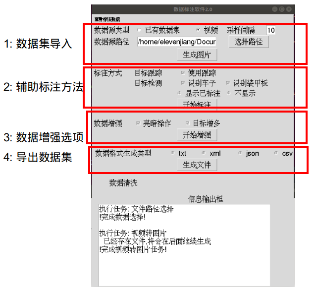
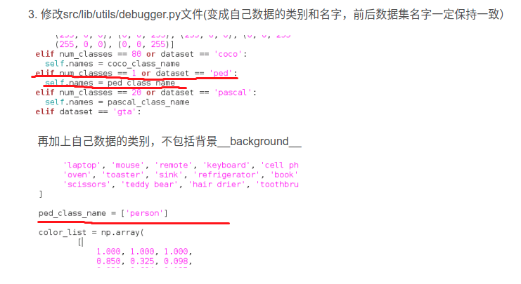

# 一 使用说明

## 1. 软件综述

本软件主要实现的功能有:

1. 使用GUI进行整体软件标注配置选择
2. 使用神经网络识别/自动跟踪的方法进行标注辅助
3. 使用BBOX增多进行数据增强
4. 支持多种数据集格式导出


## 2. 操作说明

> 快速使用主要是要使用软件中的视频转图片,BBOX增多,以及数据集导出,另外如果物体较近可以考虑使用目标跟踪
>
> 神经网络辅助标注需要在Annotation中完成MyDetector的实现从而有对应帮助的标注

### 2.1 环境配置与快速使用

> 其他所需包遇到什么安装什么即可

```
torch                         1.2.0        
torchvision                   0.2.0    
numpy                         1.18.4   
opencv-python                 4.2.0.32     
opencv-contrib-python         4.2.0.32     
tqdm                          4.35.0 
matplotlib
albumentations
progress
```

完成安装后,执行GUI.py的代码,即可看到GUI界面




具体视频教程链接:

https://www.bilibili.com/video/BV1EK411V7oC

标注过程:

1. w:弹出ROIs框进行标注
2. 拉动鼠标进行标注,回车完成此bbox的记录
3. esc退出bbox选择
4. 直接输入数字(选中图片框输入,而非在Terminal中输入),回车键保存label
5. s键保存此次标注,c键撤销标注


### 2.2 详细说明

> 未完善,日后慢慢补充

#### 2.2.1 数据集导入

> 数据集导入可以选择已有数据集导入/视频导入.

快速使用中仅介绍使用视频导入的方法.

视频导入即选择对应拍摄的视频文件,指定视频采样间隔(默认10帧采样一次),点击生成图片即可.支持多条视频连续导入.导入后,Test1/dataset/images中会生成x.jpg


#### 2.2.2 辅助标注方法

> 标注方法支持目标跟踪和目标检测,

需要自己实现BaseDetector的类,现在仅使用了EasyDetecotr,为了能够尽快进行数据集的生成


#### 2.2.3 数据集增强


#### 2.2.4 数据集导出

Json文件可以使用CenterNet进行配置

##### (1) CenterNet配置

###### a. 创建对应文件

> 创建对应文件主要是dataset中新增一个rm.py的文件专门用于自己的数据(直接抄coco的改改名称就好),同时更改opts中的数据集,改成是自己的数据集就好了.具体内容解释不清楚可以查看那个CSDN博客

**前面需要在环境配置中,在src/lib/models/network的文件夹中添加DCNv2的文件夹,同时取消掉下载的操作,具体的查看配置问题进行解决**

1. **添加rm.py文件**

     直接在datasets/dataset的文件夹下添加一个rm.py文件,把coco.py的文件复制过来即可,然后其中需要更改的地方为:

     - 把coco的类变换为RM的类(同时后面的super也需要改名称)

     - num_classes=80改成自己希望的类别数

     - 对data_dir进行修改,data_dir是全局的路径,而img_dir是所有文件存储的位置

     - split=='val':

          这一块需要修改几个路径:

          (其实本质上都是采用os.path.join进行路径合并,因此需要就根据刚刚配置的路径放文件就好了)

          ```python
           if split == 'val':
                self.annot_path = os.path.join(
                    self.data_dir, 'annotations', 
                    'instances_val2017.json')#data_dir/annotations/image_info_test-dev2017.json
              else:
                if opt.task == 'exdet':
                  self.annot_path = os.path.join(
                    self.data_dir, 'annotations', 
                    'instances_train2017.json')#data_dir/annotations/instances_extreme_train2017.json
                else:
                  self.annot_path = os.path.join(
                    self.data_dir, 'annotations', 
                    'instances_train2017.json')#data_dir/annotations/instances__train2017.json
          ```

     - 修改其中的class_name和_valid_ids

          这一块其实更正的id是从1开始,而不是从0开始,但是感觉影响并不大

2. **修改dataset_factory**

     在dataset_factory中添加自己的类(在COCO的同级下添加,而不是在sample_factory中添加)

3. **修改opts.py**

     - ```python
          self.parser.add_argument('--dataset', default='rm',help='coco | kitti | coco_hp | pascal |rm)
          ```

          此处的ped改为rm即可

     - default_dataset_info中的num_classes变为对应的类(即ctdet中修改num_classes)

4. **修改debugger.py**

     在其中添加上自己的类别

     

     - 如果显示的结果的命名不对,是这里出现了的datset应该命名为coco


5. **准备数据集:**

     放置文件的格式为:(文件格式readme中的development.md也说了)

     ```
     data
     └── coco
         ├── annotations
         ├── train2017
         └── val2017
     ```

     - 在data目录下方式coco这个数据集,其中annotations中放置json文件(与dafault中的json文件名字相同)

          ```
          instances_train2017.json
          instances_val2017.json
          ```

     - train2017和val2017文件夹下面分别放置训练和验证的图片(图片可以多不可以少)

          如果有的数据不够,或者会进行图片报错,可以在datasets/sample/ctdet.py中_ gettitem _的函数读取图片中固定读一张图片:

          ```python
          img = cv2.imread(img_path)
          try:
              height, width = img.shape[0], img.shape[1]
              except:
                  img=cv2.imread("/home/elevenjiang/Documents/Project/RM/Code/CenterNet/CenterNet-master_suitcate/data/coco/train2017/1.jpg")
                  height, width = img.shape[0], img.shape[1]
                  print("缺少这张图片:",img_path)
          ```

          


###### c. 训练

> 有了生成的对应model,最后的生成问题就不大了.

训练代码:

```
python main.py ctdet --exp_id res18 --batch_size 16 --master_batch 15 --lr 1.25e-4 --load_model ../models/model_last.pth
```


```
python main.py ctdet --exp_id coco_dla --batch_size 8 --master_batch 15 --lr 1.25e-4 --load_model ../models/model_last.pth
```

```
python main.py ctdet --exp_id coco_dla --batch_size 8 --master_batch 15 --lr 1.25e-4 --load_model ../exp/ctdet/coco_dla/model_last.pth
```

python main.py ctdet --exp_id coco_dla --batch_size 8 --master_batch 15 --lr 1.25e-4 --load_model ../models/model_last.pth


- 训练中的不同的数据集:
     - instances_train20170224.json:这个是直接进行了xml的移植
     - fourclass_json5k.json:这个是自己写的4个类别的判断的效果


###### d. 结果验证

```
python demo.py ctdet --demo /home/elevenjiang/Desktop/output.mp4 --load_model ../models/model_best.pth
```

```
python demo.py ctdet --demo /home/elevenjiang/Desktop/output.mp4 --load_model ../exp/ctdet/coco_dla/model_last.pth
```

- 不同训练参数的:

     - model_last_originxml.pth:直接是进行了基本转换的效果

          其对应了src0224的文件夹,这个文件夹的代码是可以进行原来xml的正确解析的

     - (4) 不同数据集方案

python demo.py ctdet --demo /home/elevenjiang/Desktop/output.mp4 --load_model ../exp/ctdet/coco_dla/model_last.pth


python demo.py ctdet --demo ../images/20200418-14-50.avi --load_model ../exp/ctdet/coco_dla/model_last.pth


# 二 改进需求

## 1. 需求

1. 所有需要使用到的包需要用一个新的python环境进行添加

2. 一些特殊环境需要实现的包,直接在对应位置进行生成

3. python包的路径如果缺少,需要自己完成配置

4. 生成CenterNet数据集的时候,数据集名称存在问题(但是这个不影响最终的识别)

     


## 2. 已完成更改

1. 更换了CenterNet的Backbone,变为了res18,从而方便进行识别

2. 添加了不使用任何辅助标注的方式,即重新定义了MyDetector中的内容

     这里面继承了新的类,从而不识别


# 三 存在问题

1. opencv-Contribute的为

     ```
     AttributeError: module 'cv2.cv2' has no attribute 'MultiTracker_create'
     ```

     这里面,需要使用opencv-contribute,如果出现此问题,可以重新安装opencv和opencv-contribute

     ```
     pip uninstall opencv-python opencv-contrib-python
     pip install opencv-python==4.2.0.32
     pip install opencv-contrib-python==4.2.0.32
     ```

     


