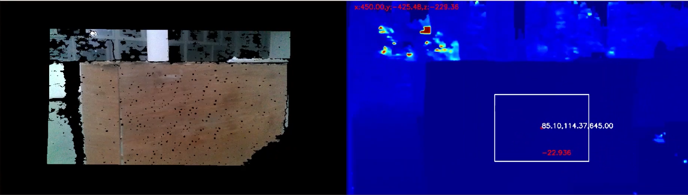

# README

## 1. 工程自动对位项目

### 1.1 项目介绍

​		使用D435进行资源岛寻找，控制工程车运动到资源岛前。

​		资源岛寻找中，采用深度图作为数据输入，以空间中一个75cm宽的竖直平面作为资源岛特征，最后通过串口控制车辆，完成资源岛自动对位任务。

 

### 1.2 技术细节说明

#### (1) **Version1:**

​		为了获取资源岛的矩形框,我们直接选取图像中心点作为深度阈值,索引深度阈值±5cm的点,再进行形态学操作.

​		如图所示，图中红色点为行李箱的正中心点，而白色点为图片中心点，以白色点的深度为阈值，索引中间正负5cm的点，再进行一些形态学操作，就可以得到右边图所示的轮廓图

#### (2) Version2:

​		在第一版本中,仅适用正对资源岛的情况,同时还容易由于噪声导致误差,为此,我们假设正中心区域的平面进行判断

1. 选用图像正中心200x100的矩形框的所有点,假定所有点在一平面上,采用最小三乘法确定这些点所在的平面,类似于最小二乘法确定一条线.
2. 计算全深度图的每个点到此平面的距离,索引距离不超过5cm的点,从而得到潜在资源岛矩形框
3. 最终获取矩形框的空间位姿,进行对位

#### (3) Version3:

​		第二版基本上只要正对就可以找到资源岛,但是仍然需要正对,为此,我们继续优化.我们一开始没有发现资源岛的时候直接在图中左中右位置进行矩形区域寻找,一旦找到资源岛的平面,我们就采用资源岛中心的区域作为下一帧寻找的位置,从而最终可以实现自动对位.

​		另外,顺嘴一说,在Version1和Version2中的算法验证我们采用的是乐视的深度相机,换成D435后,深度视野(FOV)得到了极大的提高,但是深度成像素质却大幅度下降,为此我们进行了许多滤波才提升到可以用的效果.如果不是为了能在近处仍可以看完资源岛,乐视的深度相机反而是更好的选择.

​																(最终识别效果图)

### 1.3 工程代码说明

> 所有代码在ToStation中,同时配备了UML图(ToStation/ToStation_UML.png)进行工程说明,可以考虑参考UML图进行工程理解

整体工程主要包含了Detect.py,Message.py,Move.py和tools.py.

**Detect.py:**

​	包含了RS和Detect两个类,RS用于使用相机进行通信,Detect用于寻找资源岛

**Message.py:**

​	主要是用于发送移动位置,这个需要每个队伍自行定义.

**Move.py:**

​	其中主要是Move类,该类基于Detect类识别到的资源岛进行PID运动控制,运动到目标

**tools.py:**

​	主要是提供了一些常用的功能函数