# 工程对位

******

**Log:**

> 工程对位目前比较简单的就是直接识别到目标然后开始对位,但是之后如果需要添加上花里胡哨的东西,那么还是可以有非常多的东西扩展的.初步的任务就是完成工程的对位任务
>
> 2020.1.16:
>
> ​	目前开始从识别弹药箱变成识别子弹,子弹的识别效果在打光之后会好很多
>
> 2020.3.25:
>
> ​	这段时间重启工程对位任务.工程对位的要求有2:
>
> 1. 识别所剩弹药箱位置
> 2. 工程与资源岛位置的对准
>
> 如果不考虑新的机械结构.解决方案包括**视觉和深度.**
>
> ​		视觉方面可以做,视觉上打光做颜色识别(主要针对于弹药的颜色识别).视觉上的高级识别方案可以考虑计算一个平面上的颜色分布,包含和不包含目标的颜色分布是不同的,以及考虑模板匹配的方案.最不济再使用YOLOV3的方案.整体如果可以不打光最好不要打光.
>
> ​		深度方面考虑直接识别两个平面是否包含物体,如果包含物体,则认为那一块有东西,不包含物体,则那一块地方没有东西,但是这一块需要进行点云数据的处理,滤出噪声点等.这一块的数据点可视化的操作我并不是很熟悉,需要去细节掌握.
>
> 2020.4.5:
>
> ​	今天想到了一个比较好的方案进行工程对位的解决,就是直接采用中心点是深度进行一层滤波,从而找到中心点所属的平面,然后判断一下平面是否是资源岛,如果是则完成,否则就说没有检测到目标
>
> 2020.4.7:
>
> ​	开始采用三个点进行采样的方案,从而知道平面的所属,提升识别的效果.不过里面还有很多需要进行提升的地方,很多参数都需要慢慢地调整
>
> 2020.4.9:
>
> ​	进行了任务的沟通,发现这竟然要求我的距离要尽量能够解决50cm内的问题,但是但是感觉这里面,为什么不能够算上工程的距离,如果算上了工程的距离,那么视野是不是就能够满足要求了呢
>
> ​	之后查了一下D435的对位方法,发现D435的FOV是87°的,从而750mm的视野,距离只需要350mm,从而这个问题算是能够解决了,但是这一块需要最后去基地实际验证,这里我并不敢打包票可以完成这个任务,需要回到基地进行任务的验证
>
> 2020.5.16:
>
> ​	进行串口的使用,完成串口传输的任务
>
> 2020.5.18:
>
> ​	开始进行工程对位任务的完成,希望整体不会浪费我特别多的时间,Realsense有了,以前的平面识别也有,而且主要还是基于Python算了,没必要基于Cpp,快速开发,时间不够的地方调用cpp进行加速即可
>
> 2020.6.9:
>
> ​	目前车子可以通过串口动起来了,但是越做越发现这里面的问题一堆一堆的,想要解决需要非常多的操作.从串口的互相通信,到整个项目更像一个项目而非一个python的小程序,等等的问题都需要进行解决.
>
> 2020.6.15:
>
> ​	上一周整体完成了节能环保的任务,接下来就是主要突破资源岛对位,看看自己写代码能多快了把,争取有多快就多快地解决问题

*****


## 1. 弹药箱位置判断(挂起)

> 暂时挂起,主要由许良铺负责这一块的任务
>
> 这一块主要进行基于深度和基于颜色两种思路进行识别

### 1.1 识别思路

#### 1.1.1 颜色

> 颜色整体会存在不鲁棒的情况,需要到比赛场现场调整

- 最基本的就是直接打光,然后找白色弹丸的位置,再索引对应的位置进行二次验证

     存在问题:

     1. 打光的灯光控制比较麻烦,而且太暴力简单的方法感觉上就不好

- 进阶是不用打光,使用颜色分布的方案,去分析弹药箱对应的位置的颜色分布情况(这一块需要在比赛前在弹药箱前放一个标定板,识别出摄像头位置,从而结算出对应位置上是否有弹药箱)

     1. 颜色分布的方案需要进行验证,基于颜色但是又要有很强的颜色变化的特征

- 实在不行使用YOLOV3进行识别,同时进行数据增强,增加不同颜色的变化的数据,保证识别更为鲁棒

     1. 速度较慢,需要1以上甚至更多,同时也是在比赛场上需要重新训练,光照等的不能够保证


#### 1.1.2 深度

1. 识别两个平面上是否有物体,从而知道是否有弹药箱的位置,但是这一块的数据结构不是很懂如何操作

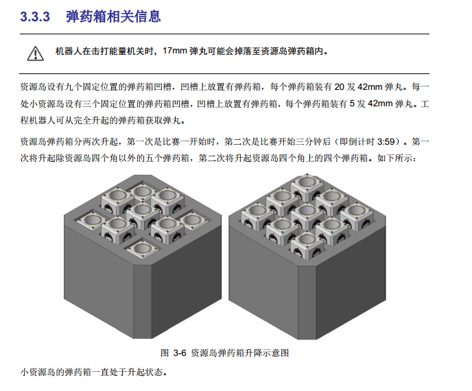

**即识别升起和降落的两个平面,判断这两个平面上是否有物体的存在**

存在问题:

1. 深度信息操作并不算好,我并不熟悉深度信息的处理方法
2. 噪声点等,都算是深度信息的处理方法


2. 使用类似Hog的特征提取方法,对点云图进行边缘点,尖角等的特征提取,从而对于弹药箱进行识别

存在问题同上,没做过,需要进行学习

3. 直接测试固定位置的距离,查看这些距离上面是否有目标


### 1.2 实验实现

#### 1.2.1 颜色方案

##### (1) 最low的方案

- 固定Realsense位置,同时固定光照的颜色,之后很快就可以跳出一个比较好的阈值,完成参数的获取操作,然后获得矩形的中心点,进而得到中心点的XYZ信息,最终实现弹药的识别(寒假前已经进行了第一版的实现验证)


##### (2) 基于颜色分布

- 学习颜色频率等,同时还需要有一个进行提前定位的


#### 1.2.2 深度方案

- 直接基于固定点的测距从而确定是否有目标(假设已经对齐位置),这一套思路类似于5个传感器直接测距的方案.没有进行验证,之后可以采用projectPoint的方法映射到2维平面,然后具体的尺寸进行一下修改即可


## 2. 资源岛识别

> 资源岛对位要求进行大资源岛的识别.不采用颜色作为识别,而是直接采用深度进行实现.目前主要是采用找平面的方案,接下来可以尝试的有3维ICP的配准方法,或者2维里面拟合出多个平面出来进行比对等等

### 2.1 二维深度图

#### 2.1.1 找线方案(废弃)

> 找线方案存在的问题主要是
>
> 1. 距离判断并不好,距离信息处的阈值调控并不好
> 2. 线在较远处能够找到,但是这种先经过膨胀等的,形状就很难看了,这些对应位置上面也并不是非常标准的线

##### (1) 方案介绍:

1. 把深度图直接归一化0,255,然后做了一个图层操作获得颜色图,然后直接进行canny操作,获得了边线

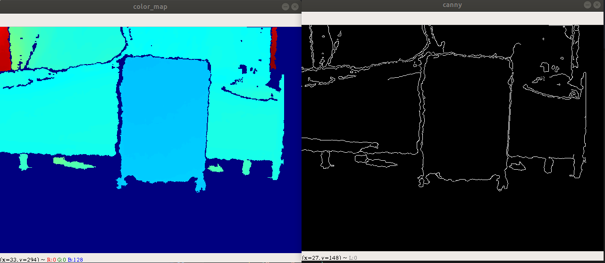


2. 对所有的线进行膨胀腐蚀操作,然后只允许纵向很长的线存在

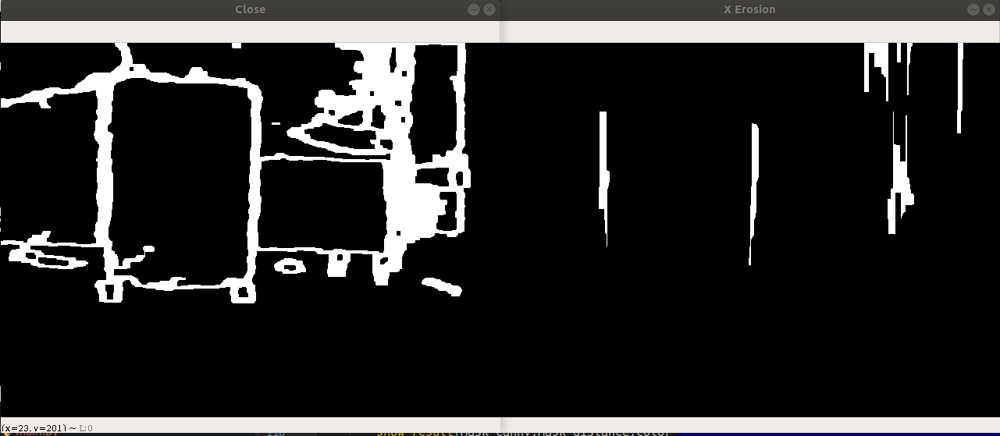


3. 对于一定距离内的东西进行阈值分割,从而知道比较近的一块区域的内容


4. 最后对2,3两个步骤的Mask进行相与操作,得到最后的结果

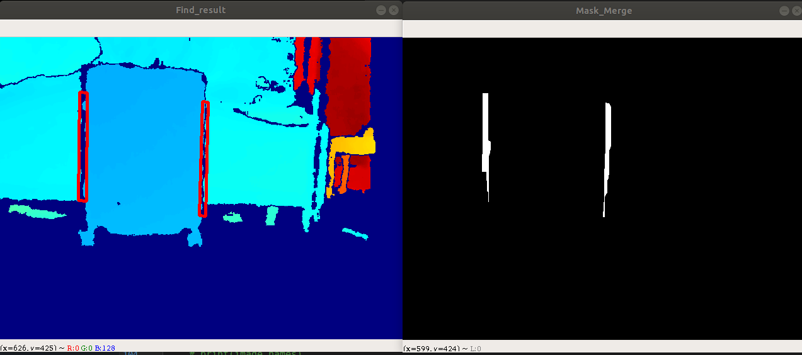


##### (2) 存在问题

###### a. canny方面问题:

在比较边缘的地方,由于噪声的原因,会存在边界的0,从而会滤波出这种线

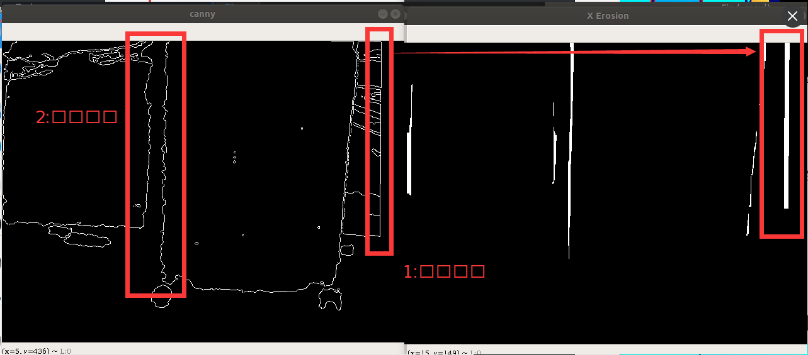


###### b. 距离滤波的问题

距离的阈值其实并不好判断,因为车子是运动的,从而这一步很容易把周围环境给包围进去了

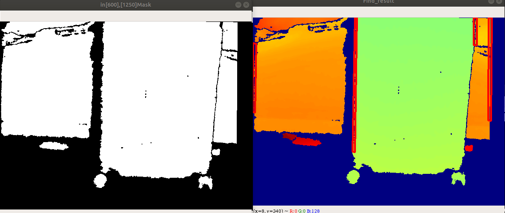


###### c. 线条匹配问题

就算找到了两条边,一来由于膨胀腐蚀,从而边的信息肯定是不准的,需要在一条横向上进行采样从而知道距离信息等,在图中的蓝线上面对深度图进行一个一个点的采样,从而知道摄像头相对于平面是否有倾斜,以及这两条蓝线的长度,从而知道是否对齐准确.

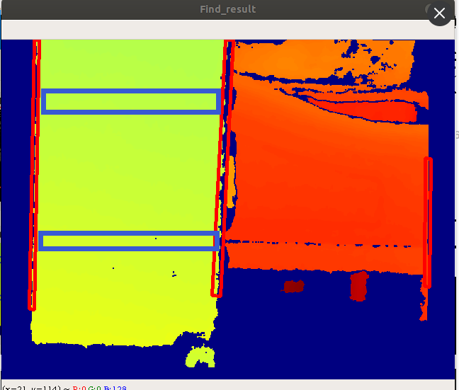


##### (3) 重点解决问题

a. 距离尺度阈值问题

> 目前主要的问题是深度的动态阈值问题,这个问题之前也没有进行解决,其实最好能够先进行一下聚类操作,或者说点一个点,然后自由地扩展到整个平面

- 现在可以考虑,对中心的那个点进行自由的尺度扩展,扩散到整个平面,从而只要保证中心对准资源岛,然后就可以找到整个平面了


#### 2.1.2 中心点找平面

> 核心方法:直接找图片中心点的深度,然后基于中心点索引他的平面,如果平面符合要求(宽度足够,在中心点),则这个平面就是资源岛的平面


##### (1) 实现思路

1. 选取中心点(作图白色点),记录此中心点距离N,直接对深度图进行inRange操作,即只允许深度图中在距离N上下5cm的点出现

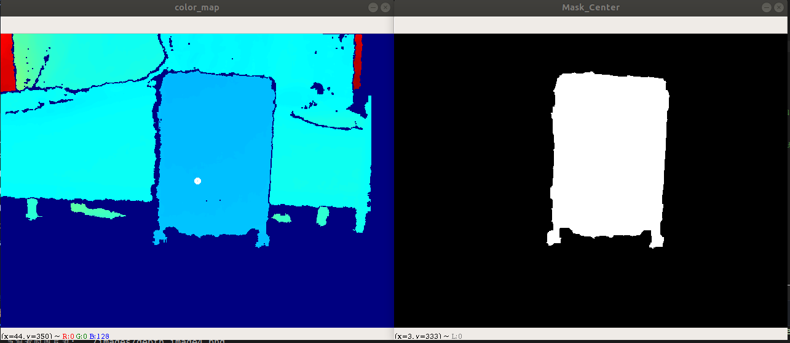


2. 采用旋转矩形拟合,并得到近邻的4个点,并计算这4个点的深度信息


3. 计算X方向上的差距,如果差距较小,则认为是资源岛,从而完成识别,否则则认为没有完成识别,不进行中间红点的索引

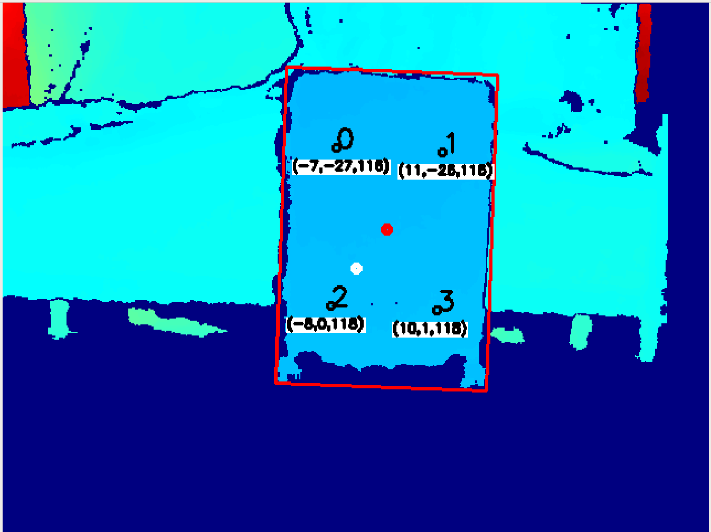


##### (2) 效果展示

行李箱宽38cm,高56cm,选取的是一半,因此距离X应为19,Y为28

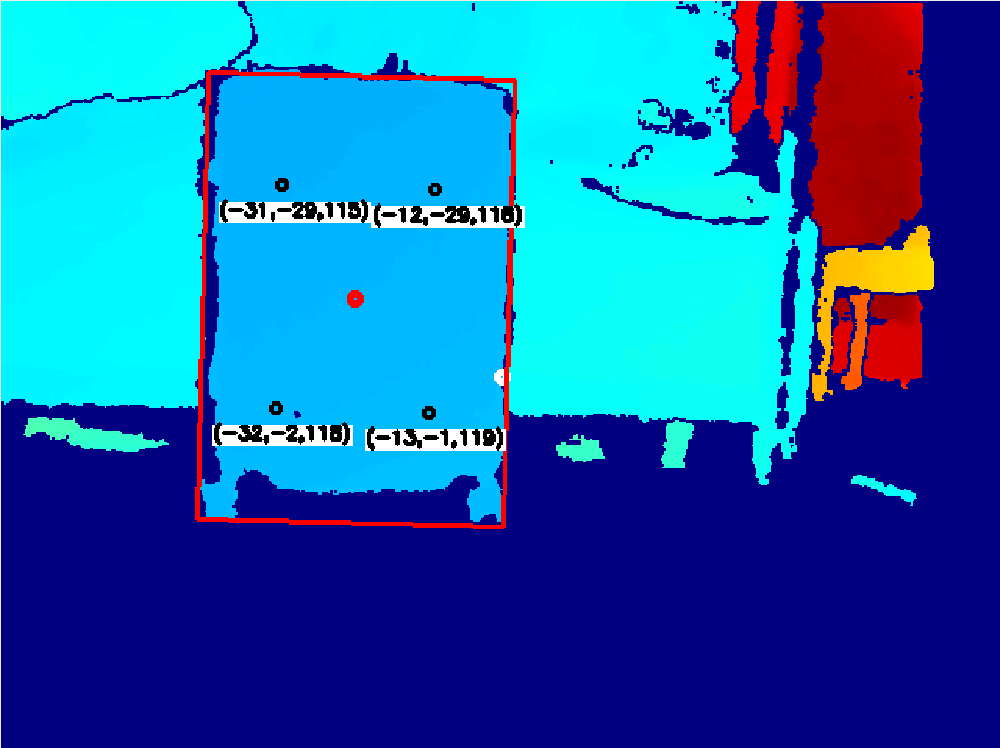

**X方向差19,19,Y方向差27,28,效果较好**


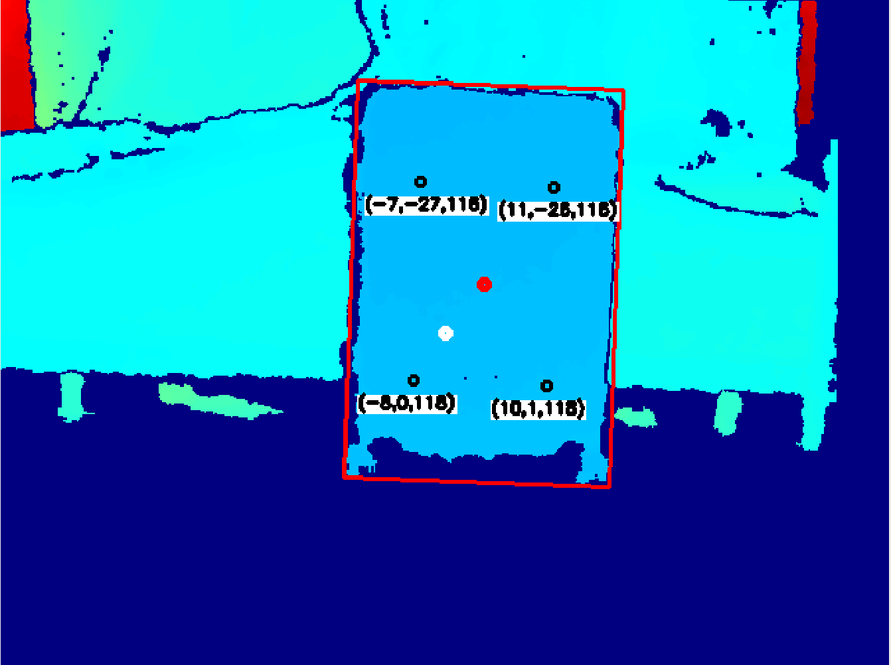

**X方向差18,18,Y方向差27,28,效果较好**


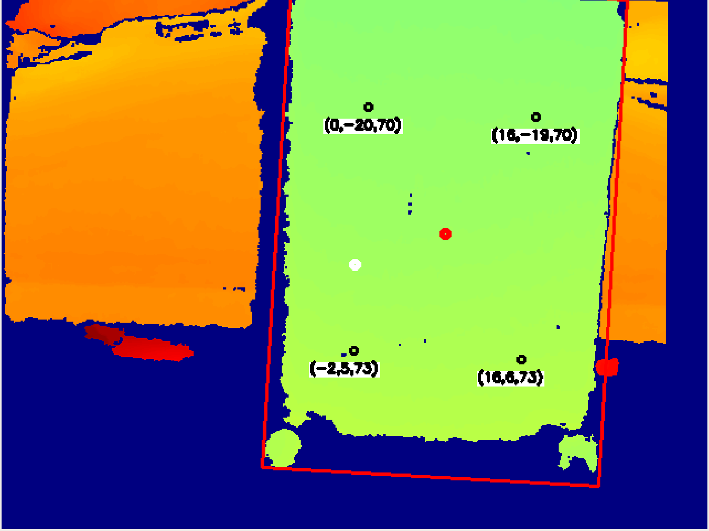

**X方向差16,18,Y方向差25,25,效果勉强了**


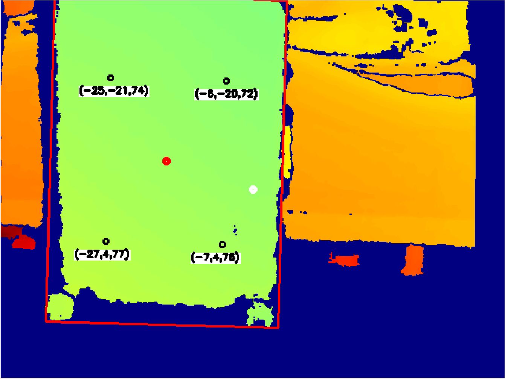

**X方向差19,20,Y方向差25,24,效果勉强**


##### (3) 存在问题:

- 如果平面存在倾斜,则是否会存在问题
- 是否会包括不了资源岛的左右点


**大问题:**

- 发现存在会索引到地面的情况,形态学操作能够解决,狠一点做滤波就好

- 发现侧面的情况效果会很差

     尝试去拟合这个平面


#### 2.1.3 中心点升级

> 中心点已经出了第一版的效果,效果还算是有的,但是的确在第一层面的滤除方面的效果不好,因此接下来需要去重新更改inrange的滤波效果

##### (1) 实现思路

> 目前采用直接采样3个点的方案进行,不过这个方案要求的中心点对准的要求更高了,当然了,其实整体也还好,毕竟资源岛还是非常大的.不过整体实现非常的粗糙,很多地方都进行大的改进

- 对于一条线上的3个点云,如果中心点和两边的点差距不是很大,就直接认为没有很大问题,直接返回Center的值
- 否则则进行侧面的选取,把侧面的冗余量放宽,且左右各筛选一半然后拼接而成的资源岛轮廓


##### (2) 效果展示

> 主要是解决了斜着的情况,但是斜着的情况整体不算特别好

红色为better的效果,绿色为原来效果,正对没有影响

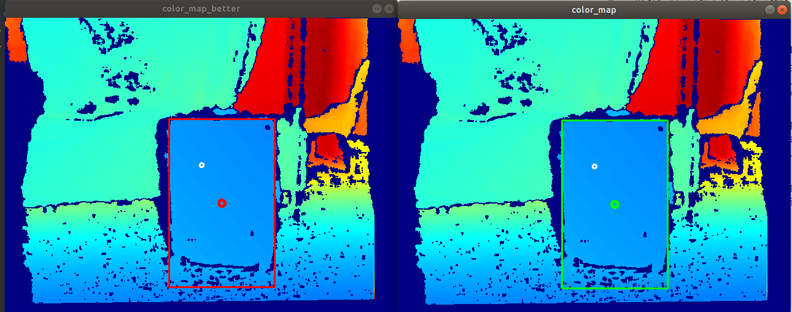


倾斜情况,只有红色,但是没有绿色,即原来的方法不能够识别,而改进后可以识别

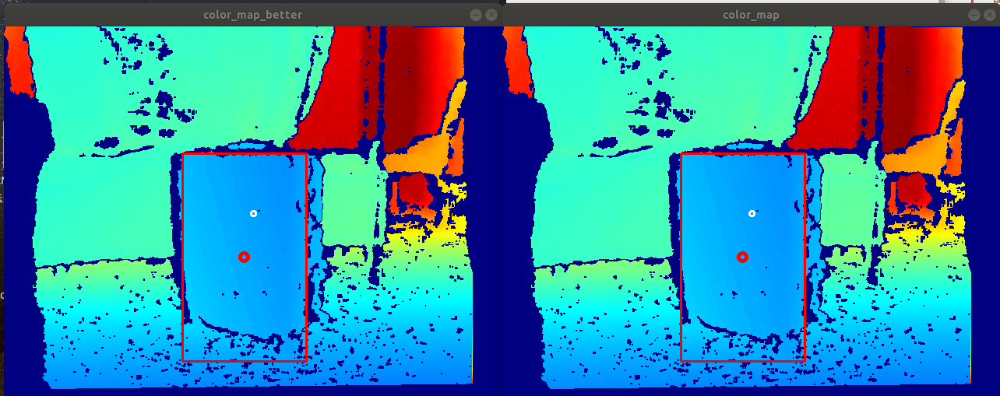


##### (3) 存在问题:

仍然是侧面的一些情况没有解决,这里我没有很好的建模,没有非常的认真地去解决问题,很多参数需要慢慢地调整

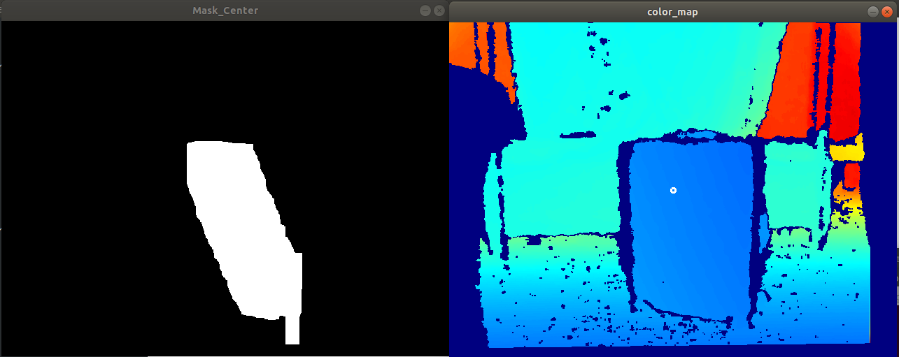


仍然存在一个特定角度存在偏差的问题,但是这个角度比较小,需要专门调整到这个角度才行

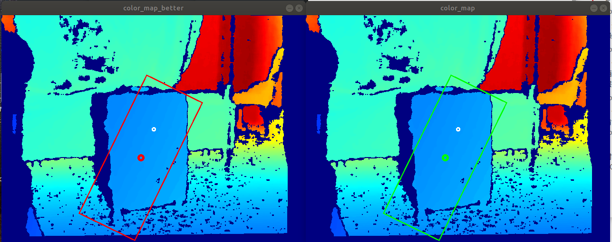


##### (4) 细节修缮

> 发现细节的修缮可以不断地进行优化,而且的确优化是没有尽头的,只需要想就都可以往上加

###### a. 各种问题

1. 斜着还是有一个固定角度出现问题,需要进行修缮
2. 测距精度不够,标定等的问题都存在问题,现在误差在2cm左右,需要再去做提升,对Realsense的精度要求很高.同时测距是采用X的距离直接算的,但是应该也要考虑上Z的差距,测距是一个斜面的距离
3. 中间的三个采样点可以加大,从而让其阈值更好滴满足要求
4. 每一帧找到的rect中,也可以进行一下再次筛选,从而不至于只允许找到一个rect才进行返回
5. 斜面的计算方式并不算好,之后可以再进行提升.同时,三个采样点也可以网上提升,从而进行平面的拟合操作,这样子误识别的情况就很少了(不识别远处的平面直接来一个inrange就好)
6. 需要解决类不断地被初始化的问题,不能够不断地初始化这个类,应该是在一个总函数中进行初始化,然后不断地读入depth_image的操作,而不是目前的每个循环中使用定义一个类


###### b. 距离问题

> 通过计算D435的视角问题,发现深度传感器的视角是能够满足目标的,因此最关键的问题算是解决了

**各种深度摄像头视角:**

- D435(87°±3° x 58°±1° x 95°±3°),可用于室内外

     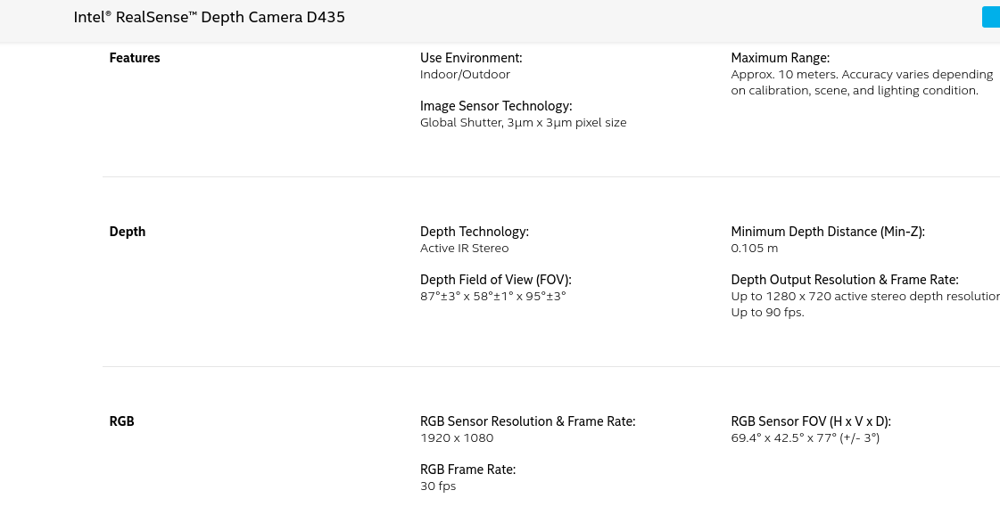

     D415的深度部分的FOV比D435小,但是D415的测距精度好很多,D415的FOV为:65°±2° x 40°±1° x 72°±2°

     另外,D415和D435的摄像头也不同,D415的测距精度会更高


- L515:(70° × 55° (±2°)) 不过主要是只能用于室内

     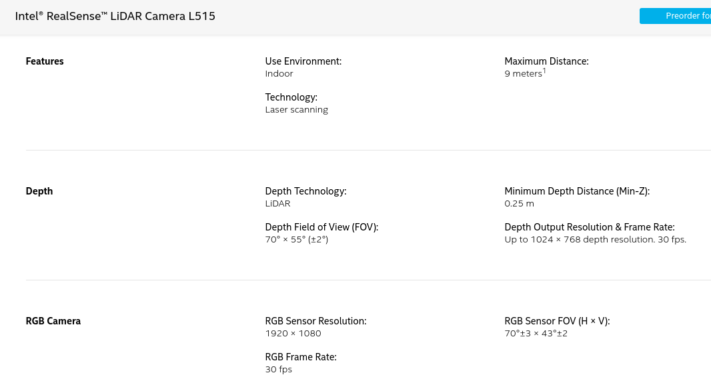


- 乐视astra FOV( 60,46.7 )  astra pro的范围是58.4,45.5

     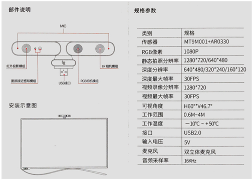


###### c. 与能量机关误识别

> 应该不会识别到能量机关,因为二者之间仍然存在了一定的间距


###### d. 识别逻辑提升

> 其实目前的识别逻辑只是用了横向的距离,但是其他的限制条件都没有往上加,这里可以继续往上添加一些东西

- 计算的距离变为了两个点的绝对距离
- 引入了装甲板识别的方法,对长宽和角度都进行了处理,当有多个识别的旋转矩形的时候,选取最小的那一个


#### 2.1.4 斜着识别的正确率

> 对于斜着识别的正确率的判别仍然不是很好,这里再一次尝试地去解决这个问题
>
> 现在的想法是采了三个点之后,在空间中拟合一个平面,然后采用for循环进行全图的遍历,对点不超过平面的一定距离的点予以Mask,否则不认为是在mask中的

##### (1) 算法原理

如果这个算法比较准确的话,那么其实这一套是非常准确的,因此就还是采用等间距采样的方法进行计算.希望是通过3个点(之后可能会采用6个点),就拟合出一个平面出来,然后对于全图的所有点,用for循环进行遍历,点与平面的距离不超过一定数值时,满足要求

- 如果算法比较慢,那么之后可以考虑对平了之后不需要拟合平面,但是具体速度有多少并不清楚,而且加速的操作也不清楚,需要实测之后才能确定


###### a. 空间平面拟合

> 三个点可以唯一确定一个平面(多个点可以采用最小二乘类似的思想进行拟合,从而获得一个目标点)

- 空间平面方程:

$$
{
点法式方程:\\
~~~~~~~~~~~~~~~~~~~~~A(x-x_0)+B(y-y_0)+C(z-z_0)=0\\
~~~此处,一个点(x_0,y_0,z_0)在平面上,且过这个点垂直于平面的向量n为:(A,B,C)\\
~~~由此可以构建出平面方程\\
~\\
截距式方程\\
~~~~~~~~~~~~~~~~~~~~~\frac{x}{a}+\frac{y}{b}+\frac{z}{c}=1\\
这种相当于是把上面的式子做了一下变换,得到了截距式\\
但是也可以理解为是与xyz三个轴相交的三个点构成的平面\\
~\\
一般式:\\
~~~~~~~~~~~~~~~~~~~~~Ax+By+Cz+D=0
~\\
~\\
~\\
点到面的距离公式:
d=\dfrac{|Ax_0+By_0+Cz_0+D|}{\sqrt{A^2+B^2+C^2}}
}
$$


- 由此,给定3个点的XYZ,需要唯一确定一个平面方程的ABCD


###### b. 拟合方程

```
已知三个点坐标为P1(x1,y1,z1), P2(x2,y2,z2), P3(x3,y3,z3)
所以可以设方程为A(x - x1) + B(y - y1) + C(z - z1) = 0 (点法式) (也可设为过另外两个点)

核心代码：
//在此之前写好录入三个三维点的代码，然后就是处理待定系数，如下：
A = (y2 - y1)*(z3 - z1) - (z2 -z1)*(y3 - y1);
B = (x3 - x1)*(z2 - z1) - (x2 - x1)*(z3 - z1);
C = (x2 - x1)*(y3 - y1) - (x3 - x1)*(y2 - y1);

即得过P1，P2，P3的平面方程
方程也可写为    Ax + By + Cz + D = 0 (一般式)    其中D = -(A * x1 + B * y1 + C * z1)
```


##### (2) 代码实现

> 其实还是很简单的,就是因为我对于Mat类型的调用太差了,导致写了一个下午才能出结果,不过这一次顺手就整合了OpenCV的基本数据数据结构,还算是ok的

最后的效果还算是不错的,但是其中也的确存在一些问题,比如这三个点比较容易解不出来点,而且其实这样子导致了最终的结果是与这三个点密切相关的,这两个问题是这里面还需要去解决的,最好还是使用最小二乘的方法去做一个拟合,要不然直接解一个平面的问题其实并不好


##### (3) 存在问题

- 频闪问题:

     因为平面的距离的跳边等的情况造成的

- 识别帧率问题:

     这里面有一个两个for循环的地方我没有去好好地解决,之后有机会可以去进行解决


###### a. 解决方法:

使用RANSCA,随机采样一致性,从而把他变成一个回归问题,而不是一个直接解解析解的问题,然后这里面的帧率不至于掉很多,因为本质的目的就是为了找到一个较好的平面


opencv中的RANSAC: https://blog.csdn.net/laobai1015/article/details/51683076/


#### 2.1.5 不用直接对中心点(挂起)

> 其实目前主要的问题就是需要凸显出一个中心点,那么接下来,可以考虑生成几个中心点,然后在这几个中心点作为采样点(即BBOX),然后进行这几个中心点的生成.这个可以是之后的工作任务


### 2.2 三维深度图

> 可以尝试进行深度匹配的方案,类似于模板匹配,但是允许尺度变换的方案进行操作(或者说是匹配一定的形状,采用数学方法进行数学模式的匹配)

#### 2.2.1 RANC拟合平面

> 思路好像是直接迭代,然后出一个迭代解的方法


#### 2.2.2 ICP配准

> 相当于是做三维平面的图像分割任务,的确是我最想做的,但是目前肯定没有太多的时间进行这一块的操作


## 3. 资源岛对位

> 对位中还要一个比较重要的问题,就是ROI的选取问题,一开始的中心点是在目标中心,那么接下来的目标点应该是需要往对应点转移的,就是不断动态更新目标点的一个过程.这里面类就需要好好地写了


1. 上了平台之后,需要操作手先把车子稍微正对着资源岛,然后按下一个按键,从而开始进行进行资源岛的查找
2. 一旦找到资源岛之后,传送信号,就可以自动操控车子进行了,(这里是我拥有左右的权利还是我拥有全车的控制权)
3. 马上到资源岛时(大概还有1.5m-1m的时候)工程车就可以开始升起,**然后这个时候控制权就交给上面的测距模块,还是怎么处理(这里我也不确定)**
4. 完成取弹任务


## 5. 工程对位工程

> 正式开始完成对位工程,里面有4个类,通信类,相机类,识别类,移动类,也是尽量的低耦合,各个之间的通信可以快速完成

### 5.1 相机类

常用参数

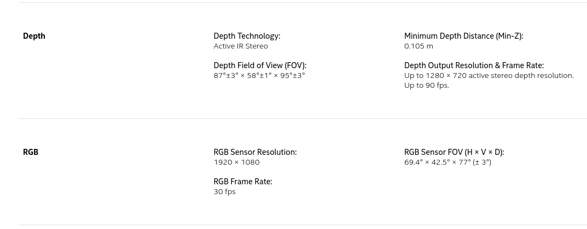


https://support.intelrealsense.com/hc/en-us/community/posts/360037753934-What-s-the-intrinsics-and-extrinsics-w-r-t-left-IR-cam-of-the-depth-map-D430-

通过这个可以读取到D430的内参矩阵,即sensor_control中有对应的操作

84 : Color #0 (Video Stream: RGB8 640x480@ 60Hz)
85 : Color #0 (Video Stream: Y16 640x480@ 60Hz)

Principal Point         : 325.905, 240.093
Focal Length            : 613.369, 612.29

这个是网上抄别人的,但是如果ok也能接收了,cm级别足够了

19 : Color #0 (Video Stream: Y16 1280x720@ 30Hz)

Principal Point         : 648.857, 360.139
Focal Length            : 920.054, 918.434


这些都是在usr/local/bin的目录下面,有许多realsense的使用文件(这些应该也是直接有源码可以看到,之后有兴趣可以去看看他们的源码,这个真的是Realsense的强势之处,这种平台绝对不是别人能比的


XY的对位不对,我猜测可能是因为FOV小了一半,且他是对其颜色图,而非对其深度图,这个去测试一下就知道问题了

内参还是有问题,之后需要再去重新测一下,但是深度值是没有问题的

由于识别比较麻烦,因此就干脆直接进行中间测距,得到目标距离算了


内参的问题还是需要解决的,虽然不知道怎么解决,但是这个问题肯定是要想办法的,要不然测得距离是不准的就很大问题了

发现rs-sensor-control中也有深度图的内参矩阵,直接选择深度图的那一项就好了


D435的深度值的跳动真的是非常的大,因此采用了最小二乘的方法,同时又对需要剔除大于mean+std的值,从而最终进行了提升了深度值的估计操作

这里面还有滤波等等的操作现在是没有做的,之后整理完代码重新弄一下这个东西

选择的roi越大,效果越好


另外,病态矩阵的问题不进行解决,因为感觉最终的乘出来的结果还算是可以,因此病态矩阵的地方不进行解决

病态矩阵博客: https://blog.csdn.net/u011584941/article/details/44625779


未来改进:

1. 对位部分进行提升,多个地方进行采样,然后得到多个CenterMask,基于多张CenterMask得到目标的点,当然这里面的选择的要求会增加,但是应该问题不算很大
2. 可以考虑侧面进行识别,不要先手识别最前面的东西,不过这个等之后看情况再处理把,现在先不进行处理


